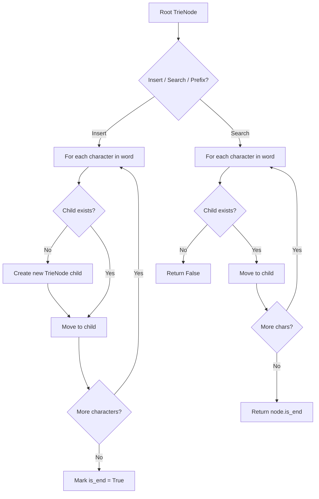
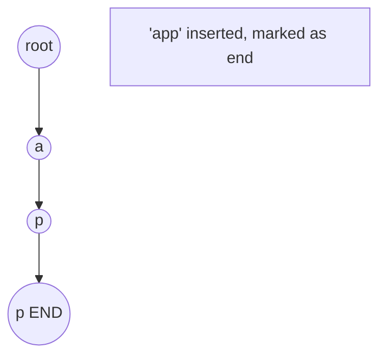
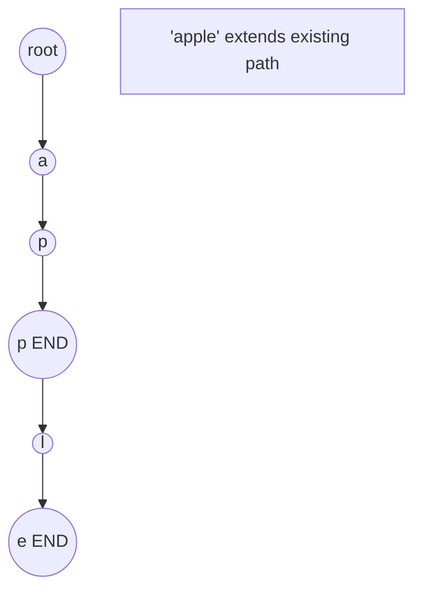
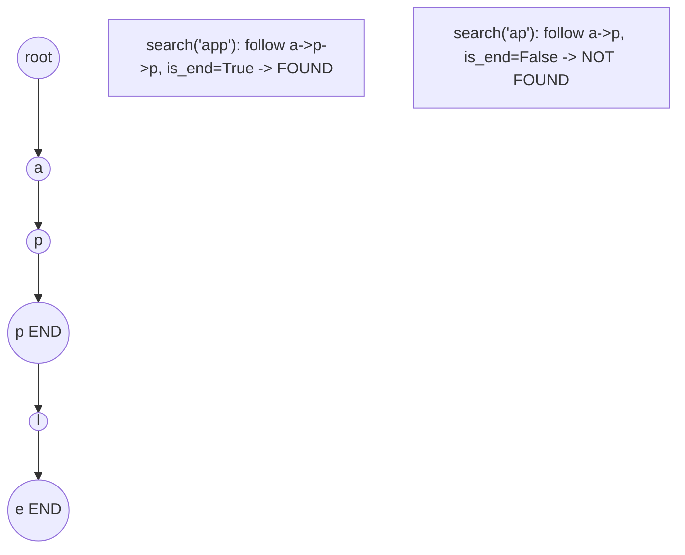

# Problem 676: Implement Magic Dictionary

**Difficulty:** Medium  
**Tags:** Hash Table, String, Depth-First Search, Design, Trie  
**Pattern:** Trie / Prefix Tree  
**Link:** [leetcode.com/problems/implement-magic-dictionary](https://leetcode.com/problems/implement-magic-dictionary/)

## Description

Design a data structure that is initialized with a list of **different** words. Provided a string, you should determine if you can change exactly one character in this string to match any word in the data structure.

Implement the `MagicDictionary` class:

	- `MagicDictionary()` Initializes the object.
	- `void buildDict(String[] dictionary)` Sets the data structure with an array of distinct strings `dictionary`.
	- `bool search(String searchWord)` Returns `true` if you can change **exactly one character** in `searchWord` to match any string in the data structure, otherwise returns `false`.

 

Example 1:

```

**Input**
["MagicDictionary", "buildDict", "search", "search", "search", "search"]
[[], [["hello", "leetcode"]], ["hello"], ["hhllo"], ["hell"], ["leetcoded"]]
**Output**
[null, null, false, true, false, false]

**Explanation**
MagicDictionary magicDictionary = new MagicDictionary();
magicDictionary.buildDict(["hello", "leetcode"]);
magicDictionary.search("hello"); // return False
magicDictionary.search("hhllo"); // We can change the second 'h' to 'e' to match "hello" so we return True
magicDictionary.search("hell"); // return False
magicDictionary.search("leetcoded"); // return False

```

 

**Constraints:**

	- `1 <= dictionary.length <= 100`
	- `1 <= dictionary[i].length <= 100`
	- `dictionary[i]` consists of only lower-case English letters.
	- All the strings in `dictionary` are **distinct**.
	- `1 <= searchWord.length <= 100`
	- `searchWord` consists of only lower-case English letters.
	- `buildDict` will be called only once before `search`.
	- At most `100` calls will be made to `search`.

## Approach: Trie / Prefix Tree

Build a trie (prefix tree) where each node represents a character. Insert words character by character, and search by following child pointers. Supports efficient prefix matching.

## Pseudocode

```
1. TrieNode: children = {}, is_end = False
2. Insert(word):
   - For each char: create child if absent, move to child
   - Mark last node as end
3. Search(word):
   - For each char: if child absent return False, move to child
   - Return node.is_end
4. StartsWith(prefix): same as search but return True at end
```

## Algorithm Flow



## Visual State Transitions

**Trie Insert and Search:**

**Frame 1: Empty trie**


**Frame 2: Insert 'app'**


**Frame 3: Insert 'apple'**


**Frame 4: Search 'app' = True, 'ap' = False**



## Complexity Analysis

- **Time:** O(L) per operation
- **Space:** O(N * L)

## Solution (Python3)

```python
class MagicDictionary:
    def __init__(self):
        # Initialize data structure
        pass

    def buildDict(self, dictionary: List[str]) -> None:
        return None

    def search(self, searchWord: str) -> bool:
        return False

```

## Solution (C++)

```cpp
#include <string>
#include <vector>
using namespace std;

class MagicDictionary {
public:
    MagicDictionary() {
        // Initialize
    }

    void buildDict(vector<string>& dictionary) {
        return ;
    }

    bool search(string& searchWord) {
        return false;
    }

};
```
