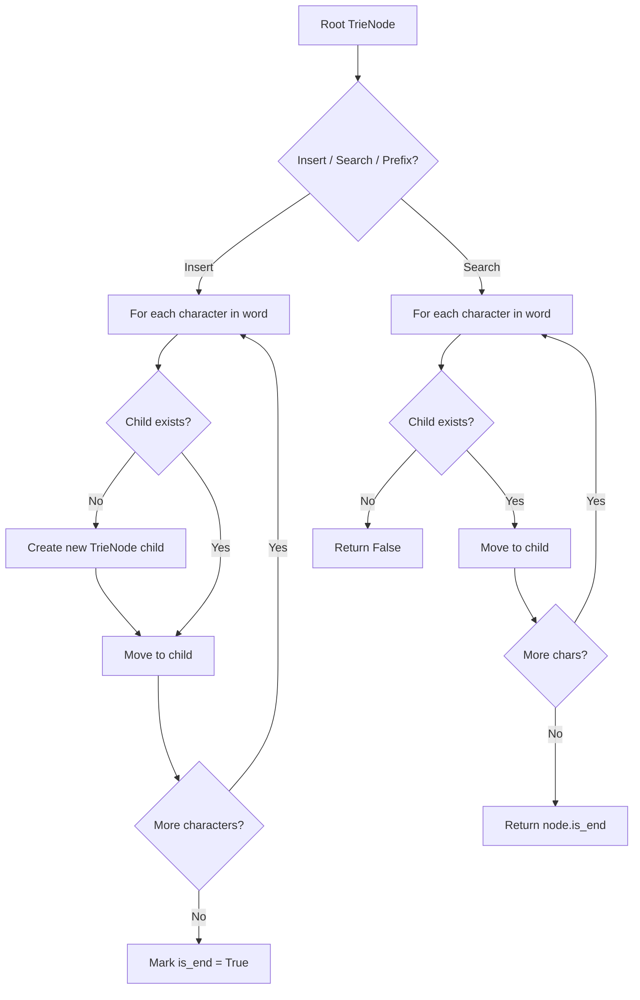
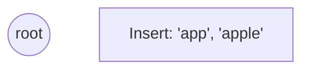
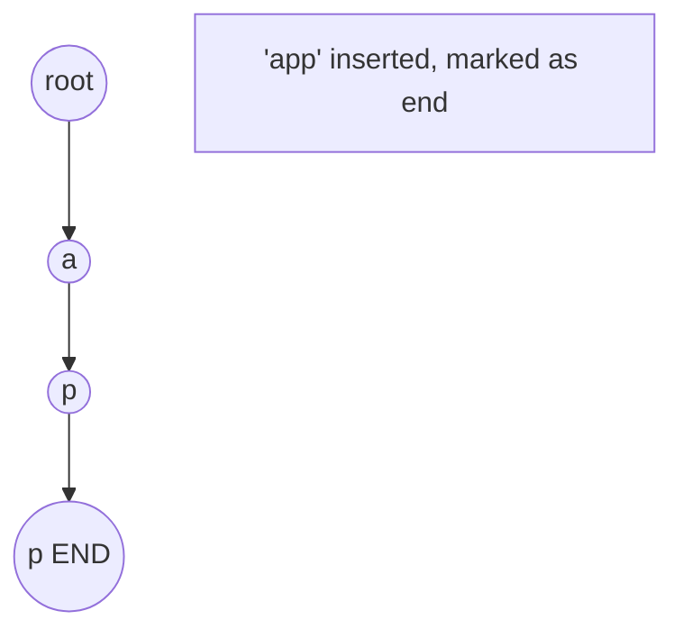
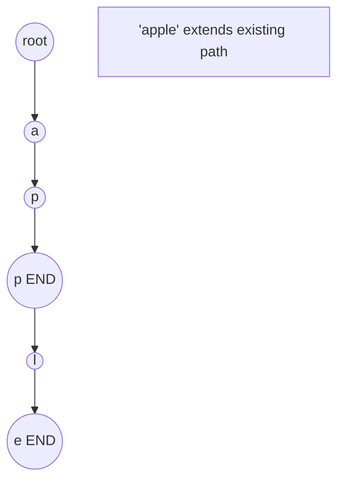
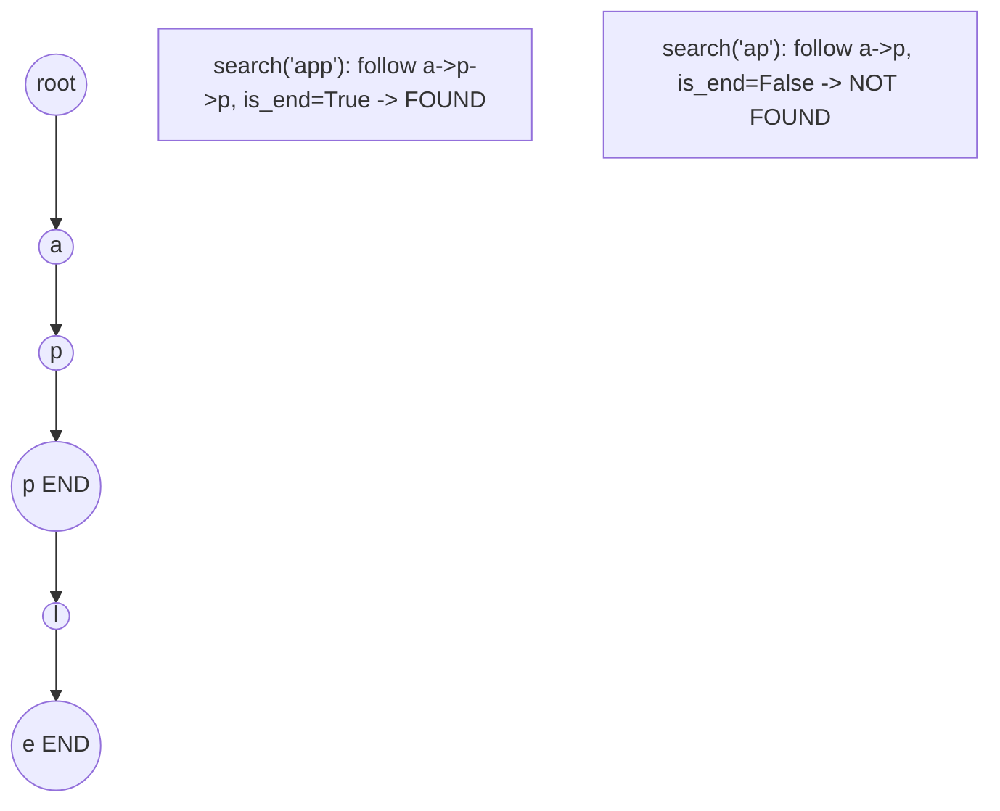

# Problem 677: Map Sum Pairs

**Difficulty:** Medium  
**Tags:** Hash Table, String, Design, Trie  
**Pattern:** Trie / Prefix Tree  
**Link:** [leetcode.com/problems/map-sum-pairs](https://leetcode.com/problems/map-sum-pairs/)

## Description

Design a map that allows you to do the following:

	- Maps a string key to a given value.
	- Returns the sum of the values that have a key with a prefix equal to a given string.

Implement the `MapSum` class:

	- `MapSum()` Initializes the `MapSum` object.
	- `void insert(String key, int val)` Inserts the `key-val` pair into the map. If the `key` already existed, the original `key-value` pair will be overridden to the new one.
	- `int sum(string prefix)` Returns the sum of all the pairs' value whose `key` starts with the `prefix`.

 

Example 1:

```

**Input**
["MapSum", "insert", "sum", "insert", "sum"]
[[], ["apple", 3], ["ap"], ["app", 2], ["ap"]]
**Output**
[null, null, 3, null, 5]

**Explanation**
MapSum mapSum = new MapSum();
mapSum.insert("apple", 3);  
mapSum.sum("ap");           // return 3 (apple = 3)
mapSum.insert("app", 2);    
mapSum.sum("ap");           // return 5 (apple + app = 3 + 2 = 5)

```

 

**Constraints:**

	- `1 <= key.length, prefix.length <= 50`
	- `key` and `prefix` consist of only lowercase English letters.
	- `1 <= val <= 1000`
	- At most `50` calls will be made to `insert` and `sum`.

## Approach: Trie / Prefix Tree

Build a trie (prefix tree) where each node represents a character. Insert words character by character, and search by following child pointers. Supports efficient prefix matching.

## Pseudocode

```
1. TrieNode: children = {}, is_end = False
2. Insert(word):
   - For each char: create child if absent, move to child
   - Mark last node as end
3. Search(word):
   - For each char: if child absent return False, move to child
   - Return node.is_end
4. StartsWith(prefix): same as search but return True at end
```

## Algorithm Flow



## Visual State Transitions

**Trie Insert and Search:**

**Frame 1: Empty trie**


**Frame 2: Insert 'app'**


**Frame 3: Insert 'apple'**


**Frame 4: Search 'app' = True, 'ap' = False**



## Complexity Analysis

- **Time:** O(L) per operation
- **Space:** O(N * L)

## Solution (Python3)

```python
class MapSum:
    def __init__(self):
        # Initialize data structure
        pass

    def insert(self, key: str, val: int) -> None:
        return None

    def sum(self, prefix: str) -> int:
        return 0

```

## Solution (C++)

```cpp
#include <string>
#include <vector>
using namespace std;

class MapSum {
public:
    MapSum() {
        // Initialize
    }

    void insert(string& key, int val) {
        return ;
    }

    int sum(string& prefix) {
        return 0;
    }

};
```
