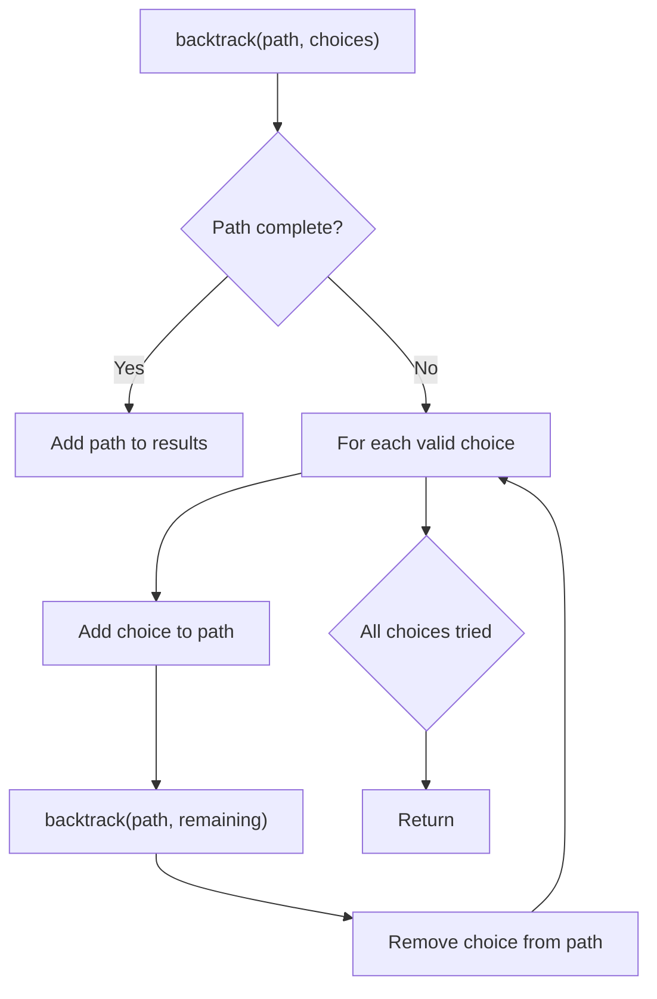
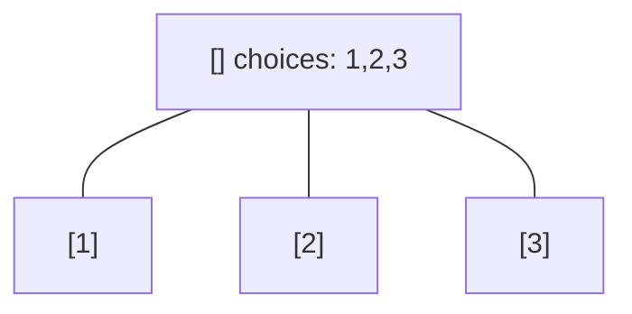
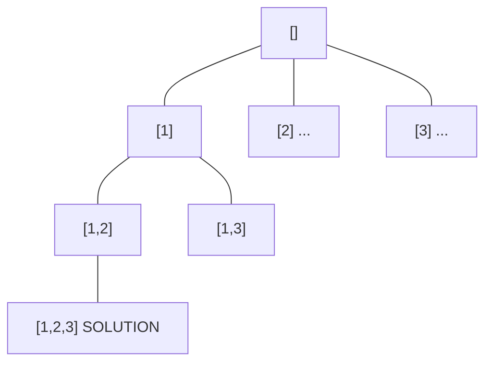
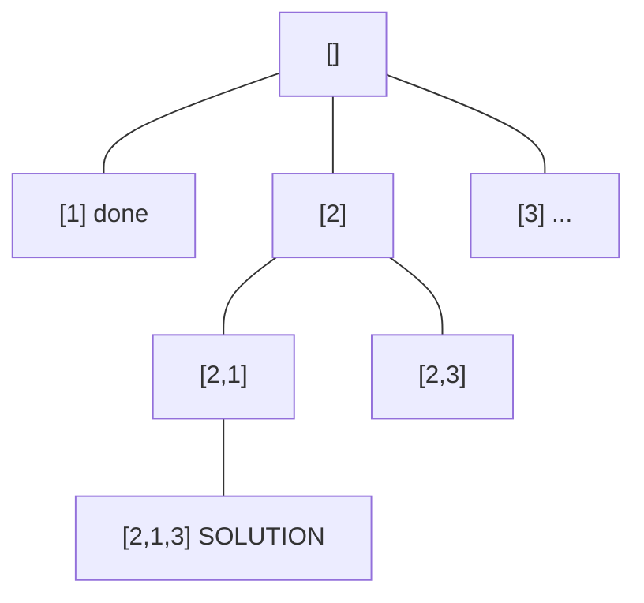
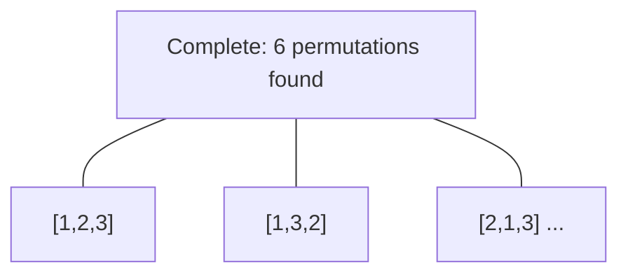

# Problem 679: 24 Game

**Difficulty:** Hard  
**Tags:** Array, Math, Backtracking  
**Pattern:** Backtracking  
**Link:** [leetcode.com/problems/24-game](https://leetcode.com/problems/24-game/)

## Description

You are given an integer array `cards` of length `4`. You have four cards, each containing a number in the range `[1, 9]`. You should arrange the numbers on these cards in a mathematical expression using the operators `['+', '-', '*', '/']` and the parentheses `'('` and `')'` to get the value 24.

You are restricted with the following rules:

	- The division operator `'/'` represents real division, not integer division.

	
		For example, `4 / (1 - 2 / 3) = 4 / (1 / 3) = 12`.
	
	
	- Every operation done is between two numbers. In particular, we cannot use `'-'` as a unary operator.
	
		For example, if `cards = [1, 1, 1, 1]`, the expression `"-1 - 1 - 1 - 1"` is **not allowed**.
	
	
	- You cannot concatenate numbers together
	
		For example, if `cards = [1, 2, 1, 2]`, the expression `"12 + 12"` is not valid.
	
	

Return `true` if you can get such expression that evaluates to `24`, and `false` otherwise.

 

Example 1:

```

**Input:** cards = [4,1,8,7]
**Output:** true
**Explanation:** (8-4) * (7-1) = 24

```

Example 2:

```

**Input:** cards = [1,2,1,2]
**Output:** false

```

 

**Constraints:**

	- `cards.length == 4`
	- `1 <= cards[i] <= 9`

## Approach: Backtracking

Explore all possible solutions by building candidates incrementally. At each step, make a choice and recurse. If the choice leads to a dead end, undo the choice (backtrack) and try the next option.

## Pseudocode

```
1. Define backtrack(path, choices):
   a. If path is a complete solution: add to results
   b. For each choice in choices:
      - If choice is valid:
        * Add choice to path
        * backtrack(path, remaining_choices)
        * Remove choice from path (backtrack)
2. Call backtrack([], all_choices)
```

## Algorithm Flow



## Visual State Transitions

**Backtracking Decision Tree:**

**Frame 1: Root - start with empty path**


**Frame 2: Explore branch [1]**


**Frame 3: Backtrack, explore [2]**


**Frame 4: All solutions found**



## Complexity Analysis

- **Time:** O(k^n) or O(n!)
- **Space:** O(n)

## Solution (Python3)

```python
class Solution:
    def judgePoint24(self, cards: List[int]) -> bool:
        # Backtracking - O(2^n) or O(n!) time
        result = []
        
        def backtrack(path, start):
            result.append(path[:])
            for i in range(start, len(cards)):
                path.append(cards[i])
                backtrack(path, i + 1)
                path.pop()
        
        backtrack([], 0)
        return result
```

## Solution (C++)

```cpp
#include <functional>
#include <string>
#include <vector>
using namespace std;

class Solution {
public:
    bool judgePoint24(vector<int>& cards) {
        // Backtracking - O(2^n) or O(n!) time
        vector<vector<int>> result;
        vector<int> path;
        function<void(int)> backtrack = [&](int start) {
            result.push_back(path);
            for (int i = start; i < (int)cards.size(); i++) {
                path.push_back(cards[i]);
                backtrack(i + 1);
                path.pop_back();
            }
        };
        backtrack(0);
        return result;
    }
};
```
