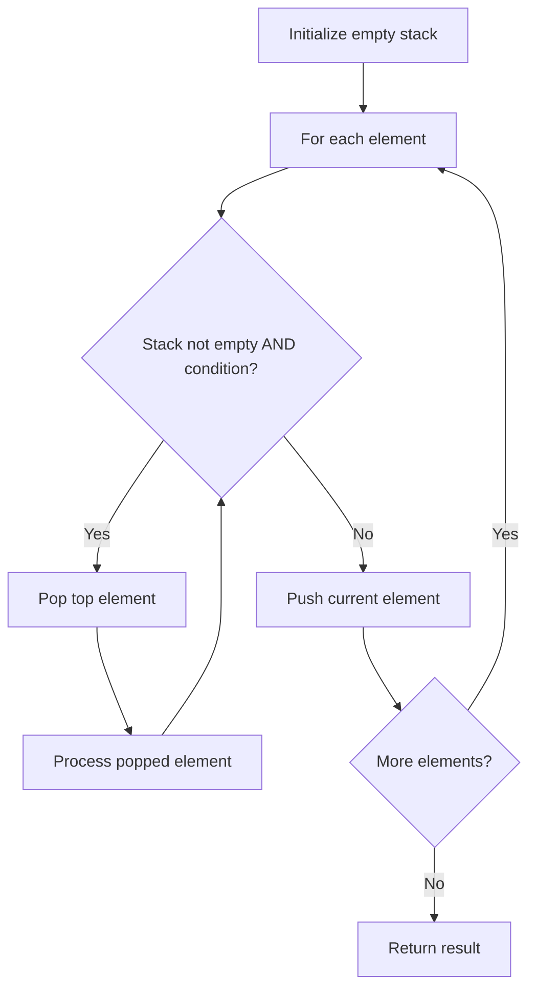

# Problem 682: Baseball Game

**Difficulty:** Easy  
**Tags:** Array, Stack, Simulation  
**Pattern:** Stack  
**Link:** [leetcode.com/problems/baseball-game](https://leetcode.com/problems/baseball-game/)

## Description

You are keeping the scores for a baseball game with strange rules. At the beginning of the game, you start with an empty record.

You are given a list of strings `operations`, where `operations[i]` is the `i^th` operation you must apply to the record and is one of the following:

	- An integer `x`.

	
		Record a new score of `x`.
	
	
	- `'+'`.
	
		Record a new score that is the sum of the previous two scores.
	
	
	- `'D'`.
	
		Record a new score that is the double of the previous score.
	
	
	- `'C'`.
	
		Invalidate the previous score, removing it from the record.
	
	

Return *the sum of all the scores on the record after applying all the operations*.

The test cases are generated such that the answer and all intermediate calculations fit in a **32-bit** integer and that all operations are valid.

 

Example 1:

```

**Input:** ops = ["5","2","C","D","+"]
**Output:** 30
**Explanation:**
"5" - Add 5 to the record, record is now [5].
"2" - Add 2 to the record, record is now [5, 2].
"C" - Invalidate and remove the previous score, record is now [5].
"D" - Add 2 * 5 = 10 to the record, record is now [5, 10].
"+" - Add 5 + 10 = 15 to the record, record is now [5, 10, 15].
The total sum is 5 + 10 + 15 = 30.

```

Example 2:

```

**Input:** ops = ["5","-2","4","C","D","9","+","+"]
**Output:** 27
**Explanation:**
"5" - Add 5 to the record, record is now [5].
"-2" - Add -2 to the record, record is now [5, -2].
"4" - Add 4 to the record, record is now [5, -2, 4].
"C" - Invalidate and remove the previous score, record is now [5, -2].
"D" - Add 2 * -2 = -4 to the record, record is now [5, -2, -4].
"9" - Add 9 to the record, record is now [5, -2, -4, 9].
"+" - Add -4 + 9 = 5 to the record, record is now [5, -2, -4, 9, 5].
"+" - Add 9 + 5 = 14 to the record, record is now [5, -2, -4, 9, 5, 14].
The total sum is 5 + -2 + -4 + 9 + 5 + 14 = 27.

```

Example 3:

```

**Input:** ops = ["1","C"]
**Output:** 0
**Explanation:**
"1" - Add 1 to the record, record is now [1].
"C" - Invalidate and remove the previous score, record is now [].
Since the record is empty, the total sum is 0.

```

 

**Constraints:**

	- `1 <= operations.length <= 1000`
	- `operations[i]` is `"C"`, `"D"`, `"+"`, or a string representing an integer in the range `[-3 * 10^4, 3 * 10^4]`.
	- For operation `"+"`, there will always be at least two previous scores on the record.
	- For operations `"C"` and `"D"`, there will always be at least one previous score on the record.

## Approach: Stack

Use a stack (LIFO) to process elements. Push elements when they might be needed later; pop when a matching or resolving condition is found. Common uses: parentheses matching, expression evaluation, next greater element.

## Pseudocode

```
1. Initialize empty stack
2. For each element:
   a. While stack is not empty and condition met:
      - Pop and process top element
   b. Push current element onto stack
3. Process remaining elements in stack if needed
4. Return result
```

## Algorithm Flow



## Complexity Analysis

- **Time:** O(n)
- **Space:** O(n)

## Solution (Python3)

```python
class Solution:
    def calPoints(self, operations: List[str]) -> int:
        # Stack-based approach - O(n) time
        stack = []
        for ch in operations:
            if stack and self._matches(stack[-1], ch):
                stack.pop()
            else:
                stack.append(ch)
        return len(stack) == 0 if isinstance(0, bool) else stack

    def _matches(self, a, b):
        pairs = {'(': ')', '[': ']', '{': '}'}
        return pairs.get(a) == b
```

## Solution (C++)

```cpp
#include <stack>
#include <string>
#include <unordered_map>
#include <vector>
using namespace std;

class Solution {
public:
    int calPoints(vector<string>& operations) {
        // Stack-based approach - O(n) time
        stack<char> st;
        unordered_map<char, char> pairs = {{'(', ')'}, {'[', ']'}, {'{', '}'}};
        for (char ch : operations) {
            if (!st.empty() && pairs.count(st.top()) && pairs[st.top()] == ch) {
                st.pop();
            } else {
                st.push(ch);
            }
        }
        return st.empty();
    }
};
```
