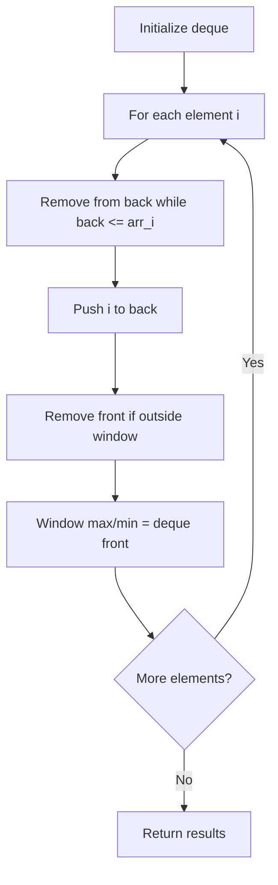

# Problem 683: K Empty Slots

**Difficulty:** Hard  
**Tags:** Array, Binary Indexed Tree, Segment Tree, Queue, Sliding Window, Heap (Priority Queue), Ordered Set, Monotonic Queue  
**Pattern:** Monotonic Queue / Deque  
**Link:** [leetcode.com/problems/k-empty-slots](https://leetcode.com/problems/k-empty-slots/)

## Description

*(Premium problem -- description requires LeetCode subscription)*

## Approach: Monotonic Queue / Deque

Use a deque to maintain a monotonic window of elements. Remove from the back to maintain order, remove from the front when elements leave the window.

## Pseudocode

```
1. Initialize deque
2. For each element:
   a. Remove from back while deque back <= current
   b. Add current to back
   c. Remove from front if outside window
   d. Front of deque is the window max/min
3. Return results
```

## Algorithm Flow



## Complexity Analysis

- **Time:** O(n)
- **Space:** O(k)

## Solution (Python3)

```python
class Solution:
    pass
```

## Solution (C++)

```cpp
class Solution {
public:
    // Design problem stub
};
```
