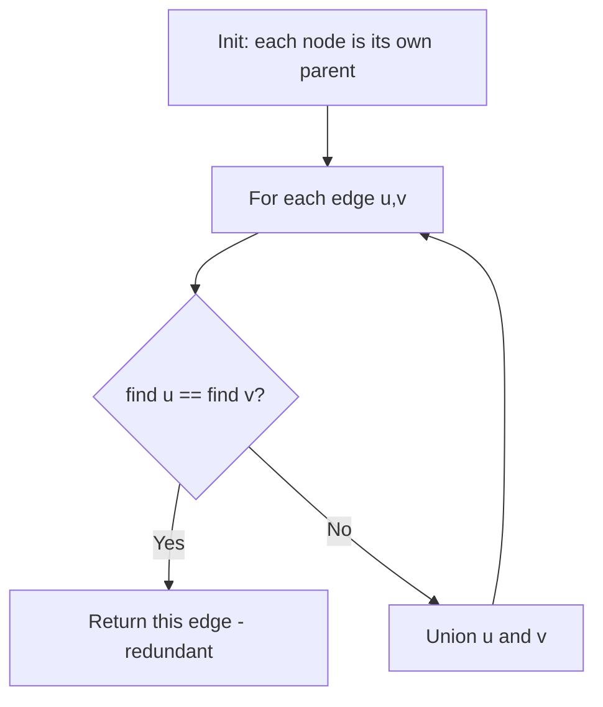
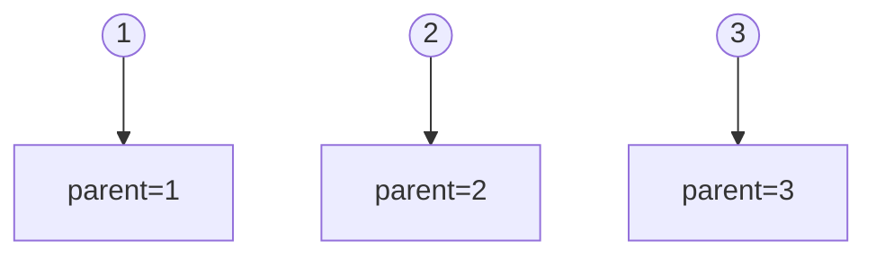
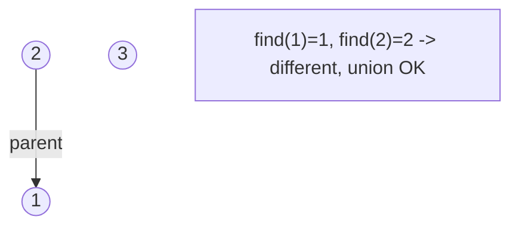
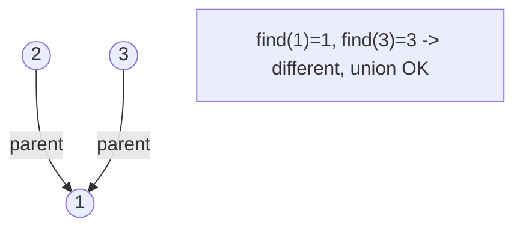
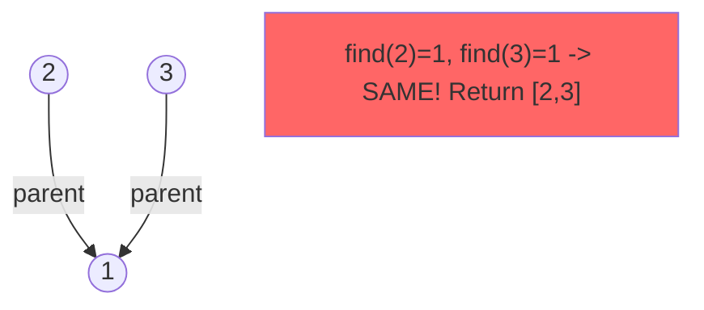

# Problem 684: Redundant Connection

**Difficulty:** Medium  
**Tags:** Depth-First Search, Breadth-First Search, Union-Find, Graph Theory  
**Pattern:** Union-Find  
**Link:** [leetcode.com/problems/redundant-connection](https://leetcode.com/problems/redundant-connection/)

## Description

In this problem, a tree is an **undirected graph** that is connected and has no cycles.

You are given a graph that started as a tree with `n` nodes labeled from `1` to `n`, with one additional edge added. The added edge has two **different** vertices chosen from `1` to `n`, and was not an edge that already existed. The graph is represented as an array `edges` of length `n` where `edges[i] = [ai, bi]` indicates that there is an edge between nodes `ai` and `bi` in the graph.

Return *an edge that can be removed so that the resulting graph is a tree of *`n`* nodes*. If there are multiple answers, return the answer that occurs last in the input.

 

Example 1:

```

**Input:** edges = [[1,2],[1,3],[2,3]]
**Output:** [2,3]

```

Example 2:

```

**Input:** edges = [[1,2],[2,3],[3,4],[1,4],[1,5]]
**Output:** [1,4]

```

 

**Constraints:**

	- `n == edges.length`
	- `3 <= n <= 1000`
	- `edges[i].length == 2`
	- `1 <= ai < bi <= edges.length`
	- `ai != bi`
	- There are no repeated edges.
	- The given graph is connected.

## Approach: Union-Find

Union-Find with path compression and rank. The edge that creates a cycle is redundant.

## Pseudocode

```
1. parent[i] = i for all nodes (each is its own set)
2. find(x): follow parent pointers to root (with path compression)
3. union(x, y): merge sets of x and y by rank
4. Process edges/operations:
   a. For each edge (u, v): union(u, v)
5. Answer queries using find()
```

## Algorithm Flow



## Visual State Transitions

**Union-Find Step-by-Step:**

**Edges:** [[1,2], [1,3], [2,3]]

**Frame 1: Initial - each node is own parent**


**Frame 2: Process edge [1,2] - union(1,2)**


**Frame 3: Process edge [1,3] - union(1,3)**


**Frame 4: Process edge [2,3] - CYCLE DETECTED!**



## Complexity Analysis

- **Time:** O(n * alpha(n))
- **Space:** O(n)

## Solution (Python3)

```python
class Solution:
    def findRedundantConnection(self, edges):
        parent = list(range(len(edges) + 1))
        rank = [0] * (len(edges) + 1)
        def find(x):
            while parent[x] != x:
                parent[x] = parent[parent[x]]
                x = parent[x]
            return x
        def union(x, y):
            px, py = find(x), find(y)
            if px == py:
                return False
            if rank[px] < rank[py]:
                px, py = py, px
            parent[py] = px
            if rank[px] == rank[py]:
                rank[px] += 1
            return True
        for u, v in edges:
            if not union(u, v):
                return [u, v]
```

## Solution (C++)

```cpp
#include <functional>
#include <numeric>
#include <string>
#include <vector>
using namespace std;

class Solution {
public:
    vector<int> findRedundantConnection(vector<vector<int>>& edges) {
        // Union Find (DSU) - O(n * alpha(n))
        int n = edges.size();
        vector<int> parent(n + 1), rnk(n + 1, 0);
        iota(parent.begin(), parent.end(), 0);
        function<int(int)> find = [&](int x) -> int {
            return parent[x] == x ? x : parent[x] = find(parent[x]);
        };
        auto unite = [&](int x, int y) -> bool {
            int px = find(x), py = find(y);
            if (px == py) return false;
            if (rnk[px] < rnk[py]) swap(px, py);
            parent[py] = px;
            if (rnk[px] == rnk[py]) rnk[px]++;
            return true;
        };
        int components = n;
        return components;
    }
};
```
