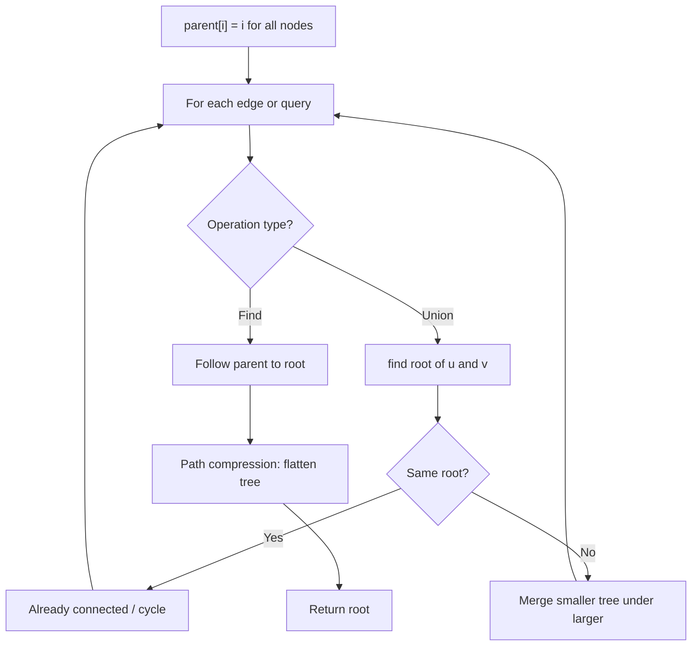
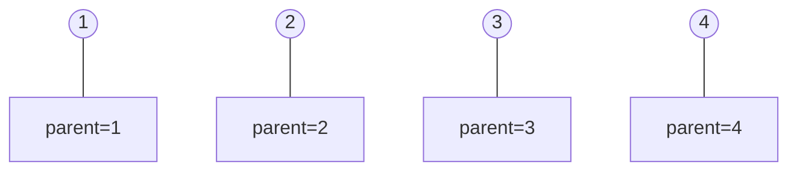
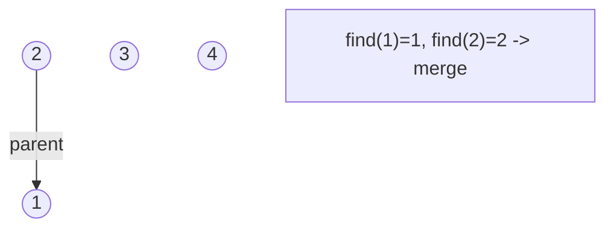
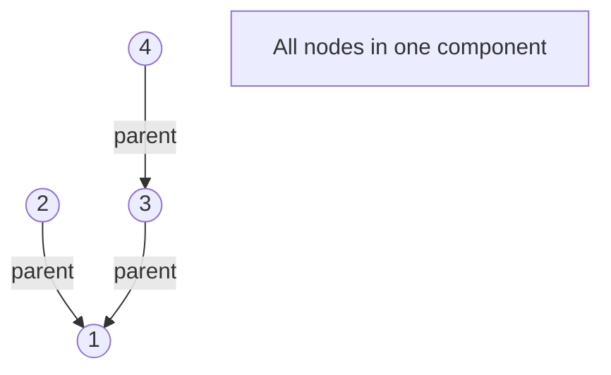
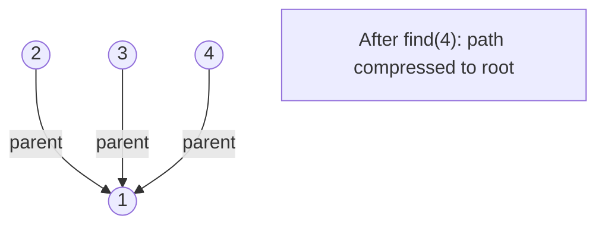

# Problem 685: Redundant Connection II

**Difficulty:** Hard  
**Tags:** Depth-First Search, Breadth-First Search, Union-Find, Graph Theory  
**Pattern:** Union-Find / Disjoint Set  
**Link:** [leetcode.com/problems/redundant-connection-ii](https://leetcode.com/problems/redundant-connection-ii/)

## Description

In this problem, a rooted tree is a **directed** graph such that, there is exactly one node (the root) for which all other nodes are descendants of this node, plus every node has exactly one parent, except for the root node which has no parents.

The given input is a directed graph that started as a rooted tree with `n` nodes (with distinct values from `1` to `n`), with one additional directed edge added. The added edge has two different vertices chosen from `1` to `n`, and was not an edge that already existed.

The resulting graph is given as a 2D-array of `edges`. Each element of `edges` is a pair `[ui, vi]` that represents a **directed** edge connecting nodes `ui` and `vi`, where `ui` is a parent of child `vi`.

Return *an edge that can be removed so that the resulting graph is a rooted tree of* `n` *nodes*. If there are multiple answers, return the answer that occurs last in the given 2D-array.

 

Example 1:

```

**Input:** edges = [[1,2],[1,3],[2,3]]
**Output:** [2,3]

```

Example 2:

```

**Input:** edges = [[1,2],[2,3],[3,4],[4,1],[1,5]]
**Output:** [4,1]

```

 

**Constraints:**

	- `n == edges.length`
	- `3 <= n <= 1000`
	- `edges[i].length == 2`
	- `1 <= ui, vi <= n`
	- `ui != vi`

## Approach: Union-Find / Disjoint Set

Use Union-Find with path compression and union by rank to efficiently manage connected components. Find(x) returns the root of x's component; Union(x,y) merges two components.

## Pseudocode

```
1. parent[i] = i for all nodes (each is its own set)
2. find(x): follow parent pointers to root (with path compression)
3. union(x, y): merge sets of x and y by rank
4. Process edges/operations:
   a. For each edge (u, v): union(u, v)
5. Answer queries using find()
```

## Algorithm Flow



## Visual State Transitions

**Union-Find Step-by-Step:**

**Frame 1: Initial - each node is own parent**


**Frame 2: Union(1,2) - merge components**


**Frame 3: Union(3,4) then Union(2,3)**


**Frame 4: Path compression on find(4)**



## Complexity Analysis

- **Time:** O(n * alpha(n))
- **Space:** O(n)

## Solution (Python3)

```python
class Solution:
    def findRedundantDirectedConnection(self, edges: List[List[int]]) -> List[int]:
        # Union Find (Disjoint Set Union) - O(n * alpha(n))
        parent = list(range(len(edges) + 1 if isinstance(edges, list) else edges + 1))
        rank = [0] * len(parent)
        
        def find(x):
            if parent[x] != x:
                parent[x] = find(parent[x])
            return parent[x]
        
        def union(x, y):
            px, py = find(x), find(y)
            if px == py:
                return False
            if rank[px] < rank[py]:
                px, py = py, px
            parent[py] = px
            if rank[px] == rank[py]:
                rank[px] += 1
            return True
        
        components = len(parent)
        # Process edges/connections
        return components
```

## Solution (C++)

```cpp
#include <functional>
#include <numeric>
#include <string>
#include <vector>
using namespace std;

class Solution {
public:
    vector<int> findRedundantDirectedConnection(vector<vector<int>>& edges) {
        // Union Find (DSU) - O(n * alpha(n))
        int n = edges.size();
        vector<int> parent(n + 1), rnk(n + 1, 0);
        iota(parent.begin(), parent.end(), 0);
        function<int(int)> find = [&](int x) -> int {
            return parent[x] == x ? x : parent[x] = find(parent[x]);
        };
        auto unite = [&](int x, int y) -> bool {
            int px = find(x), py = find(y);
            if (px == py) return false;
            if (rnk[px] < rnk[py]) swap(px, py);
            parent[py] = px;
            if (rnk[px] == rnk[py]) rnk[px]++;
            return true;
        };
        int components = n;
        return components;
    }
};
```
