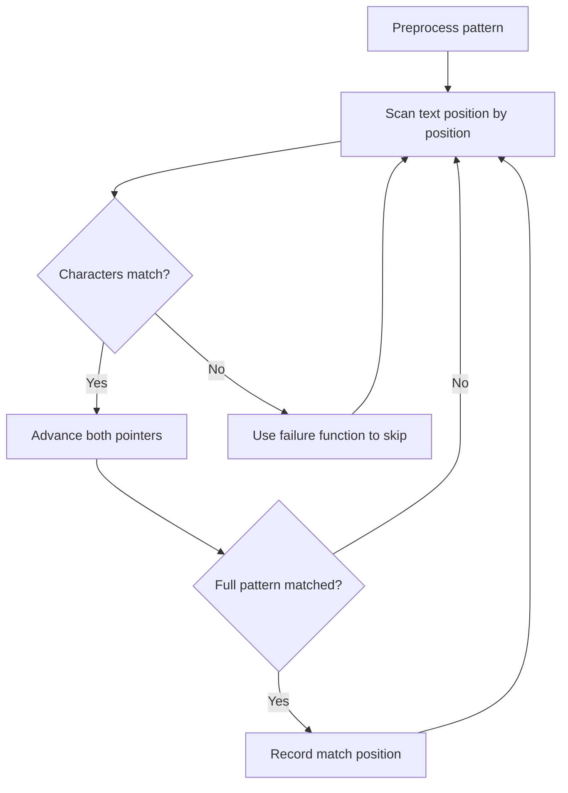

# Problem 686: Repeated String Match

**Difficulty:** Medium  
**Tags:** String, String Matching  
**Pattern:** String Matching  
**Link:** [leetcode.com/problems/repeated-string-match](https://leetcode.com/problems/repeated-string-match/)

## Description

Given two strings `a` and `b`, return *the minimum number of times you should repeat string *`a`* so that string* `b` *is a substring of it*. If it is impossible for `b`​​​​​​ to be a substring of `a` after repeating it, return `-1`.

**Notice:** string `"abc"` repeated 0 times is `""`, repeated 1 time is `"abc"` and repeated 2 times is `"abcabc"`.

 

Example 1:

```

**Input:** a = "abcd", b = "cdabcdab"
**Output:** 3
**Explanation:** We return 3 because by repeating a three times "ab**cdabcdab**cd", b is a substring of it.

```

Example 2:

```

**Input:** a = "a", b = "aa"
**Output:** 2

```

 

**Constraints:**

	- `1 <= a.length, b.length <= 10^4`
	- `a` and `b` consist of lowercase English letters.

## Approach: String Matching

Find pattern occurrences in text. Use KMP, Rabin-Karp, or Z-algorithm for efficient matching beyond brute force.

## Pseudocode

```
1. Preprocess pattern (build failure function / hash)
2. Scan text with pattern:
   a. Compare characters
   b. On mismatch: use preprocessed data to skip
   c. On full match: record position
3. Return matches
```

## Algorithm Flow



## Complexity Analysis

- **Time:** O(n + m)
- **Space:** O(m)

## Solution (Python3)

```python
class Solution:
    def repeatedStringMatch(self, a: str, b: str) -> int:
        # String matching (KMP/Rolling Hash) - O(n+m) time
        if not b or not a:
            return 0
        n, m = len(a), len(b)
        # Build failure function for KMP
        fail = [0] * m
        j = 0
        for i in range(1, m):
            while j > 0 and b[i] != b[j]:
                j = fail[j-1]
            if b[i] == b[j]:
                j += 1
            fail[i] = j
        # Search
        j = 0
        for i in range(n):
            while j > 0 and a[i] != b[j]:
                j = fail[j-1]
            if a[i] == b[j]:
                j += 1
            if j == m:
                return i - m + 1
        return -1
```

## Solution (C++)

```cpp
#include <string>
#include <vector>
using namespace std;

class Solution {
public:
    int repeatedStringMatch(string& a, string& b) {
        // String matching (KMP) - O(n+m) time
        int n = a.size(), m = b.size();
        if (m == 0) return 0;
        vector<int> fail(m, 0);
        for (int i = 1, j = 0; i < m; i++) {
            while (j > 0 && b[i] != b[j]) j = fail[j-1];
            if (b[i] == b[j]) j++;
            fail[i] = j;
        }
        for (int i = 0, j = 0; i < n; i++) {
            while (j > 0 && a[i] != b[j]) j = fail[j-1];
            if (a[i] == b[j]) j++;
            if (j == m) return i - m + 1;
        }
        return -1;
    }
};
```
