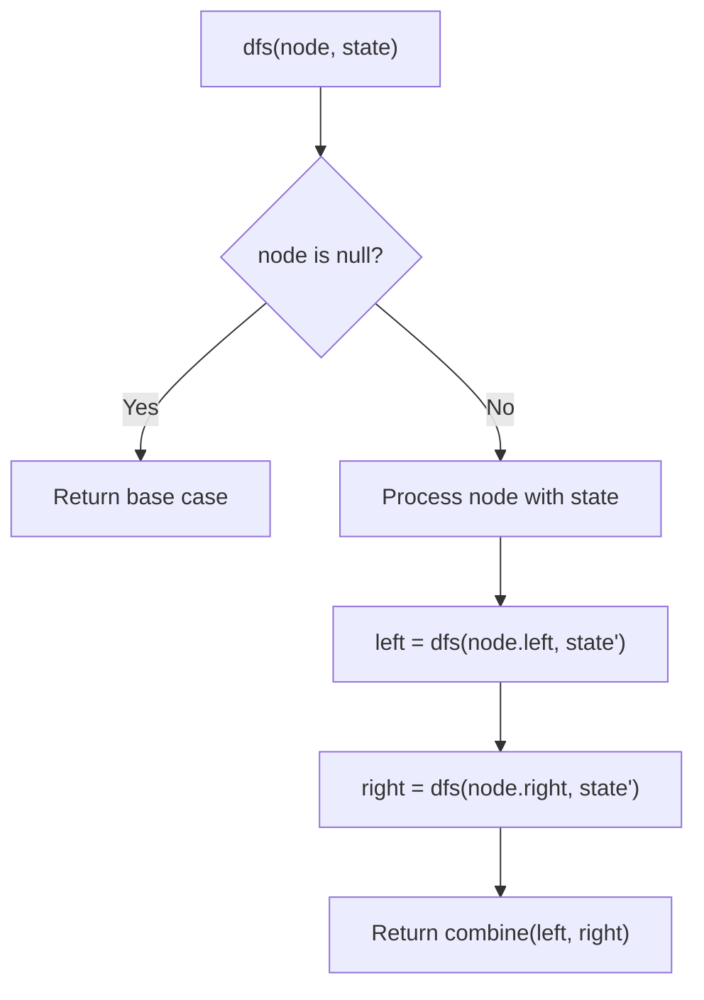
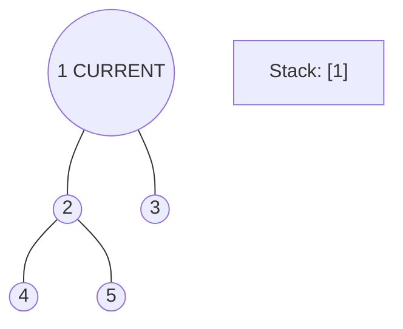
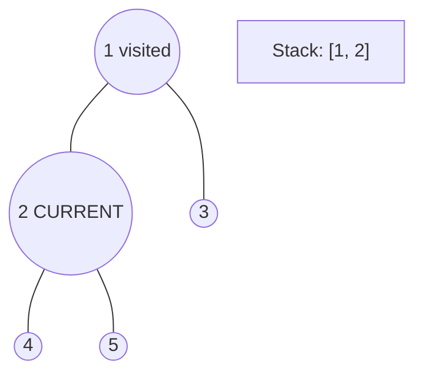
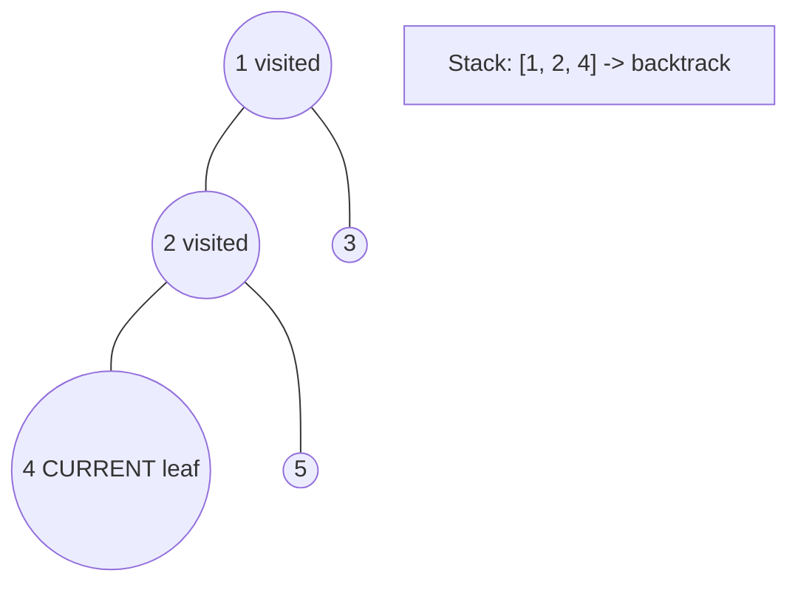
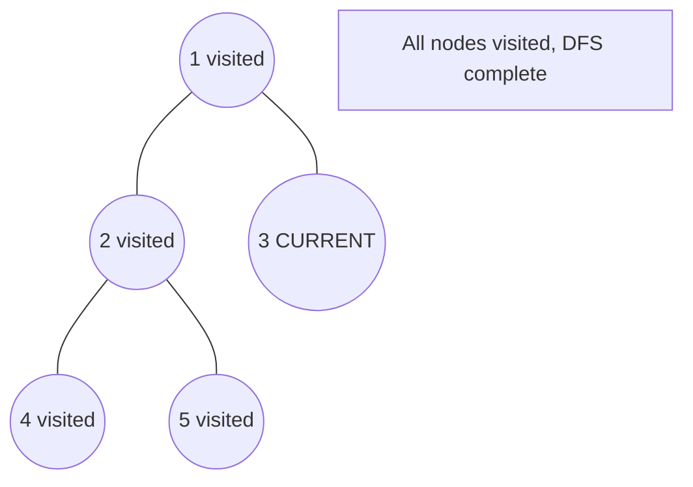

# Problem 690: Employee Importance

**Difficulty:** Medium  
**Tags:** Array, Hash Table, Tree, Depth-First Search, Breadth-First Search  
**Pattern:** DFS Tree Traversal  
**Link:** [leetcode.com/problems/employee-importance](https://leetcode.com/problems/employee-importance/)

## Description

You have a data structure of employee information, including the employee's unique ID, importance value, and direct subordinates' IDs.

You are given an array of employees `employees` where:

	- `employees[i].id` is the ID of the `i^th` employee.
	- `employees[i].importance` is the importance value of the `i^th` employee.
	- `employees[i].subordinates` is a list of the IDs of the direct subordinates of the `i^th` employee.

Given an integer `id` that represents an employee's ID, return *the **total** importance value of this employee and all their direct and indirect subordinates*.

 

Example 1:

```

**Input:** employees = [[1,5,[2,3]],[2,3,[]],[3,3,[]]], id = 1
**Output:** 11
**Explanation:** Employee 1 has an importance value of 5 and has two direct subordinates: employee 2 and employee 3.
They both have an importance value of 3.
Thus, the total importance value of employee 1 is 5 + 3 + 3 = 11.

```

Example 2:

```

**Input:** employees = [[1,2,[5]],[5,-3,[]]], id = 5
**Output:** -3
**Explanation:** Employee 5 has an importance value of -3 and has no direct subordinates.
Thus, the total importance value of employee 5 is -3.

```

 

**Constraints:**

	- `1 <= employees.length <= 2000`
	- `1 <= employees[i].id <= 2000`
	- All `employees[i].id` are **unique**.
	- `-100 <= employees[i].importance <= 100`
	- One employee has at most one direct leader and may have several subordinates.
	- The IDs in `employees[i].subordinates` are valid IDs.

## Approach: DFS Tree Traversal

Perform depth-first search on the tree. Recurse on left and right subtrees, combining results bottom-up. Track state (path, depth, sum) during traversal.

## Pseudocode

```
1. Define dfs(node, state):
   a. Base case: if null, return default
   b. Process node with current state
   c. left_result = dfs(node.left, updated_state)
   d. right_result = dfs(node.right, updated_state)
   e. Return combine(left_result, right_result)
2. Return dfs(root, initial_state)
```

## Algorithm Flow



## Visual State Transitions

**DFS Tree Traversal Step-by-Step:**

**Frame 1: Start at root**


**Frame 2: Go left - visit node 2**


**Frame 3: Go left - visit node 4 (leaf)**


**Frame 4: Backtrack, visit node 5, then node 3**



## Complexity Analysis

- **Time:** O(n)
- **Space:** O(h)

## Solution (Python3)

```python
class Employee:
    def __init__(self, id: int, importance: int, subordinates: List[int]):
        # Initialize data structure
        self.id = id
        self.importance = importance
        self.subordinates = subordinates

    def getImportance(self, employees: List['Employee'], id: int) -> int:
        return 0

```

## Solution (C++)

```cpp
#include <algorithm>
#include <functional>
#include <string>
#include <vector>
using namespace std;

class Employee {
public:
    Employee(int id, int importance, vector<int>& subordinates) {
        // Initialize
    }

    int getImportance(vector<'Employee'>& employees, int id) {
        return 0;
    }

};
```
