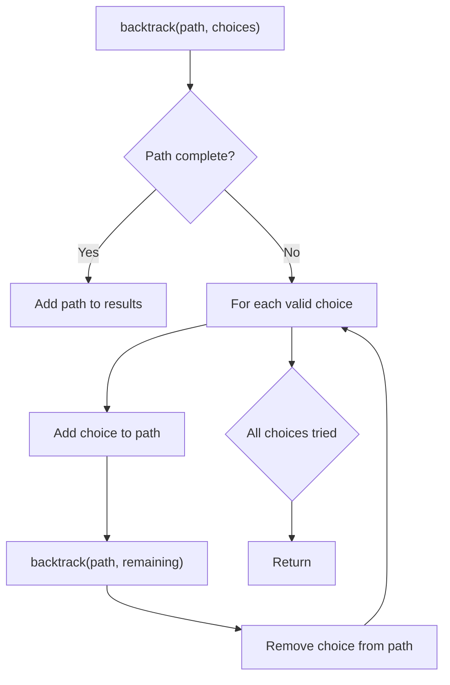
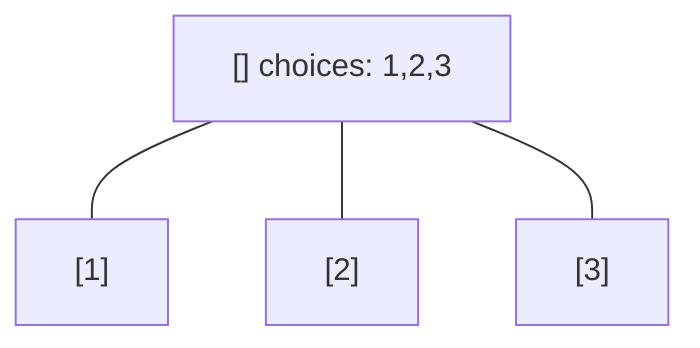
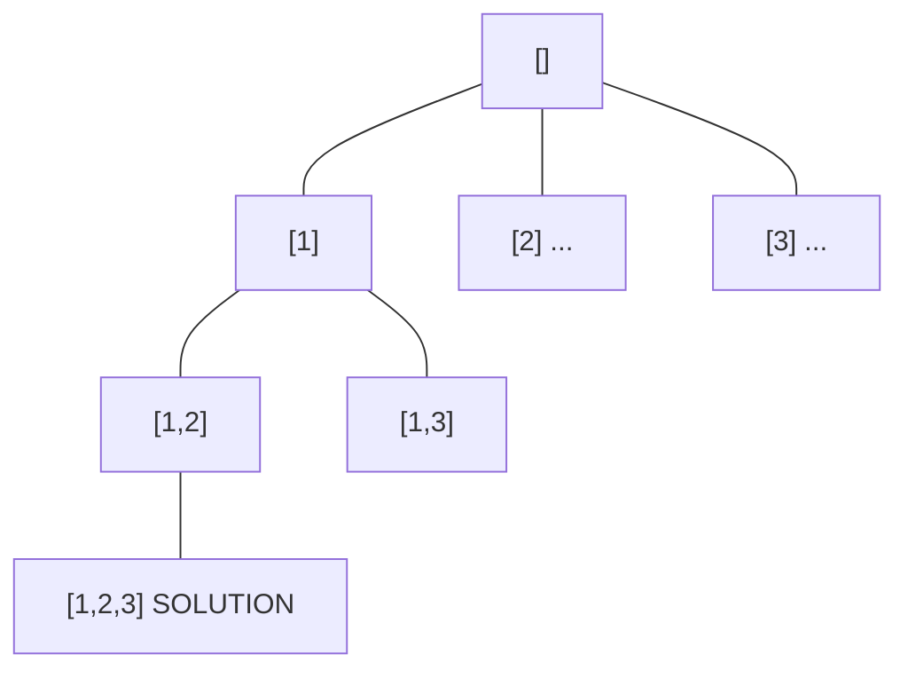
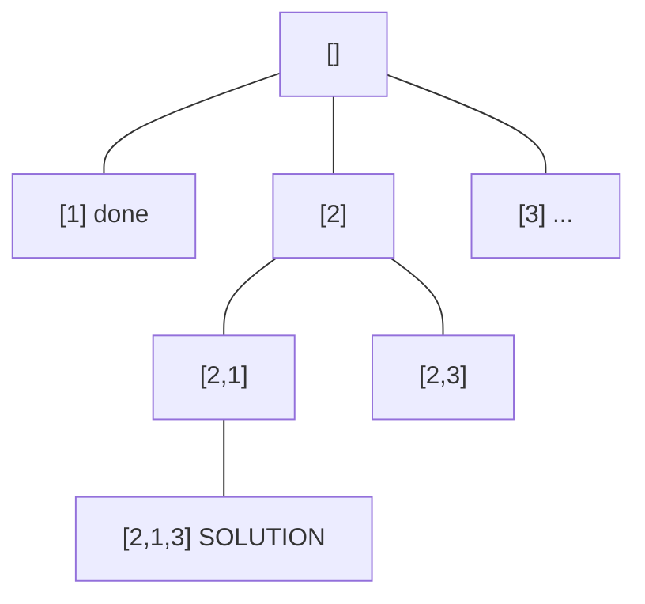
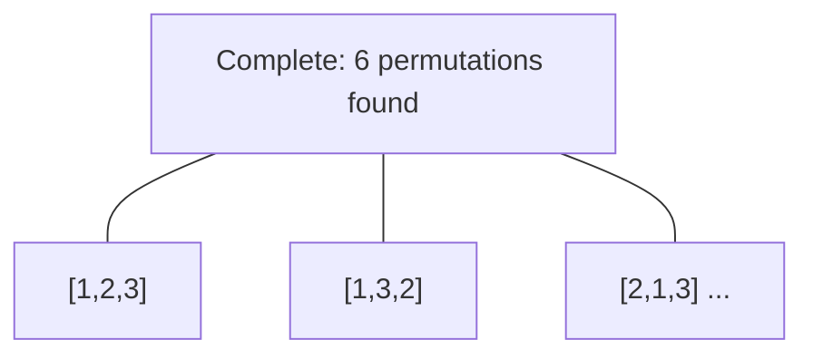

# Problem 691: Stickers to Spell Word

**Difficulty:** Hard  
**Tags:** Array, Hash Table, String, Dynamic Programming, Backtracking, Bit Manipulation, Memoization, Bitmask  
**Pattern:** Backtracking  
**Link:** [leetcode.com/problems/stickers-to-spell-word](https://leetcode.com/problems/stickers-to-spell-word/)

## Description

We are given `n` different types of `stickers`. Each sticker has a lowercase English word on it.

You would like to spell out the given string `target` by cutting individual letters from your collection of stickers and rearranging them. You can use each sticker more than once if you want, and you have infinite quantities of each sticker.

Return *the minimum number of stickers that you need to spell out *`target`. If the task is impossible, return `-1`.

**Note:** In all test cases, all words were chosen randomly from the `1000` most common US English words, and `target` was chosen as a concatenation of two random words.

 

Example 1:

```

**Input:** stickers = ["with","example","science"], target = "thehat"
**Output:** 3
**Explanation:**
We can use 2 "with" stickers, and 1 "example" sticker.
After cutting and rearrange the letters of those stickers, we can form the target "thehat".
Also, this is the minimum number of stickers necessary to form the target string.

```

Example 2:

```

**Input:** stickers = ["notice","possible"], target = "basicbasic"
**Output:** -1
Explanation:
We cannot form the target "basicbasic" from cutting letters from the given stickers.

```

 

**Constraints:**

	- `n == stickers.length`
	- `1 <= n <= 50`
	- `1 <= stickers[i].length <= 10`
	- `1 <= target.length <= 15`
	- `stickers[i]` and `target` consist of lowercase English letters.

## Approach: Backtracking

Explore all possible solutions by building candidates incrementally. At each step, make a choice and recurse. If the choice leads to a dead end, undo the choice (backtrack) and try the next option.

## Pseudocode

```
1. Define backtrack(path, choices):
   a. If path is a complete solution: add to results
   b. For each choice in choices:
      - If choice is valid:
        * Add choice to path
        * backtrack(path, remaining_choices)
        * Remove choice from path (backtrack)
2. Call backtrack([], all_choices)
```

## Algorithm Flow



## Visual State Transitions

**Backtracking Decision Tree:**

**Frame 1: Root - start with empty path**


**Frame 2: Explore branch [1]**


**Frame 3: Backtrack, explore [2]**


**Frame 4: All solutions found**



## Complexity Analysis

- **Time:** O(k^n) or O(n!)
- **Space:** O(n)

## Solution (Python3)

```python
class Solution:
    def minStickers(self, stickers: List[str], target: str) -> int:
        # Backtracking - O(2^n) or O(n!) time
        result = []
        
        def backtrack(path, start):
            result.append(path[:])
            for i in range(start, len(stickers)):
                path.append(stickers[i])
                backtrack(path, i + 1)
                path.pop()
        
        backtrack([], 0)
        return result
```

## Solution (C++)

```cpp
#include <functional>
#include <string>
#include <vector>
using namespace std;

class Solution {
public:
    int minStickers(vector<string>& stickers, string& target) {
        // Backtracking - O(2^n) or O(n!) time
        vector<vector<int>> result;
        vector<int> path;
        function<void(int)> backtrack = [&](int start) {
            result.push_back(path);
            for (int i = start; i < (int)stickers.size(); i++) {
                path.push_back(stickers[i]);
                backtrack(i + 1);
                path.pop_back();
            }
        };
        backtrack(0);
        return result;
    }
};
```
