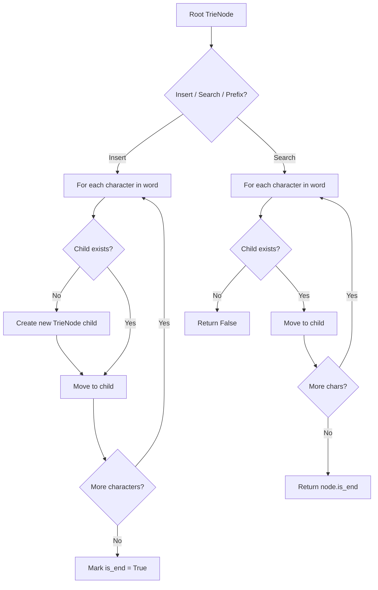
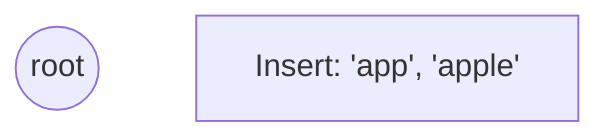
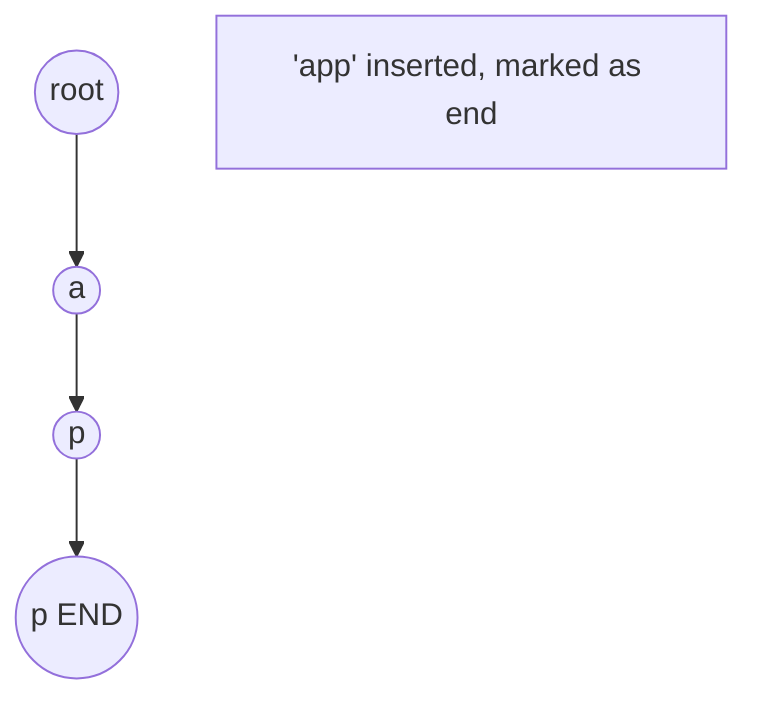
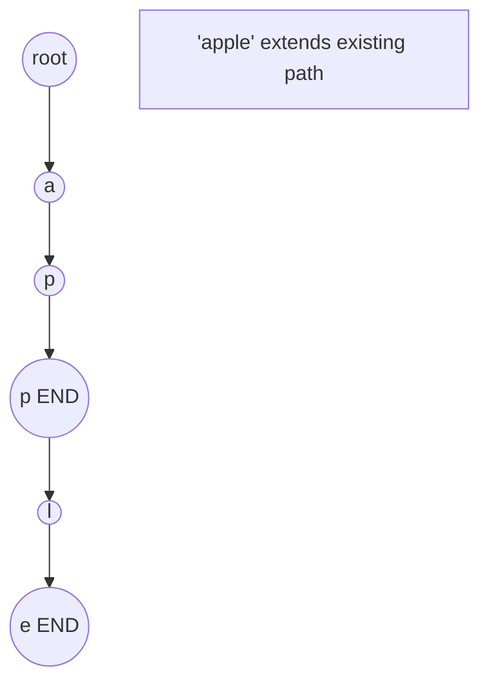
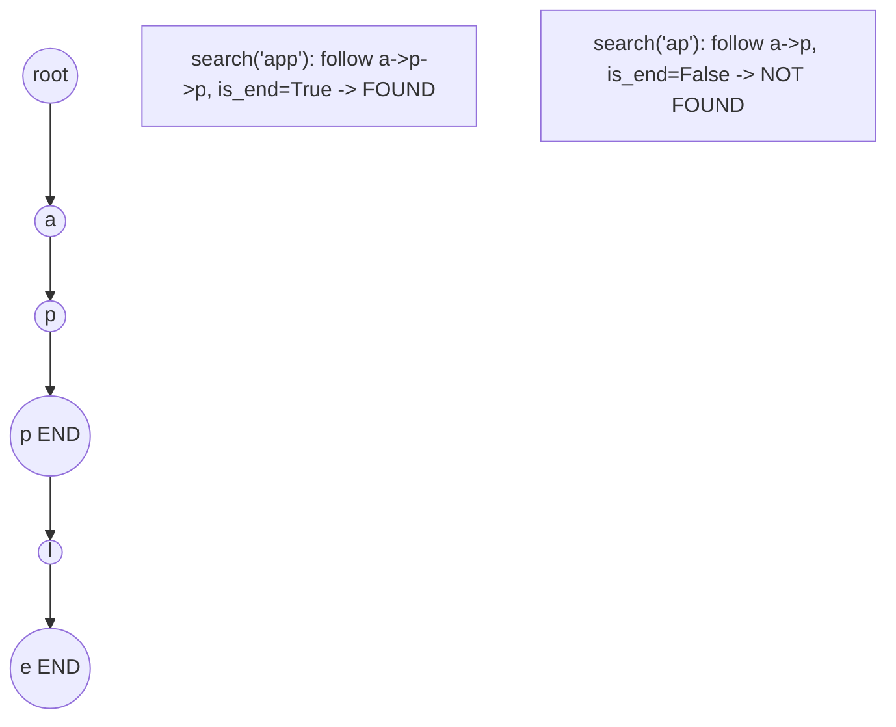

# Problem 692: Top K Frequent Words

**Difficulty:** Medium  
**Tags:** Array, Hash Table, String, Trie, Sorting, Heap (Priority Queue), Bucket Sort, Counting  
**Pattern:** Trie / Prefix Tree  
**Link:** [leetcode.com/problems/top-k-frequent-words](https://leetcode.com/problems/top-k-frequent-words/)

## Description

Given an array of strings `words` and an integer `k`, return *the *`k`* most frequent strings*.

Return the answer **sorted** by **the frequency** from highest to lowest. Sort the words with the same frequency by their **lexicographical order**.

 

Example 1:

```

**Input:** words = ["i","love","leetcode","i","love","coding"], k = 2
**Output:** ["i","love"]
**Explanation:** "i" and "love" are the two most frequent words.
Note that "i" comes before "love" due to a lower alphabetical order.

```

Example 2:

```

**Input:** words = ["the","day","is","sunny","the","the","the","sunny","is","is"], k = 4
**Output:** ["the","is","sunny","day"]
**Explanation:** "the", "is", "sunny" and "day" are the four most frequent words, with the number of occurrence being 4, 3, 2 and 1 respectively.

```

 

**Constraints:**

	- `1 <= words.length <= 500`
	- `1 <= words[i].length <= 10`
	- `words[i]` consists of lowercase English letters.
	- `k` is in the range `[1, The number of **unique** words[i]]`

 

**Follow-up:** Could you solve it in `O(n log(k))` time and `O(n)` extra space?

## Approach: Trie / Prefix Tree

Build a trie (prefix tree) where each node represents a character. Insert words character by character, and search by following child pointers. Supports efficient prefix matching.

## Pseudocode

```
1. TrieNode: children = {}, is_end = False
2. Insert(word):
   - For each char: create child if absent, move to child
   - Mark last node as end
3. Search(word):
   - For each char: if child absent return False, move to child
   - Return node.is_end
4. StartsWith(prefix): same as search but return True at end
```

## Algorithm Flow



## Visual State Transitions

**Trie Insert and Search:**

**Frame 1: Empty trie**


**Frame 2: Insert 'app'**


**Frame 3: Insert 'apple'**


**Frame 4: Search 'app' = True, 'ap' = False**



## Complexity Analysis

- **Time:** O(L) per operation
- **Space:** O(N * L)

## Solution (Python3)

```python
class Solution:
    def topKFrequent(self, words: List[str], k: int) -> List[str]:
        # Trie-based approach
        trie = {}
        # Build trie from word list
        words = words if isinstance(words, list) else [words]
        for word in words:
            node = trie
            for ch in word:
                if ch not in node:
                    node[ch] = {}
                node = node[ch]
            node['#'] = True
        
        # Search in trie
        def search(word):
            node = trie
            for ch in word:
                if ch not in node:
                    return False
                node = node[ch]
            return '#' in node
        
        return []
```

## Solution (C++)

```cpp
#include <string>
#include <vector>
using namespace std;

class Solution {
public:
    vector<string> topKFrequent(vector<string>& words, int k) {
        // Trie-based approach
        struct TrieNode {
            TrieNode* children[26] = {};
            bool isEnd = false;
        };
        TrieNode* root = new TrieNode();
        // Build trie
        for (auto& word : words) {
            TrieNode* node = root;
            for (char ch : word) {
                int idx = ch - 'a';
                if (!node->children[idx])
                    node->children[idx] = new TrieNode();
                node = node->children[idx];
            }
            node->isEnd = true;
        }
        return {};
    }
};
```
