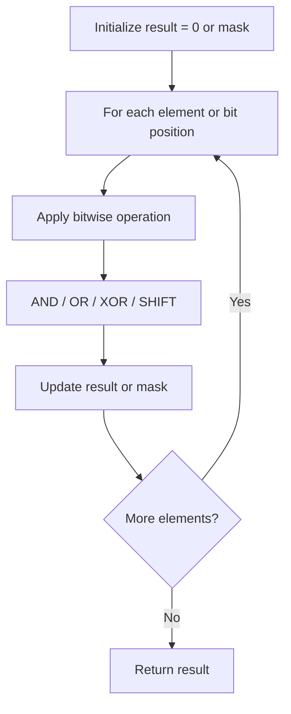

# Problem 693: Binary Number with Alternating Bits

**Difficulty:** Easy  
**Tags:** Bit Manipulation  
**Pattern:** Bit Manipulation  
**Link:** [leetcode.com/problems/binary-number-with-alternating-bits](https://leetcode.com/problems/binary-number-with-alternating-bits/)

## Description

Given a positive integer, check whether it has alternating bits: namely, if two adjacent bits will always have different values.

 

Example 1:

```

**Input:** n = 5
**Output:** true
**Explanation:** The binary representation of 5 is: 101

```

Example 2:

```

**Input:** n = 7
**Output:** false
**Explanation:** The binary representation of 7 is: 111.
```

Example 3:

```

**Input:** n = 11
**Output:** false
**Explanation:** The binary representation of 11 is: 1011.
```

 

**Constraints:**

	- `1 <= n <= 2^31 - 1`

## Approach: Bit Manipulation

Operate on individual bits using bitwise operators (AND, OR, XOR, shift). Common tricks: x & (x-1) removes lowest set bit, x ^ x = 0, XOR all elements to find unique.

## Pseudocode

```
1. Apply bitwise operations:
   - XOR all elements to cancel paired bits
   - Use bitmask to track state
   - Shift and mask to extract/set individual bits
2. Return result
```

## Algorithm Flow



## Complexity Analysis

- **Time:** O(n) or O(log n)
- **Space:** O(1)

## Solution (Python3)

```python
class Solution:
    def hasAlternatingBits(self, n: int) -> bool:
        # Bit manipulation - O(n) time, O(1) space
        result = 0
        for val in n:
            result ^= val
        return result
```

## Solution (C++)

```cpp
#include <string>
#include <vector>
using namespace std;

class Solution {
public:
    bool hasAlternatingBits(int n) {
        // Bit manipulation - O(n) time, O(1) space
        int result = 0;
        for (int val : n) {
            result ^= val;
        }
        return result;
    }
};
```
