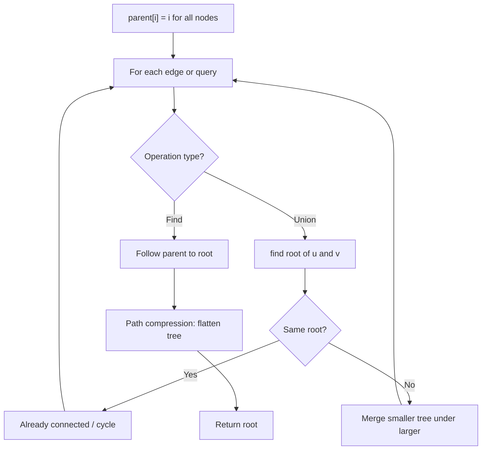
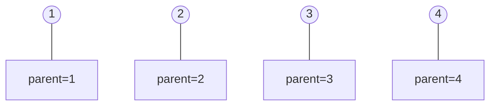
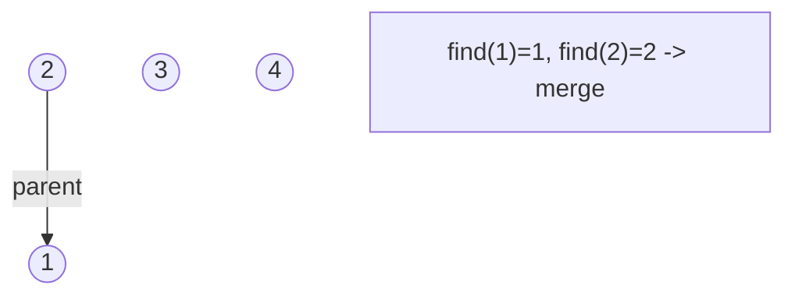
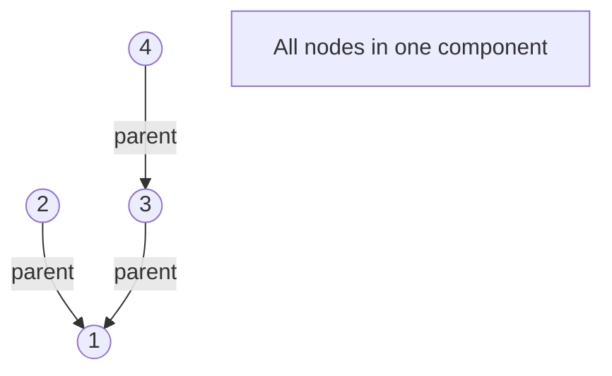
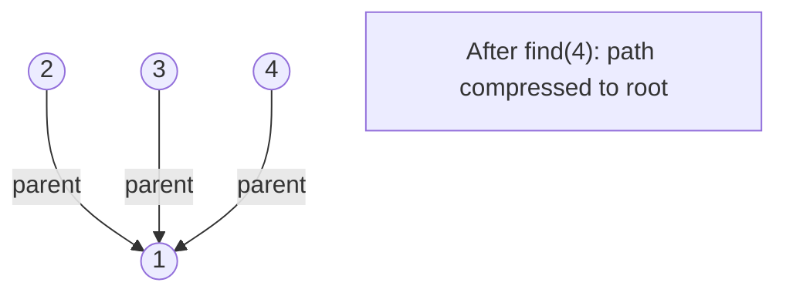

# Problem 695: Max Area of Island

**Difficulty:** Medium  
**Tags:** Array, Depth-First Search, Breadth-First Search, Union-Find, Matrix  
**Pattern:** DFS / Graph  
**Link:** [leetcode.com/problems/max-area-of-island](https://leetcode.com/problems/max-area-of-island/)

## Description

You are given an `m x n` binary matrix `grid`. An island is a group of `1`'s (representing land) connected **4-directionally** (horizontal or vertical.) You may assume all four edges of the grid are surrounded by water.

The **area** of an island is the number of cells with a value `1` in the island.

Return *the maximum **area** of an island in *`grid`. If there is no island, return `0`.

 

Example 1:

```

**Input:** grid = [[0,0,1,0,0,0,0,1,0,0,0,0,0],[0,0,0,0,0,0,0,1,1,1,0,0,0],[0,1,1,0,1,0,0,0,0,0,0,0,0],[0,1,0,0,1,1,0,0,1,0,1,0,0],[0,1,0,0,1,1,0,0,1,1,1,0,0],[0,0,0,0,0,0,0,0,0,0,1,0,0],[0,0,0,0,0,0,0,1,1,1,0,0,0],[0,0,0,0,0,0,0,1,1,0,0,0,0]]
**Output:** 6
**Explanation:** The answer is not 11, because the island must be connected 4-directionally.

```

Example 2:

```

**Input:** grid = [[0,0,0,0,0,0,0,0]]
**Output:** 0

```

 

**Constraints:**

	- `m == grid.length`
	- `n == grid[i].length`
	- `1 <= m, n <= 50`
	- `grid[i][j]` is either `0` or `1`.

## Approach: DFS / Graph

DFS from each land cell, counting area. Mark visited by setting to 0.

## Pseudocode

```
1. parent[i] = i for all nodes (each is its own set)
2. find(x): follow parent pointers to root (with path compression)
3. union(x, y): merge sets of x and y by rank
4. Process edges/operations:
   a. For each edge (u, v): union(u, v)
5. Answer queries using find()
```

## Algorithm Flow



## Visual State Transitions

**Union-Find Step-by-Step:**

**Frame 1: Initial - each node is own parent**


**Frame 2: Union(1,2) - merge components**


**Frame 3: Union(3,4) then Union(2,3)**


**Frame 4: Path compression on find(4)**



## Complexity Analysis

- **Time:** O(m*n)
- **Space:** O(m*n)

## Solution (Python3)

```python
class Solution:
    def maxAreaOfIsland(self, grid: list[list[int]]) -> int:
        m, n = len(grid), len(grid[0])
        def dfs(r, c):
            if r < 0 or r >= m or c < 0 or c >= n or grid[r][c] == 0:
                return 0
            grid[r][c] = 0
            return 1 + dfs(r+1,c) + dfs(r-1,c) + dfs(r,c+1) + dfs(r,c-1)
        return max((dfs(r, c) for r in range(m) for c in range(n)), default=0)
```

## Solution (C++)

```cpp
#include <functional>
#include <numeric>
#include <string>
#include <vector>
using namespace std;

class Solution {
public:
    int maxAreaOfIsland(vector<vector<int>>& grid) {
        // Union Find (DSU) - O(n * alpha(n))
        int n = grid.size();
        vector<int> parent(n + 1), rnk(n + 1, 0);
        iota(parent.begin(), parent.end(), 0);
        function<int(int)> find = [&](int x) -> int {
            return parent[x] == x ? x : parent[x] = find(parent[x]);
        };
        auto unite = [&](int x, int y) -> bool {
            int px = find(x), py = find(y);
            if (px == py) return false;
            if (rnk[px] < rnk[py]) swap(px, py);
            parent[py] = px;
            if (rnk[px] == rnk[py]) rnk[px]++;
            return true;
        };
        int components = n;
        return components;
    }
};
```
