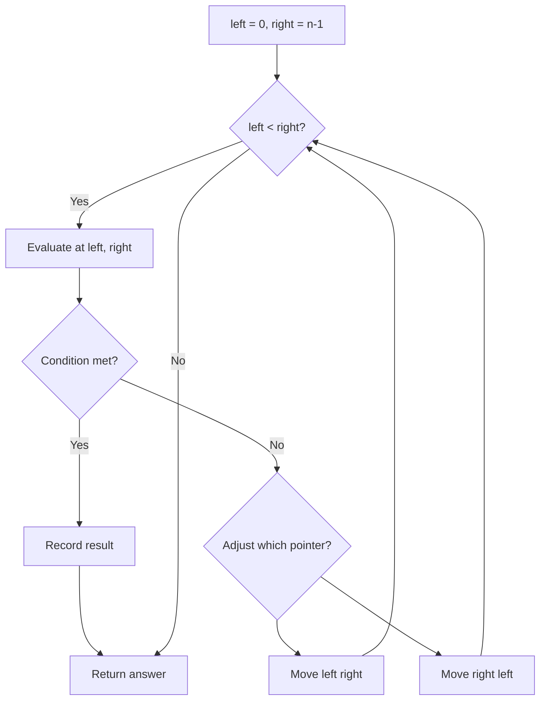
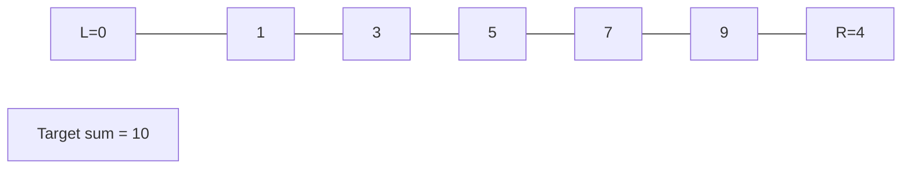
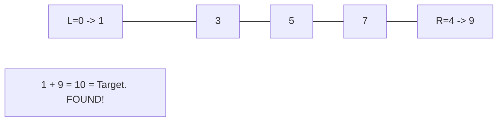

# Problem 696: Count Binary Substrings

**Difficulty:** Easy  
**Tags:** Two Pointers, String  
**Pattern:** Two Pointers  
**Link:** [leetcode.com/problems/count-binary-substrings](https://leetcode.com/problems/count-binary-substrings/)

## Description

Given a binary string `s`, return the number of non-empty substrings that have the same number of `0`'s and `1`'s, and all the `0`'s and all the `1`'s in these substrings are grouped consecutively.

Substrings that occur multiple times are counted the number of times they occur.

 

Example 1:

```

**Input:** s = "00110011"
**Output:** 6
**Explanation:** There are 6 substrings that have equal number of consecutive 1's and 0's: "0011", "01", "1100", "10", "0011", and "01".
Notice that some of these substrings repeat and are counted the number of times they occur.
Also, "00110011" is not a valid substring because all the 0's (and 1's) are not grouped together.

```

Example 2:

```

**Input:** s = "10101"
**Output:** 4
**Explanation:** There are 4 substrings: "10", "01", "10", "01" that have equal number of consecutive 1's and 0's.

```

 

**Constraints:**

	- `1 <= s.length <= 10^5`
	- `s[i]` is either `'0'` or `'1'`.

## Approach: Two Pointers

Use two pointers moving through the data structure. Depending on the problem, pointers may move toward each other (converging), in the same direction (fast/slow), or independently.

## Pseudocode

```
1. Initialize left = 0, right = n-1 (or two independent pointers)
2. While pointers haven't crossed:
   a. Evaluate condition at pointer positions
   b. Move left pointer right or right pointer left
3. Return result
```

## Algorithm Flow



## Visual State Transitions

**Two Pointer Convergence:**

**Frame 1: Initialize pointers**


**Frame 2: Sum = 1+9 = 10, found!**



## Complexity Analysis

- **Time:** O(n)
- **Space:** O(1)

## Solution (Python3)

```python
class Solution:
    def countBinarySubstrings(self, s: str) -> int:
        # Two pointer approach - O(n) time, O(1) space
        left, right = 0, len(s) - 1
        while left < right:
            curr = s[left] + s[right]
            if curr == s:
                return [left, right]
            elif curr < s:
                left += 1
            else:
                right -= 1
        return 0
```

## Solution (C++)

```cpp
#include <string>
#include <vector>
using namespace std;

class Solution {
public:
    int countBinarySubstrings(string& s) {
        // Two pointer approach - O(n) time, O(1) space
        int left = 0, right = s.size() - 1;
        while (left < right) {
            int curr = s[left] + s[right];
            if (curr == s) {
                return {left, right};
            } else if (curr < s) {
                left++;
            } else {
                right--;
            }
        }
        return 0;
    }
};
```
