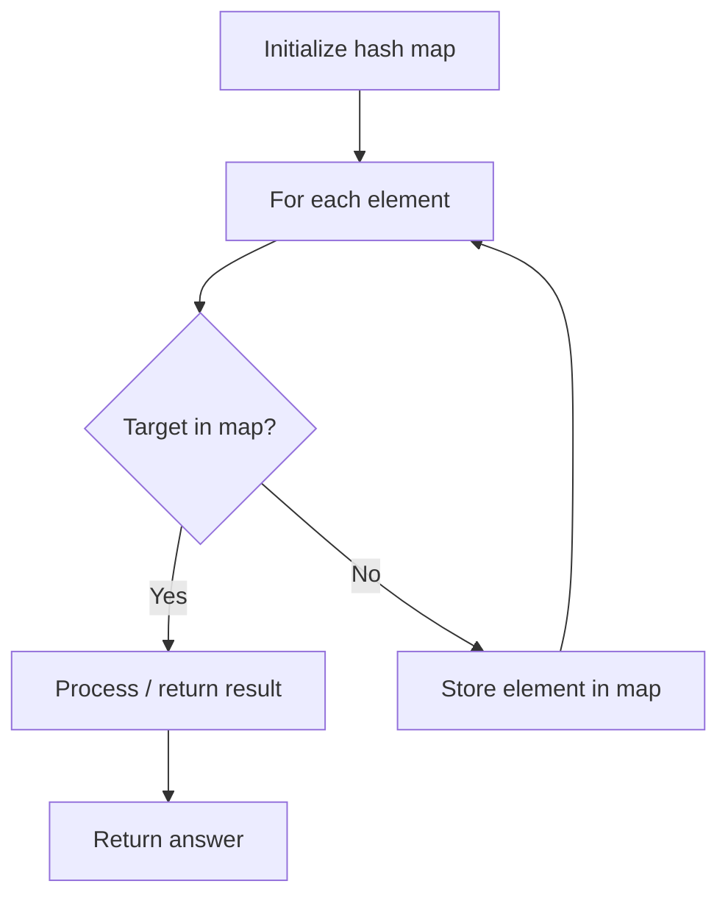

# Problem 697: Degree of an Array

**Difficulty:** Easy  
**Tags:** Array, Hash Table  
**Pattern:** Hash Map Lookup  
**Link:** [leetcode.com/problems/degree-of-an-array](https://leetcode.com/problems/degree-of-an-array/)

## Description

Given a non-empty array of non-negative integers `nums`, the **degree** of this array is defined as the maximum frequency of any one of its elements.

Your task is to find the smallest possible length of a (contiguous) subarray of `nums`, that has the same degree as `nums`.

 

Example 1:

```

**Input:** nums = [1,2,2,3,1]
**Output:** 2
**Explanation:** 
The input array has a degree of 2 because both elements 1 and 2 appear twice.
Of the subarrays that have the same degree:
[1, 2, 2, 3, 1], [1, 2, 2, 3], [2, 2, 3, 1], [1, 2, 2], [2, 2, 3], [2, 2]
The shortest length is 2. So return 2.

```

Example 2:

```

**Input:** nums = [1,2,2,3,1,4,2]
**Output:** 6
**Explanation:** 
The degree is 3 because the element 2 is repeated 3 times.
So [2,2,3,1,4,2] is the shortest subarray, therefore returning 6.

```

 

**Constraints:**

	- `nums.length` will be between 1 and 50,000.
	- `nums[i]` will be an integer between 0 and 49,999.

## Approach: Hash Map Lookup

Use a hash map (dictionary) to store elements for O(1) lookup. Iterate through the input, checking membership or counting frequencies in the map.

## Pseudocode

```
1. Initialize hash map
2. Iterate through elements:
   a. Check if target/complement exists in map
   b. If found: process result
   c. Otherwise: store element in map
3. Return result
```

## Algorithm Flow



## Complexity Analysis

- **Time:** O(n)
- **Space:** O(n)

## Solution (Python3)

```python
class Solution:
    def findShortestSubArray(self, nums: List[int]) -> int:
        # Hash map approach - O(n) time, O(n) space
        seen = {}
        for i, val in enumerate(nums):
            complement = nums - val
            if complement in seen:
                return [seen[complement], i]
            seen[val] = i
        return 0
```

## Solution (C++)

```cpp
#include <string>
#include <unordered_map>
#include <vector>
using namespace std;

class Solution {
public:
    int findShortestSubArray(vector<int>& nums) {
        // Hash map approach - O(n) time, O(n) space
        unordered_map<int, int> seen;
        for (int i = 0; i < nums.size(); i++) {
            int complement = nums - nums[i];
            if (seen.count(complement)) {
                return {seen[complement], i};
            }
            seen[nums[i]] = i;
        }
        return 0;
    }
};
```
