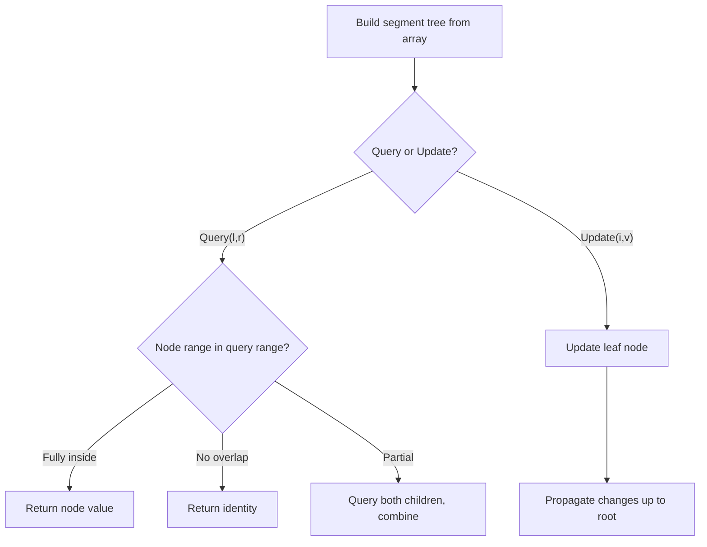

# Problem 699: Falling Squares

**Difficulty:** Hard  
**Tags:** Array, Segment Tree, Ordered Set  
**Pattern:** Segment Tree  
**Link:** [leetcode.com/problems/falling-squares](https://leetcode.com/problems/falling-squares/)

## Description

There are several squares being dropped onto the X-axis of a 2D plane.

You are given a 2D integer array `positions` where `positions[i] = [lefti, sideLengthi]` represents the `i^th` square with a side length of `sideLengthi` that is dropped with its left edge aligned with X-coordinate `lefti`.

Each square is dropped one at a time from a height above any landed squares. It then falls downward (negative Y direction) until it either lands **on the top side of another square** or **on the X-axis**. A square brushing the left/right side of another square does not count as landing on it. Once it lands, it freezes in place and cannot be moved.

After each square is dropped, you must record the **height of the current tallest stack of squares**.

Return *an integer array *`ans`* where *`ans[i]`* represents the height described above after dropping the *`i^th`* square*.

 

Example 1:

```

**Input:** positions = [[1,2],[2,3],[6,1]]
**Output:** [2,5,5]
**Explanation:**
After the first drop, the tallest stack is square 1 with a height of 2.
After the second drop, the tallest stack is squares 1 and 2 with a height of 5.
After the third drop, the tallest stack is still squares 1 and 2 with a height of 5.
Thus, we return an answer of [2, 5, 5].

```

Example 2:

```

**Input:** positions = [[100,100],[200,100]]
**Output:** [100,100]
**Explanation:**
After the first drop, the tallest stack is square 1 with a height of 100.
After the second drop, the tallest stack is either square 1 or square 2, both with heights of 100.
Thus, we return an answer of [100, 100].
Note that square 2 only brushes the right side of square 1, which does not count as landing on it.

```

 

**Constraints:**

	- `1 <= positions.length <= 1000`
	- `1 <= lefti <= 10^8`
	- `1 <= sideLengthi <= 10^6`

## Approach: Segment Tree

Build a segment tree for range queries (sum, min, max) with point or range updates. Each node covers a range; queries are answered by combining relevant segments.

## Pseudocode

```
1. Build segment tree from array (O(n))
2. Query(l, r):
   - If node range within [l,r]: return node value
   - If no overlap: return identity
   - Else: combine query(left_child) and query(right_child)
3. Update(i, val): update leaf and propagate up
```

## Algorithm Flow



## Complexity Analysis

- **Time:** O(n log n) build, O(log n) query/update
- **Space:** O(n)

## Solution (Python3)

```python
class Solution:
    def fallingSquares(self, positions: List[List[int]]) -> List[int]:
        # Segment tree for range queries - O(n log n) build, O(log n) query
        n = len(positions)
        tree = [0] * (4 * n)
        
        def build(node, start, end):
            if start == end:
                tree[node] = positions[start]
                return
            mid = (start + end) // 2
            build(2*node, start, mid)
            build(2*node+1, mid+1, end)
            tree[node] = tree[2*node] + tree[2*node+1]
        
        def query(node, start, end, l, r):
            if r < start or end < l:
                return 0
            if l <= start and end <= r:
                return tree[node]
            mid = (start + end) // 2
            return query(2*node, start, mid, l, r) + query(2*node+1, mid+1, end, l, r)
        
        build(1, 0, n-1)
        return []
```

## Solution (C++)

```cpp
#include <functional>
#include <string>
#include <vector>
using namespace std;

class Solution {
public:
    vector<int> fallingSquares(vector<vector<int>>& positions) {
        // Segment tree for range queries
        int n = positions.size();
        vector<int> tree(4 * n, 0);
        function<void(int, int, int)> build = [&](int node, int s, int e) {
            if (s == e) { tree[node] = positions[s]; return; }
            int mid = (s + e) / 2;
            build(2*node, s, mid);
            build(2*node+1, mid+1, e);
            tree[node] = tree[2*node] + tree[2*node+1];
        };
        function<int(int, int, int, int, int)> query = [&](int node, int s, int e, int l, int r) -> int {
            if (r < s || e < l) return 0;
            if (l <= s && e <= r) return tree[node];
            int mid = (s + e) / 2;
            return query(2*node, s, mid, l, r) + query(2*node+1, mid+1, e, l, r);
        };
        build(1, 0, n-1);
        return {};
    }
};
```
