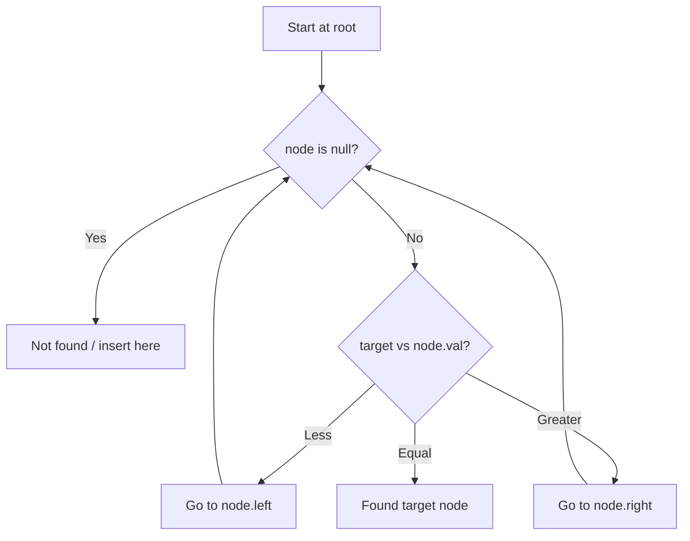

# Problem 701: Insert into a Binary Search Tree

**Difficulty:** Medium  
**Tags:** Tree, Binary Search Tree, Binary Tree  
**Pattern:** Binary Search Tree  
**Link:** [leetcode.com/problems/insert-into-a-binary-search-tree](https://leetcode.com/problems/insert-into-a-binary-search-tree/)

## Description

You are given the `root` node of a binary search tree (BST) and a `value` to insert into the tree. Return *the root node of the BST after the insertion*. It is **guaranteed** that the new value does not exist in the original BST.

**Notice** that there may exist multiple valid ways for the insertion, as long as the tree remains a BST after insertion. You can return **any of them**.

 

Example 1:

```

**Input:** root = [4,2,7,1,3], val = 5
**Output:** [4,2,7,1,3,5]
**Explanation:** Another accepted tree is:

```

Example 2:

```

**Input:** root = [40,20,60,10,30,50,70], val = 25
**Output:** [40,20,60,10,30,50,70,null,null,25]

```

Example 3:

```

**Input:** root = [4,2,7,1,3,null,null,null,null,null,null], val = 5
**Output:** [4,2,7,1,3,5]

```

 

**Constraints:**

	- The number of nodes in the tree will be in the range `[0, 10^4]`.
	- `-10^8 <= Node.val <= 10^8`
	- All the values `Node.val` are **unique**.
	- `-10^8 <= val <= 10^8`
	- It's **guaranteed** that `val` does not exist in the original BST.

## Approach: Binary Search Tree

Leverage BST property: left < root < right. Navigate left for smaller values, right for larger values. Inorder traversal yields sorted order.

## Pseudocode

```
1. Start at root
2. Compare target with current node:
   a. If target < node.val: go left
   b. If target > node.val: go right
   c. If equal: found
3. Return result
```

## Algorithm Flow



## Complexity Analysis

- **Time:** O(h)
- **Space:** O(h)

## Solution (Python3)

```python
class Solution:
    def insertIntoBST(self, root: Optional[TreeNode], val: int) -> Optional[TreeNode]:
        # BST search/insert - O(h) time
        def search(node, target):
            if not node:
                return None
            if target == node.val:
                return node
            elif target < node.val:
                return search(node.left, target)
            else:
                return search(node.right, target)
        return search(root, val if 'val' != 'root' else 0)
```

## Solution (C++)

```cpp
#include <functional>
#include <string>
#include <vector>
using namespace std;

class Solution {
public:
    TreeNode* insertIntoBST(TreeNode* root, int val) {
        // BST search/insert - O(h) time
        function<TreeNode*(TreeNode*, int)> search = [&](TreeNode* node, int target) -> TreeNode* {
            if (!node) return nullptr;
            if (target == node->val) return node;
            else if (target < node->val) return search(node->left, target);
            else return search(node->right, target);
        };
        return search(root, val);
    }
};
```
