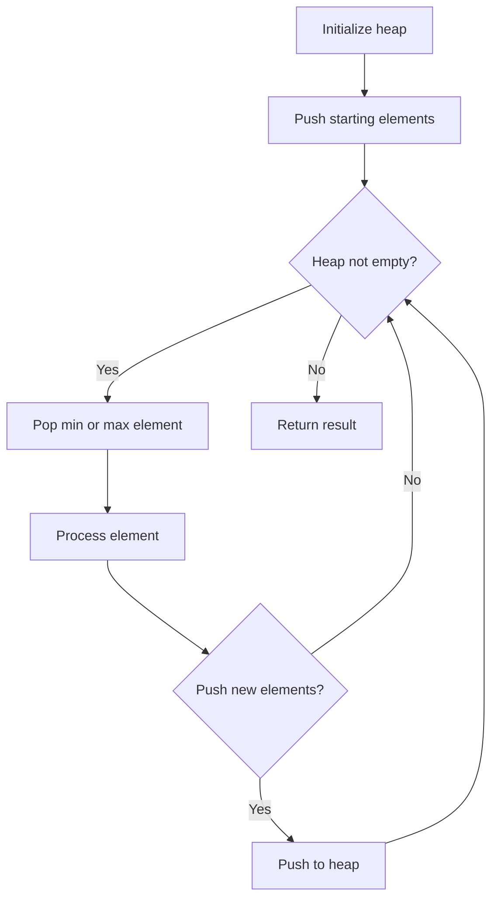
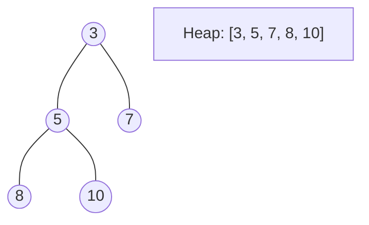
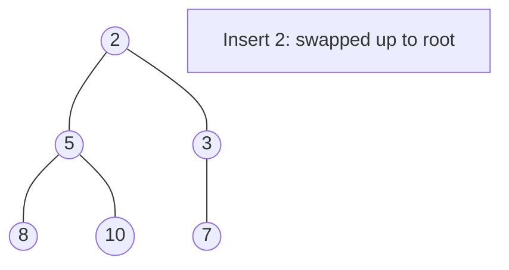
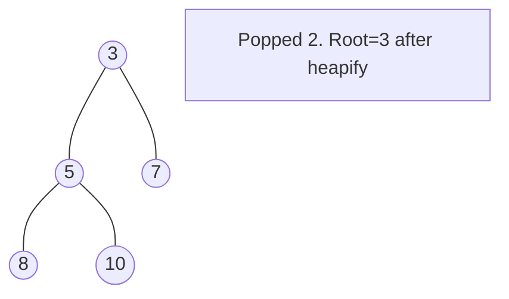

# Problem 703: Kth Largest Element in a Stream

**Difficulty:** Easy  
**Tags:** Tree, Design, Binary Search Tree, Heap (Priority Queue), Binary Tree, Data Stream  
**Pattern:** Heap / Design  
**Link:** [leetcode.com/problems/kth-largest-element-in-a-stream](https://leetcode.com/problems/kth-largest-element-in-a-stream/)

## Description

You are part of a university admissions office and need to keep track of the `kth` highest test score from applicants in real-time. This helps to determine cut-off marks for interviews and admissions dynamically as new applicants submit their scores.

You are tasked to implement a class which, for a given integer `k`, maintains a stream of test scores and continuously returns the `k`th highest test score **after** a new score has been submitted. More specifically, we are looking for the `k`th highest score in the sorted list of all scores.

Implement the `KthLargest` class:

	- `KthLargest(int k, int[] nums)` Initializes the object with the integer `k` and the stream of test scores `nums`.
	- `int add(int val)` Adds a new test score `val` to the stream and returns the element representing the `k^th` largest element in the pool of test scores so far.

 

Example 1:

**Input:**

["KthLargest", "add", "add", "add", "add", "add"]

[[3, [4, 5, 8, 2]], [3], [5], [10], [9], [4]]

**Output:** [null, 4, 5, 5, 8, 8]

**Explanation:**

KthLargest kthLargest = new KthLargest(3, [4, 5, 8, 2]);

kthLargest.add(3); // return 4

kthLargest.add(5); // return 5

kthLargest.add(10); // return 5

kthLargest.add(9); // return 8

kthLargest.add(4); // return 8

Example 2:

**Input:**

["KthLargest", "add", "add", "add", "add"]

[[4, [7, 7, 7, 7, 8, 3]], [2], [10], [9], [9]]

**Output:** [null, 7, 7, 7, 8]

**Explanation:**

KthLargest kthLargest = new KthLargest(4, [7, 7, 7, 7, 8, 3]);

kthLargest.add(2); // return 7

kthLargest.add(10); // return 7

kthLargest.add(9); // return 7

kthLargest.add(9); // return 8

 

**Constraints:**

	- `0 <= nums.length <= 10^4`
	- `1 <= k <= nums.length + 1`
	- `-10^4 <= nums[i] <= 10^4`
	- `-10^4 <= val <= 10^4`
	- At most `10^4` calls will be made to `add`.

## Approach: Heap / Design

Maintain a min-heap of size k. The top is always the kth largest.

## Pseudocode

```
1. Initialize heap (min or max)
2. Push initial elements onto heap
3. While heap not empty and condition:
   a. Pop top element (min or max)
   b. Process element
   c. Push new elements if needed
4. Return result
```

## Algorithm Flow



## Visual State Transitions

**Heap Operations (Min-Heap):**

**Frame 1: Initial heap**


**Frame 2: Insert 2 - bubble up**


**Frame 3: Pop minimum (2) - heapify down**



## Complexity Analysis

- **Time:** O(log k) per add
- **Space:** O(k)

## Solution (Python3)

```python
import heapq

class KthLargest:
    def __init__(self, k: int, nums: list[int]):
        self.k = k
        self.heap = nums
        heapq.heapify(self.heap)
        while len(self.heap) > k:
            heapq.heappop(self.heap)

    def add(self, val: int) -> int:
        heapq.heappush(self.heap, val)
        if len(self.heap) > self.k:
            heapq.heappop(self.heap)
        return self.heap[0]
```

## Solution (C++)

```cpp
#include <queue>
#include <string>
#include <vector>
using namespace std;

class KthLargest {
public:
    KthLargest(int k, vector<int>& nums) {
        // Initialize
    }

    int add(int val) {
        return 0;
    }

};
```
