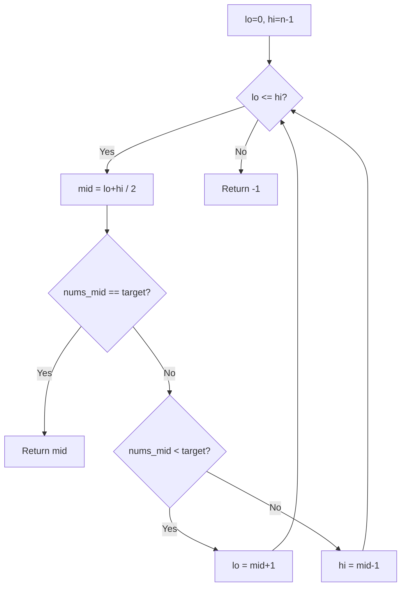
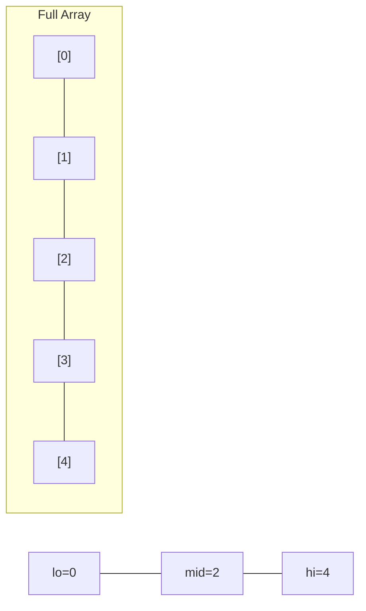
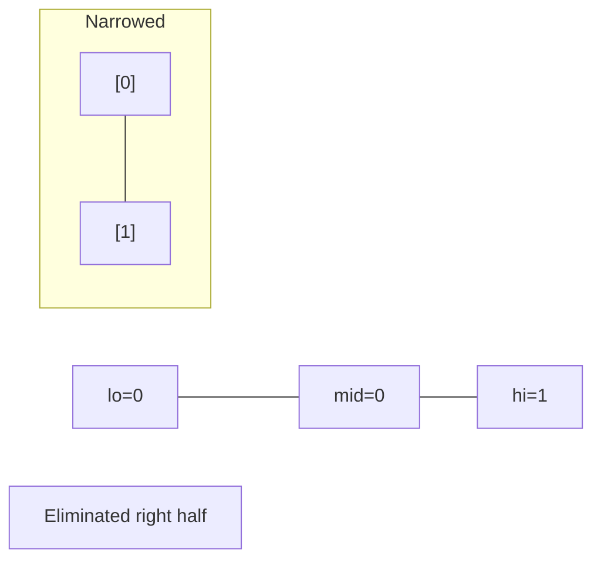
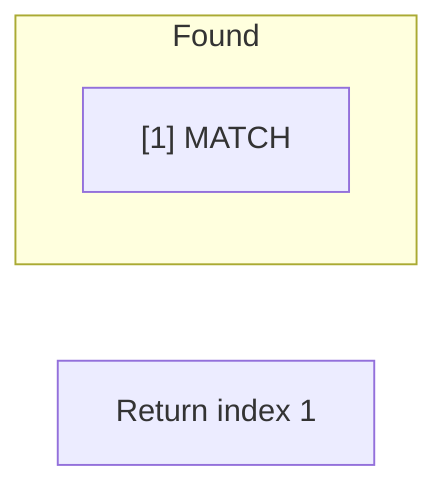

# Problem 704: Binary Search

**Difficulty:** Easy  
**Tags:** Array, Binary Search  
**Pattern:** Binary Search  
**Link:** [leetcode.com/problems/binary-search](https://leetcode.com/problems/binary-search/)

## Description

Given an array of integers `nums` which is sorted in ascending order, and an integer `target`, write a function to search `target` in `nums`. If `target` exists, then return its index. Otherwise, return `-1`.

You must write an algorithm with `O(log n)` runtime complexity.

 

Example 1:

```

**Input:** nums = [-1,0,3,5,9,12], target = 9
**Output:** 4
**Explanation:** 9 exists in nums and its index is 4

```

Example 2:

```

**Input:** nums = [-1,0,3,5,9,12], target = 2
**Output:** -1
**Explanation:** 2 does not exist in nums so return -1

```

 

**Constraints:**

	- `1 <= nums.length <= 10^4`
	- `-10^4 < nums[i], target < 10^4`
	- All the integers in `nums` are **unique**.
	- `nums` is sorted in ascending order.

## Approach: Binary Search

Classic binary search.

## Pseudocode

```
1. lo = lower_bound, hi = upper_bound
2. While lo <= hi (or lo < hi):
   a. mid = (lo + hi) // 2
   b. If condition(mid) is satisfied: record answer, search left half
   c. Else: search right half
3. Return answer
```

## Algorithm Flow



## Visual State Transitions

**Binary Search Step-by-Step:**

**Frame 1: Initial search space**


**Frame 2: Compare mid, narrow search**


**Frame 3: Found target**



## Complexity Analysis

- **Time:** O(log n)
- **Space:** O(1)

## Solution (Python3)

```python
class Solution:
    def search(self, nums: list[int], target: int) -> int:
        lo, hi = 0, len(nums) - 1
        while lo <= hi:
            mid = (lo + hi) // 2
            if nums[mid] == target:
                return mid
            elif nums[mid] < target:
                lo = mid + 1
            else:
                hi = mid - 1
        return -1
```

## Solution (C++)

```cpp
#include <string>
#include <vector>
using namespace std;

class Solution {
public:
    int search(vector<int>& nums, int target) {
        // Binary search - O(log n) time, O(1) space
        int lo = 0, hi = nums.size() - 1;
        while (lo <= hi) {
            int mid = lo + (hi - lo) / 2;
            if (nums[mid] == target) {
                return mid;
            } else if (nums[mid] < target) {
                lo = mid + 1;
            } else {
                hi = mid - 1;
            }
        }
        return 0;
    }
};
```
