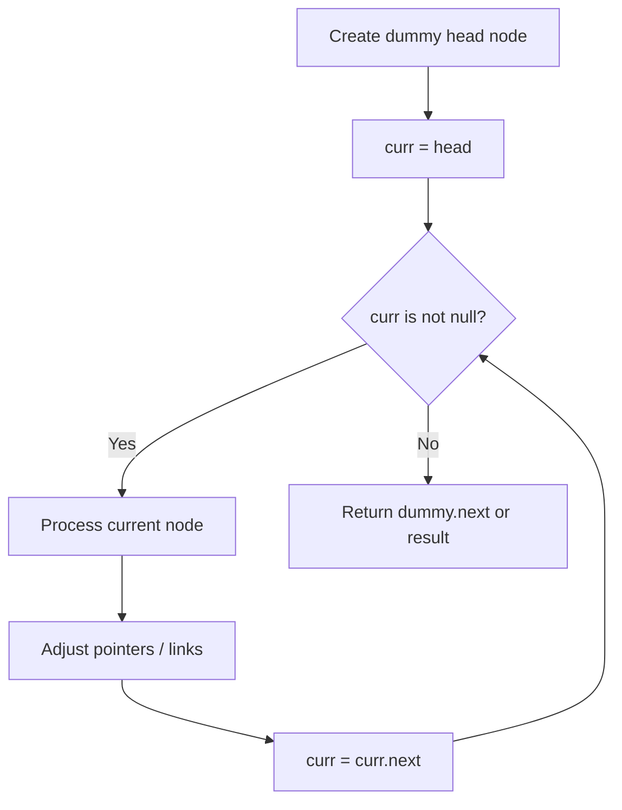
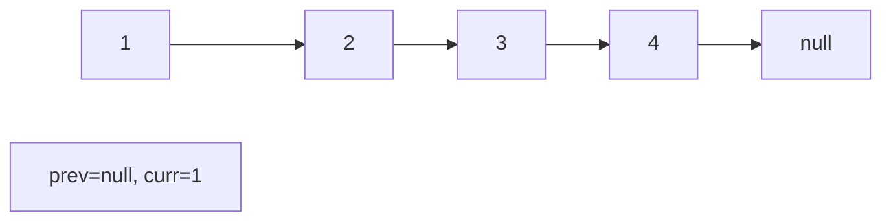
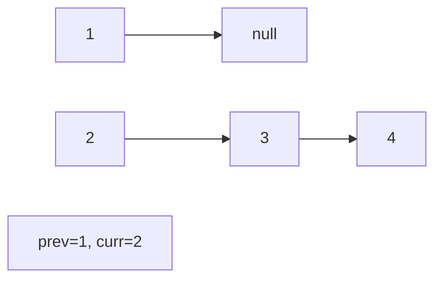
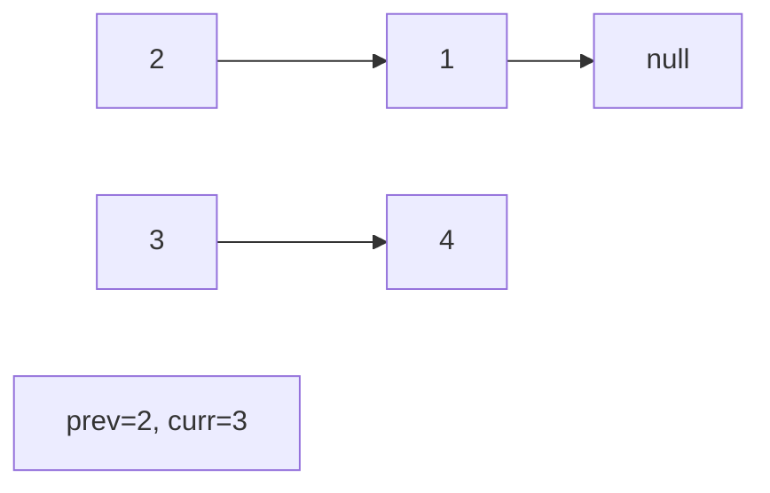
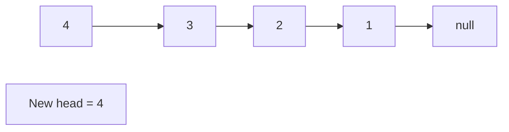

# Problem 705: Design HashSet

**Difficulty:** Easy  
**Tags:** Array, Hash Table, Linked List, Design, Hash Function  
**Pattern:** Linked List  
**Link:** [leetcode.com/problems/design-hashset](https://leetcode.com/problems/design-hashset/)

## Description

Design a HashSet without using any built-in hash table libraries.

Implement `MyHashSet` class:

	- `void add(key)` Inserts the value `key` into the HashSet.
	- `bool contains(key)` Returns whether the value `key` exists in the HashSet or not.
	- `void remove(key)` Removes the value `key` in the HashSet. If `key` does not exist in the HashSet, do nothing.

 

Example 1:

```

**Input**
["MyHashSet", "add", "add", "contains", "contains", "add", "contains", "remove", "contains"]
[[], [1], [2], [1], [3], [2], [2], [2], [2]]
**Output**
[null, null, null, true, false, null, true, null, false]

**Explanation**
MyHashSet myHashSet = new MyHashSet();
myHashSet.add(1);      // set = [1]
myHashSet.add(2);      // set = [1, 2]
myHashSet.contains(1); // return True
myHashSet.contains(3); // return False, (not found)
myHashSet.add(2);      // set = [1, 2]
myHashSet.contains(2); // return True
myHashSet.remove(2);   // set = [1]
myHashSet.contains(2); // return False, (already removed)
```

 

**Constraints:**

	- `0 <= key <= 10^6`
	- At most `10^4` calls will be made to `add`, `remove`, and `contains`.

## Approach: Linked List

Traverse or manipulate the linked list using pointer techniques. Common patterns: dummy head node for edge cases, fast/slow pointers for cycle detection or middle finding, in-place reversal, and merge operations.

## Pseudocode

```
1. Create dummy head if needed
2. Initialize pointer(s) at head
3. Traverse / modify list:
   a. Process current node
   b. Adjust next pointers as needed
   c. Move to next node
4. Return dummy.next or result
```

## Algorithm Flow



## Visual State Transitions

**Linked List Operation (Reverse):**

**Frame 1: Initial list**


**Frame 2: Reverse first link**


**Frame 3: Reverse second link**


**Frame 4: Fully reversed**



## Complexity Analysis

- **Time:** O(n)
- **Space:** O(1)

## Solution (Python3)

```python
class MyHashSet:
    def __init__(self):
        # Initialize data structure
        pass

    def add(self, key: int) -> None:
        return None

    def remove(self, key: int) -> None:
        return None

    def contains(self, key: int) -> bool:
        return False

```

## Solution (C++)

```cpp
#include <string>
#include <vector>
using namespace std;

class MyHashSet {
public:
    MyHashSet() {
        // Initialize
    }

    void add(int key) {
        return ;
    }

    void remove(int key) {
        return ;
    }

    bool contains(int key) {
        return false;
    }

};
```
