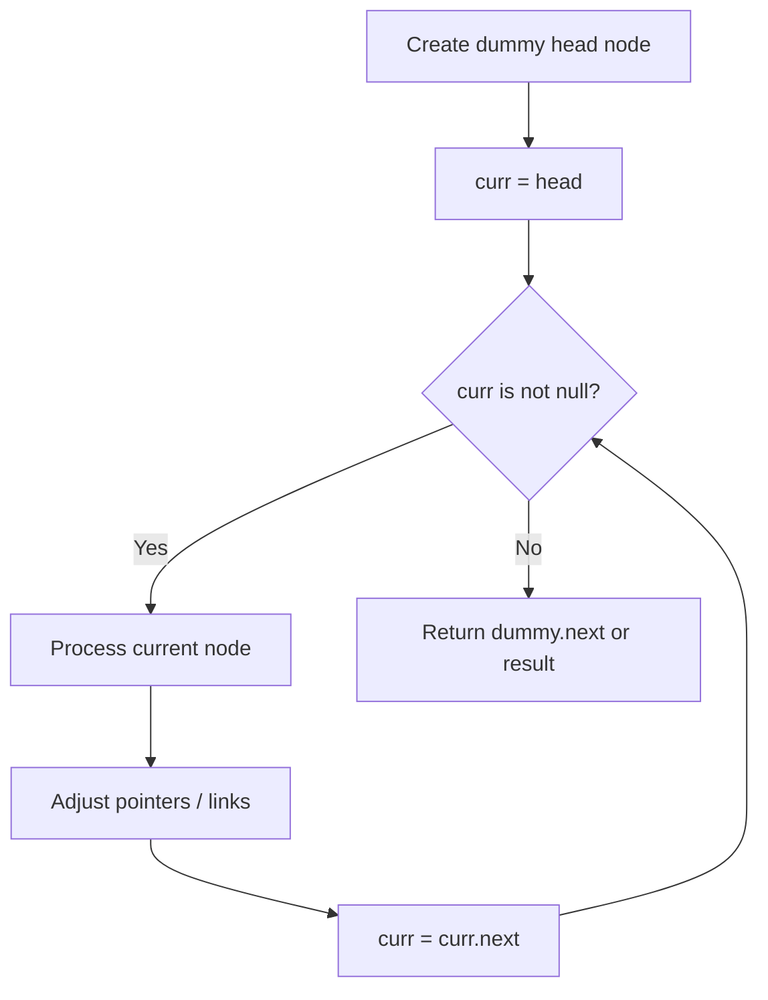
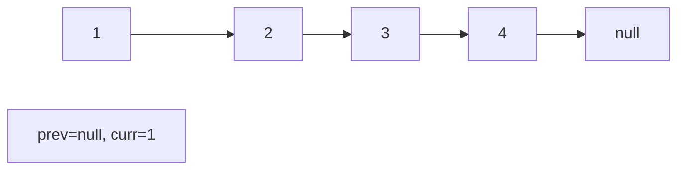
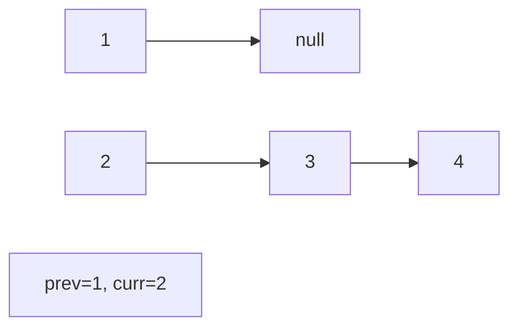
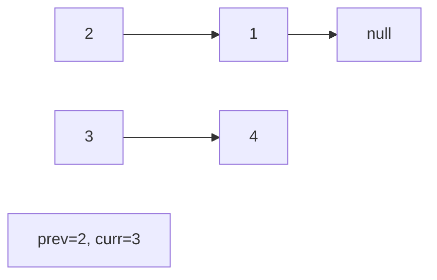
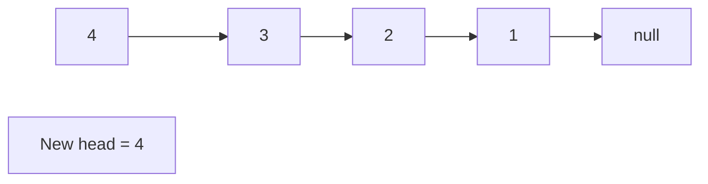

# Problem 706: Design HashMap

**Difficulty:** Easy  
**Tags:** Array, Hash Table, Linked List, Design, Hash Function  
**Pattern:** Linked List  
**Link:** [leetcode.com/problems/design-hashmap](https://leetcode.com/problems/design-hashmap/)

## Description

Design a HashMap without using any built-in hash table libraries.

Implement the `MyHashMap` class:

	- `MyHashMap()` initializes the object with an empty map.
	- `void put(int key, int value)` inserts a `(key, value)` pair into the HashMap. If the `key` already exists in the map, update the corresponding `value`.
	- `int get(int key)` returns the `value` to which the specified `key` is mapped, or `-1` if this map contains no mapping for the `key`.
	- `void remove(key)` removes the `key` and its corresponding `value` if the map contains the mapping for the `key`.

 

Example 1:

```

**Input**
["MyHashMap", "put", "put", "get", "get", "put", "get", "remove", "get"]
[[], [1, 1], [2, 2], [1], [3], [2, 1], [2], [2], [2]]
**Output**
[null, null, null, 1, -1, null, 1, null, -1]

**Explanation**
MyHashMap myHashMap = new MyHashMap();
myHashMap.put(1, 1); // The map is now [[1,1]]
myHashMap.put(2, 2); // The map is now [[1,1], [2,2]]
myHashMap.get(1);    // return 1, The map is now [[1,1], [2,2]]
myHashMap.get(3);    // return -1 (i.e., not found), The map is now [[1,1], [2,2]]
myHashMap.put(2, 1); // The map is now [[1,1], [2,1]] (i.e., update the existing value)
myHashMap.get(2);    // return 1, The map is now [[1,1], [2,1]]
myHashMap.remove(2); // remove the mapping for 2, The map is now [[1,1]]
myHashMap.get(2);    // return -1 (i.e., not found), The map is now [[1,1]]

```

 

**Constraints:**

	- `0 <= key, value <= 10^6`
	- At most `10^4` calls will be made to `put`, `get`, and `remove`.

## Approach: Linked List

Traverse or manipulate the linked list using pointer techniques. Common patterns: dummy head node for edge cases, fast/slow pointers for cycle detection or middle finding, in-place reversal, and merge operations.

## Pseudocode

```
1. Create dummy head if needed
2. Initialize pointer(s) at head
3. Traverse / modify list:
   a. Process current node
   b. Adjust next pointers as needed
   c. Move to next node
4. Return dummy.next or result
```

## Algorithm Flow



## Visual State Transitions

**Linked List Operation (Reverse):**

**Frame 1: Initial list**


**Frame 2: Reverse first link**


**Frame 3: Reverse second link**


**Frame 4: Fully reversed**



## Complexity Analysis

- **Time:** O(n)
- **Space:** O(1)

## Solution (Python3)

```python
class MyHashMap:
    def __init__(self):
        # Initialize data structure
        pass

    def put(self, key: int, value: int) -> None:
        return None

    def get(self, key: int) -> int:
        return 0

    def remove(self, key: int) -> None:
        return None

```

## Solution (C++)

```cpp
#include <string>
#include <vector>
using namespace std;

class MyHashMap {
public:
    MyHashMap() {
        // Initialize
    }

    void put(int key, int value) {
        return ;
    }

    int get(int key) {
        return 0;
    }

    void remove(int key) {
        return ;
    }

};
```
