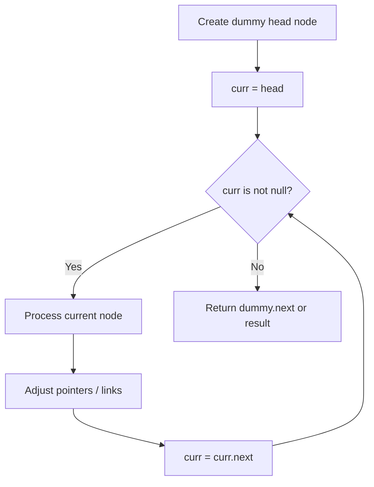
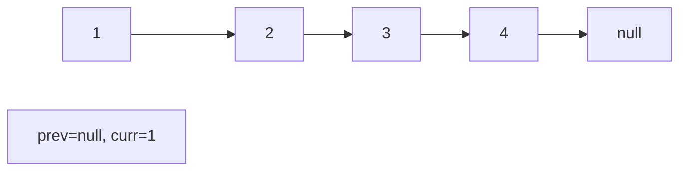
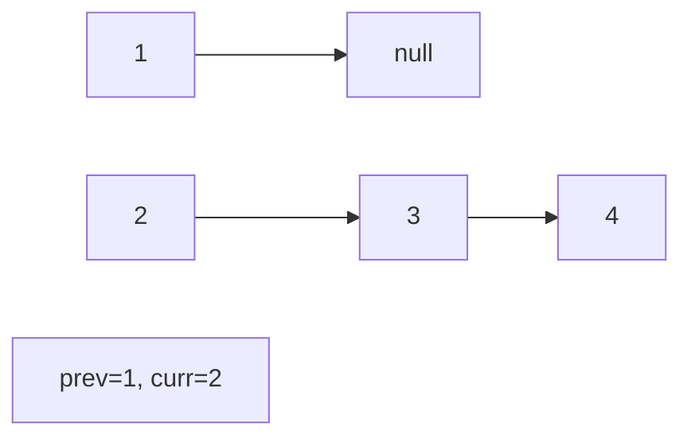
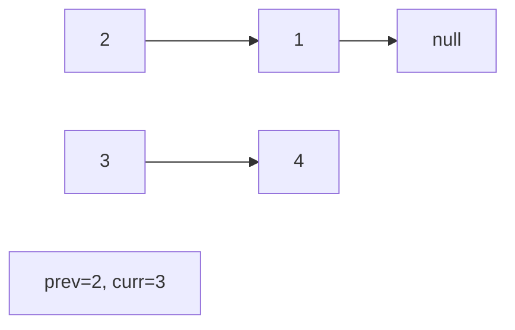
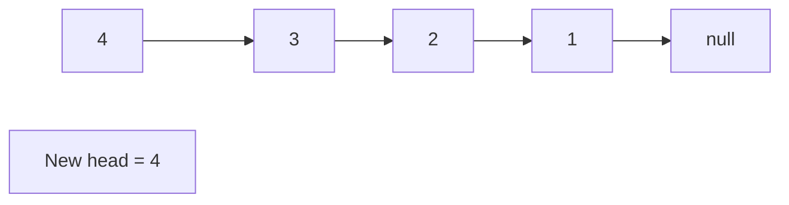

# Problem 707: Design Linked List

**Difficulty:** Medium  
**Tags:** Linked List, Design  
**Pattern:** Linked List  
**Link:** [leetcode.com/problems/design-linked-list](https://leetcode.com/problems/design-linked-list/)

## Description

Design your implementation of the linked list. You can choose to use a singly or doubly linked list.

A node in a singly linked list should have two attributes: `val` and `next`. `val` is the value of the current node, and `next` is a pointer/reference to the next node.

If you want to use the doubly linked list, you will need one more attribute `prev` to indicate the previous node in the linked list. Assume all nodes in the linked list are **0-indexed**.

Implement the `MyLinkedList` class:

	- `MyLinkedList()` Initializes the `MyLinkedList` object.
	- `int get(int index)` Get the value of the `index^th` node in the linked list. If the index is invalid, return `-1`.
	- `void addAtHead(int val)` Add a node of value `val` before the first element of the linked list. After the insertion, the new node will be the first node of the linked list.
	- `void addAtTail(int val)` Append a node of value `val` as the last element of the linked list.
	- `void addAtIndex(int index, int val)` Add a node of value `val` before the `index^th` node in the linked list. If `index` equals the length of the linked list, the node will be appended to the end of the linked list. If `index` is greater than the length, the node **will not be inserted**.
	- `void deleteAtIndex(int index)` Delete the `index^th` node in the linked list, if the index is valid.

 

Example 1:

```

**Input**
["MyLinkedList", "addAtHead", "addAtTail", "addAtIndex", "get", "deleteAtIndex", "get"]
[[], [1], [3], [1, 2], [1], [1], [1]]
**Output**
[null, null, null, null, 2, null, 3]

**Explanation**
MyLinkedList myLinkedList = new MyLinkedList();
myLinkedList.addAtHead(1);
myLinkedList.addAtTail(3);
myLinkedList.addAtIndex(1, 2);    // linked list becomes 1->2->3
myLinkedList.get(1);              // return 2
myLinkedList.deleteAtIndex(1);    // now the linked list is 1->3
myLinkedList.get(1);              // return 3

```

 

**Constraints:**

	- `0 <= index, val <= 1000`
	- Please do not use the built-in LinkedList library.
	- At most `2000` calls will be made to `get`, `addAtHead`, `addAtTail`, `addAtIndex` and `deleteAtIndex`.

## Approach: Linked List

Traverse or manipulate the linked list using pointer techniques. Common patterns: dummy head node for edge cases, fast/slow pointers for cycle detection or middle finding, in-place reversal, and merge operations.

## Pseudocode

```
1. Create dummy head if needed
2. Initialize pointer(s) at head
3. Traverse / modify list:
   a. Process current node
   b. Adjust next pointers as needed
   c. Move to next node
4. Return dummy.next or result
```

## Algorithm Flow



## Visual State Transitions

**Linked List Operation (Reverse):**

**Frame 1: Initial list**


**Frame 2: Reverse first link**


**Frame 3: Reverse second link**


**Frame 4: Fully reversed**



## Complexity Analysis

- **Time:** O(n)
- **Space:** O(1)

## Solution (Python3)

```python
class MyLinkedList:
    def __init__(self):
        # Initialize data structure
        pass

    def get(self, index: int) -> int:
        return 0

    def addAtHead(self, val: int) -> None:
        return None

    def addAtTail(self, val: int) -> None:
        return None

    def addAtIndex(self, index: int, val: int) -> None:
        return None

    def deleteAtIndex(self, index: int) -> None:
        return None

```

## Solution (C++)

```cpp
#include <string>
#include <vector>
using namespace std;

class MyLinkedList {
public:
    MyLinkedList() {
        // Initialize
    }

    int get(int index) {
        return 0;
    }

    void addAtHead(int val) {
        return ;
    }

    void addAtTail(int val) {
        return ;
    }

    void addAtIndex(int index, int val) {
        return ;
    }

    void deleteAtIndex(int index) {
        return ;
    }

};
```
