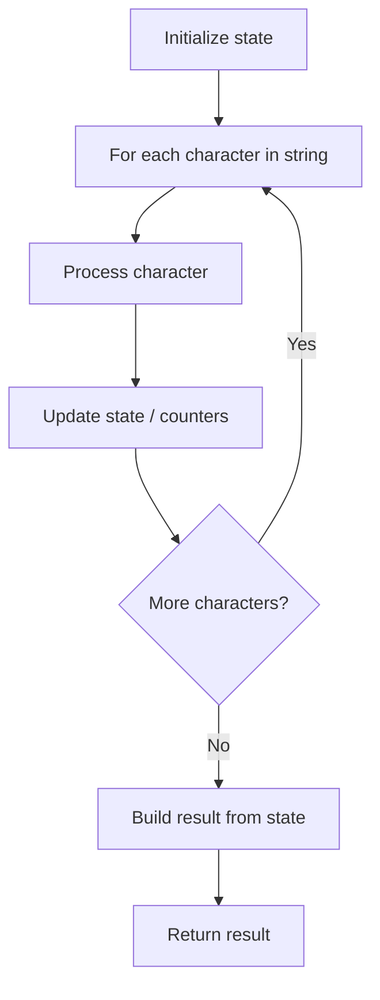

# Problem 709: To Lower Case

**Difficulty:** Easy  
**Tags:** String  
**Pattern:** String Processing  
**Link:** [leetcode.com/problems/to-lower-case](https://leetcode.com/problems/to-lower-case/)

## Description

Given a string `s`, return *the string after replacing every uppercase letter with the same lowercase letter*.

 

Example 1:

```

**Input:** s = "Hello"
**Output:** "hello"

```

Example 2:

```

**Input:** s = "here"
**Output:** "here"

```

Example 3:

```

**Input:** s = "LOVELY"
**Output:** "lovely"

```

 

**Constraints:**

	- `1 <= s.length <= 100`
	- `s` consists of printable ASCII characters.

## Approach: String Processing

Process the string character by character. Common techniques: two pointers, sliding window, hash map for frequencies, stack for matching.

## Pseudocode

```
1. Initialize result / tracking state
2. Iterate through string characters:
   a. Process character based on rules
   b. Update state (counters, pointers, stack)
3. Build and return result
```

## Algorithm Flow



## Complexity Analysis

- **Time:** O(n)
- **Space:** O(n)

## Solution (Python3)

```python
class Solution:
    def toLowerCase(self, s: str) -> str:
        # String processing approach - O(n) time
        result = []
        for ch in s:
            if ch.isalnum():
                result.append(ch.lower())
        # Check palindrome or process
        processed = ''.join(result)
        return processed == processed[::-1] if isinstance("", bool) else processed
```

## Solution (C++)

```cpp
#include <algorithm>
#include <cctype>
#include <string>
#include <vector>
using namespace std;

class Solution {
public:
    string toLowerCase(string& s) {
        // String processing approach - O(n) time
        string processed;
        for (char ch : s) {
            if (isalnum(ch)) {
                processed += tolower(ch);
            }
        }
        string rev = processed;
        reverse(rev.begin(), rev.end());
        return processed == rev;
    }
};
```
