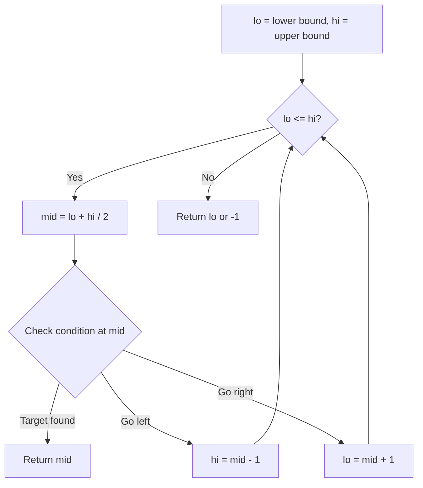
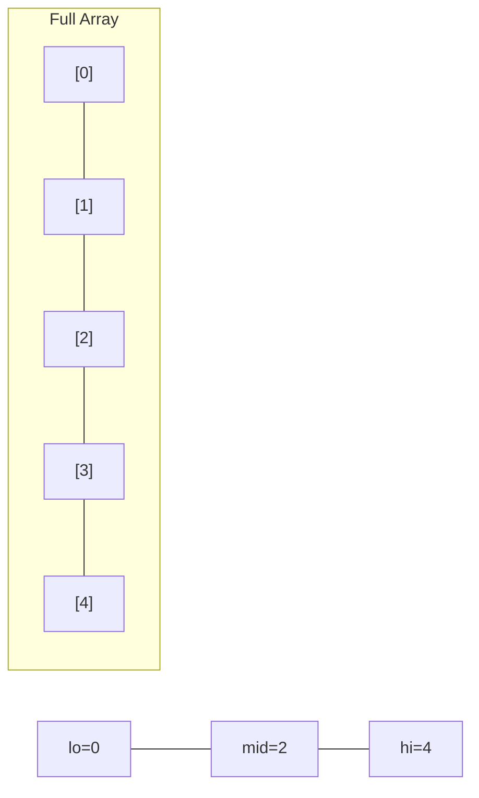
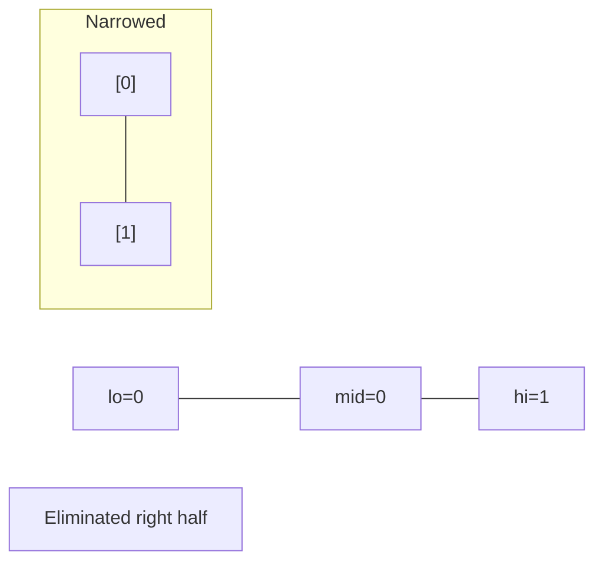
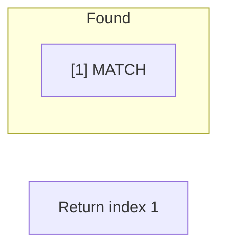

# Problem 710: Random Pick with Blacklist

**Difficulty:** Hard  
**Tags:** Array, Hash Table, Math, Binary Search, Sorting, Randomized  
**Pattern:** Binary Search  
**Link:** [leetcode.com/problems/random-pick-with-blacklist](https://leetcode.com/problems/random-pick-with-blacklist/)

## Description

You are given an integer `n` and an array of **unique** integers `blacklist`. Design an algorithm to pick a random integer in the range `[0, n - 1]` that is **not** in `blacklist`. Any integer that is in the mentioned range and not in `blacklist` should be **equally likely** to be returned.

Optimize your algorithm such that it minimizes the number of calls to the **built-in** random function of your language.

Implement the `Solution` class:

	- `Solution(int n, int[] blacklist)` Initializes the object with the integer `n` and the blacklisted integers `blacklist`.
	- `int pick()` Returns a random integer in the range `[0, n - 1]` and not in `blacklist`.

 

Example 1:

```

**Input**
["Solution", "pick", "pick", "pick", "pick", "pick", "pick", "pick"]
[[7, [2, 3, 5]], [], [], [], [], [], [], []]
**Output**
[null, 0, 4, 1, 6, 1, 0, 4]

**Explanation**
Solution solution = new Solution(7, [2, 3, 5]);
solution.pick(); // return 0, any integer from [0,1,4,6] should be ok. Note that for every call of pick,
                 // 0, 1, 4, and 6 must be equally likely to be returned (i.e., with probability 1/4).
solution.pick(); // return 4
solution.pick(); // return 1
solution.pick(); // return 6
solution.pick(); // return 1
solution.pick(); // return 0
solution.pick(); // return 4

```

 

**Constraints:**

	- `1 <= n <= 10^9`
	- `0 <= blacklist.length <= min(10^5, n - 1)`
	- `0 <= blacklist[i] < n`
	- All the values of `blacklist` are **unique**.
	- At most `2 * 10^4` calls will be made to `pick`.

## Approach: Binary Search

Use binary search to halve the search space each iteration. Define the search range [lo, hi], compute mid, and decide which half to keep based on the problem's monotonic condition.

## Pseudocode

```
1. lo = lower_bound, hi = upper_bound
2. While lo <= hi (or lo < hi):
   a. mid = (lo + hi) // 2
   b. If condition(mid) is satisfied: record answer, search left half
   c. Else: search right half
3. Return answer
```

## Algorithm Flow



## Visual State Transitions

**Binary Search Step-by-Step:**

**Frame 1: Initial search space**


**Frame 2: Compare mid, narrow search**


**Frame 3: Found target**



## Complexity Analysis

- **Time:** O(log n)
- **Space:** O(1)

## Solution (Python3)

```python
class Solution:
    def __init__(self, n: int, blacklist: List[int]):
        # Initialize data structure
        self.n = n
        self.blacklist = blacklist

    def pick(self) -> int:
        return 0

```

## Solution (C++)

```cpp
#include <string>
#include <vector>
using namespace std;

class Solution {
public:
    Solution(int n, vector<int>& blacklist) {
        // Initialize
    }

    int pick() {
        return 0;
    }

};
```
