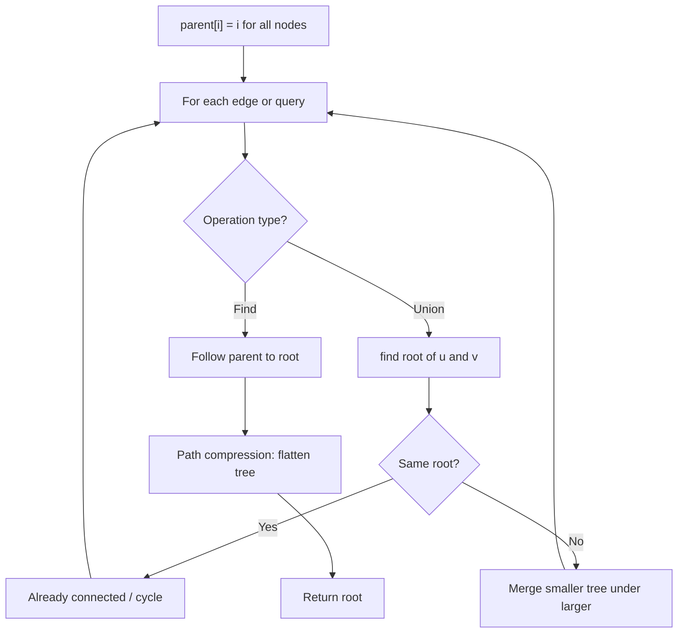
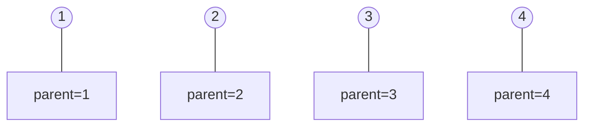
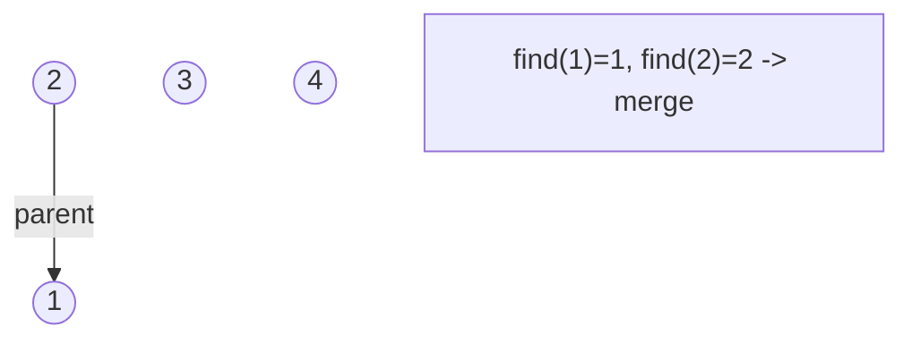
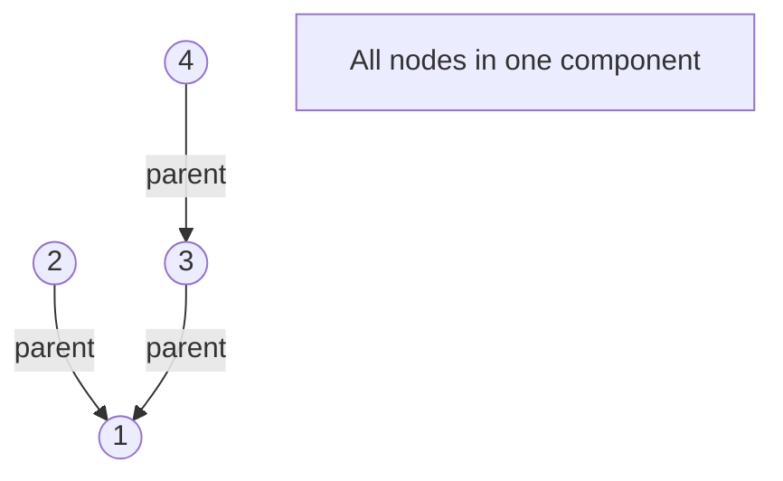
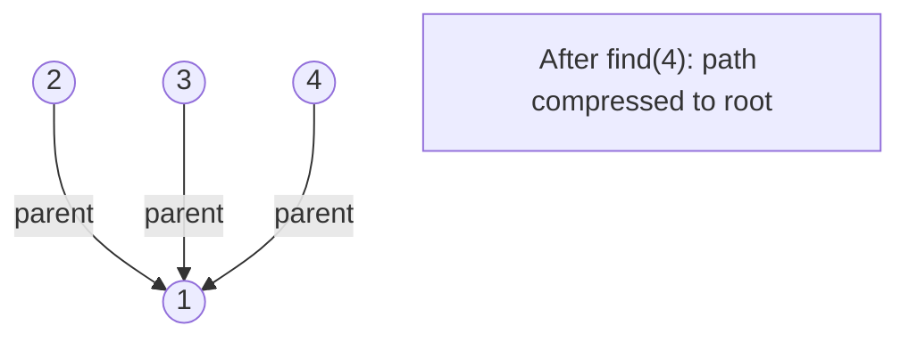

# Problem 711: Number of Distinct Islands II

**Difficulty:** Hard  
**Tags:** Array, Hash Table, Depth-First Search, Breadth-First Search, Union-Find, Sorting, Matrix, Hash Function  
**Pattern:** Union-Find / Disjoint Set  
**Link:** [leetcode.com/problems/number-of-distinct-islands-ii](https://leetcode.com/problems/number-of-distinct-islands-ii/)

## Description

*(Premium problem -- description requires LeetCode subscription)*

## Approach: Union-Find / Disjoint Set

Use Union-Find with path compression and union by rank to efficiently manage connected components. Find(x) returns the root of x's component; Union(x,y) merges two components.

## Pseudocode

```
1. parent[i] = i for all nodes (each is its own set)
2. find(x): follow parent pointers to root (with path compression)
3. union(x, y): merge sets of x and y by rank
4. Process edges/operations:
   a. For each edge (u, v): union(u, v)
5. Answer queries using find()
```

## Algorithm Flow



## Visual State Transitions

**Union-Find Step-by-Step:**

**Frame 1: Initial - each node is own parent**


**Frame 2: Union(1,2) - merge components**


**Frame 3: Union(3,4) then Union(2,3)**


**Frame 4: Path compression on find(4)**



## Complexity Analysis

- **Time:** O(n * alpha(n))
- **Space:** O(n)

## Solution (Python3)

```python
class Solution:
    pass
```

## Solution (C++)

```cpp
class Solution {
public:
    // Design problem stub
};
```
