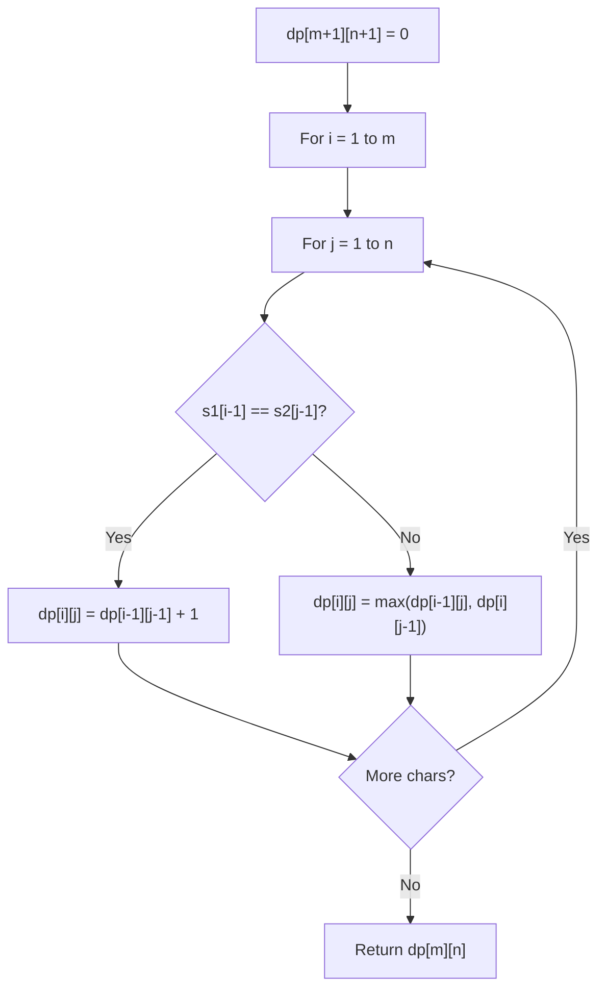

# Problem 712: Minimum ASCII Delete Sum for Two Strings

**Difficulty:** Medium  
**Tags:** String, Dynamic Programming  
**Pattern:** Dynamic Programming (String)  
**Link:** [leetcode.com/problems/minimum-ascii-delete-sum-for-two-strings](https://leetcode.com/problems/minimum-ascii-delete-sum-for-two-strings/)

## Description

Given two strings `s1` and `s2`, return *the lowest **ASCII** sum of deleted characters to make two strings equal*.

 

Example 1:

```

**Input:** s1 = "sea", s2 = "eat"
**Output:** 231
**Explanation:** Deleting "s" from "sea" adds the ASCII value of "s" (115) to the sum.
Deleting "t" from "eat" adds 116 to the sum.
At the end, both strings are equal, and 115 + 116 = 231 is the minimum sum possible to achieve this.

```

Example 2:

```

**Input:** s1 = "delete", s2 = "leet"
**Output:** 403
**Explanation:** Deleting "dee" from "delete" to turn the string into "let",
adds 100[d] + 101[e] + 101[e] to the sum.
Deleting "e" from "leet" adds 101[e] to the sum.
At the end, both strings are equal to "let", and the answer is 100+101+101+101 = 403.
If instead we turned both strings into "lee" or "eet", we would get answers of 433 or 417, which are higher.

```

 

**Constraints:**

	- `1 <= s1.length, s2.length <= 1000`
	- `s1` and `s2` consist of lowercase English letters.

## Approach: Dynamic Programming (String)

Compare or match two strings using a 2D DP table. dp[i][j] represents the answer for substrings s1[0..i-1] and s2[0..j-1]. Common patterns: LCS, edit distance, regex matching.

## Pseudocode

```
1. Create dp[m+1][n+1]
2. Initialize base cases
3. For i from 1 to m:
   For j from 1 to n:
     If s1[i-1] == s2[j-1]: dp[i][j] = dp[i-1][j-1] + 1
     Else: dp[i][j] = best of (dp[i-1][j], dp[i][j-1], dp[i-1][j-1])
4. Return dp[m][n]
```

## Algorithm Flow



## Complexity Analysis

- **Time:** O(m * n)
- **Space:** O(m * n)

## Solution (Python3)

```python
class Solution:
    def minimumDeleteSum(self, s1: str, s2: str) -> int:
        # String DP - O(m*n) time and space
        m, n = len(s1), len(s2)
        dp = [[0] * (n + 1) for _ in range(m + 1)]
        for i in range(1, m + 1):
            for j in range(1, n + 1):
                if s1[i-1] == s2[j-1]:
                    dp[i][j] = dp[i-1][j-1] + 1
                else:
                    dp[i][j] = max(dp[i-1][j], dp[i][j-1])
        return dp[m][n]
```

## Solution (C++)

```cpp
#include <algorithm>
#include <string>
#include <vector>
using namespace std;

class Solution {
public:
    int minimumDeleteSum(string& s1, string& s2) {
        // String DP - O(m*n) time and space
        int m = s1.size(), n = s2.size();
        vector<vector<int>> dp(m + 1, vector<int>(n + 1, 0));
        for (int i = 1; i <= m; i++) {
            for (int j = 1; j <= n; j++) {
                if (s1[i-1] == s2[j-1])
                    dp[i][j] = dp[i-1][j-1] + 1;
                else
                    dp[i][j] = max(dp[i-1][j], dp[i][j-1]);
            }
        }
        return dp[m][n];
    }
};
```
