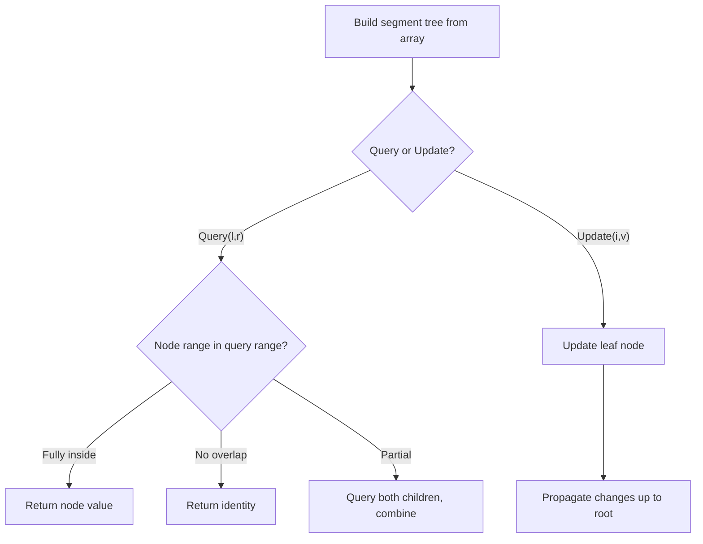

# Problem 715: Range Module

**Difficulty:** Hard  
**Tags:** Design, Segment Tree, Ordered Set  
**Pattern:** Segment Tree  
**Link:** [leetcode.com/problems/range-module](https://leetcode.com/problems/range-module/)

## Description

A Range Module is a module that tracks ranges of numbers. Design a data structure to track the ranges represented as **half-open intervals** and query about them.

A **half-open interval** `[left, right)` denotes all the real numbers `x` where `left <= x < right`.

Implement the `RangeModule` class:

	- `RangeModule()` Initializes the object of the data structure.
	- `void addRange(int left, int right)` Adds the **half-open interval** `[left, right)`, tracking every real number in that interval. Adding an interval that partially overlaps with currently tracked numbers should add any numbers in the interval `[left, right)` that are not already tracked.
	- `boolean queryRange(int left, int right)` Returns `true` if every real number in the interval `[left, right)` is currently being tracked, and `false` otherwise.
	- `void removeRange(int left, int right)` Stops tracking every real number currently being tracked in the **half-open interval** `[left, right)`.

 

Example 1:

```

**Input**
["RangeModule", "addRange", "removeRange", "queryRange", "queryRange", "queryRange"]
[[], [10, 20], [14, 16], [10, 14], [13, 15], [16, 17]]
**Output**
[null, null, null, true, false, true]

**Explanation**
RangeModule rangeModule = new RangeModule();
rangeModule.addRange(10, 20);
rangeModule.removeRange(14, 16);
rangeModule.queryRange(10, 14); // return True,(Every number in [10, 14) is being tracked)
rangeModule.queryRange(13, 15); // return False,(Numbers like 14, 14.03, 14.17 in [13, 15) are not being tracked)
rangeModule.queryRange(16, 17); // return True, (The number 16 in [16, 17) is still being tracked, despite the remove operation)

```

 

**Constraints:**

	- `1 <= left < right <= 10^9`
	- At most `10^4` calls will be made to `addRange`, `queryRange`, and `removeRange`.

## Approach: Segment Tree

Build a segment tree for range queries (sum, min, max) with point or range updates. Each node covers a range; queries are answered by combining relevant segments.

## Pseudocode

```
1. Build segment tree from array (O(n))
2. Query(l, r):
   - If node range within [l,r]: return node value
   - If no overlap: return identity
   - Else: combine query(left_child) and query(right_child)
3. Update(i, val): update leaf and propagate up
```

## Algorithm Flow



## Complexity Analysis

- **Time:** O(n log n) build, O(log n) query/update
- **Space:** O(n)

## Solution (Python3)

```python
class RangeModule:
    def __init__(self):
        # Initialize data structure
        pass

    def addRange(self, left: int, right: int) -> None:
        return None

    def queryRange(self, left: int, right: int) -> bool:
        return False

    def removeRange(self, left: int, right: int) -> None:
        return None

```

## Solution (C++)

```cpp
#include <functional>
#include <string>
#include <vector>
using namespace std;

class RangeModule {
public:
    RangeModule() {
        // Initialize
    }

    void addRange(int left, int right) {
        return ;
    }

    bool queryRange(int left, int right) {
        return false;
    }

    void removeRange(int left, int right) {
        return ;
    }

};
```
