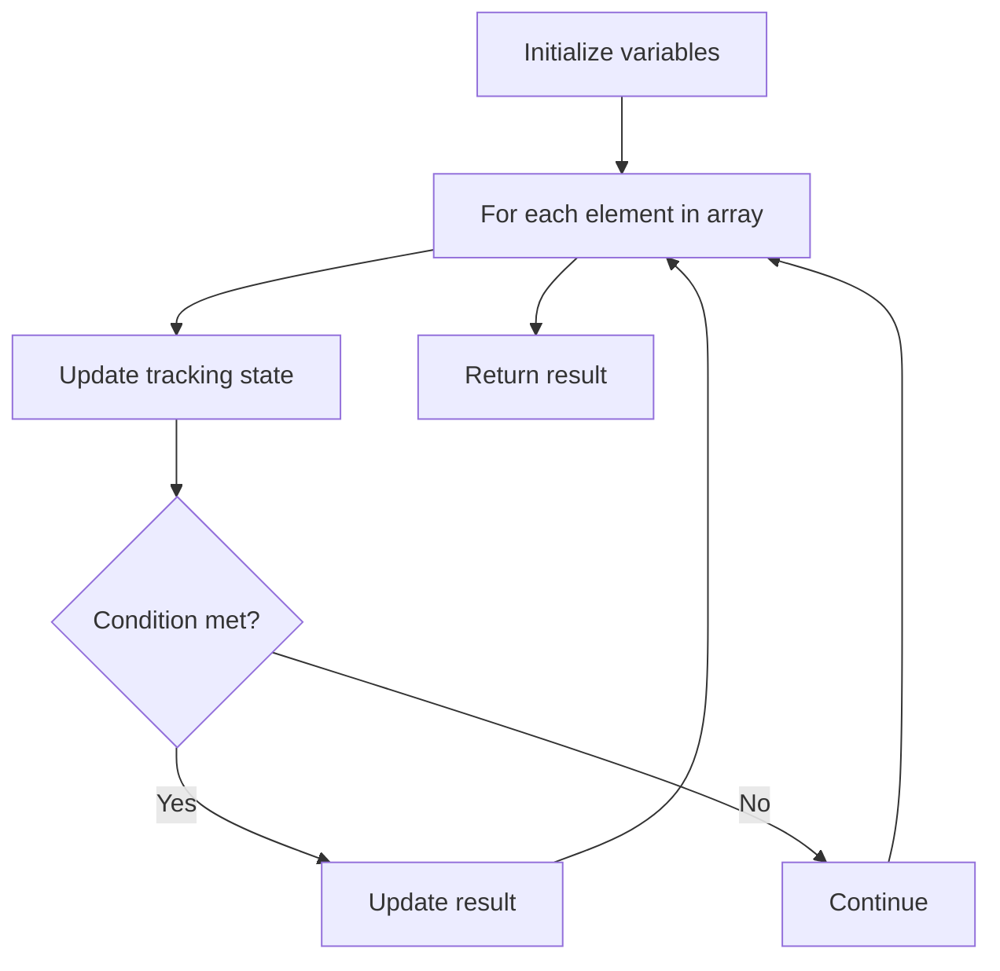

# Problem 717: 1-bit and 2-bit Characters

**Difficulty:** Easy  
**Tags:** Array  
**Pattern:** Array Processing  
**Link:** [leetcode.com/problems/1-bit-and-2-bit-characters](https://leetcode.com/problems/1-bit-and-2-bit-characters/)

## Description

We have two special characters:

	- The first character can be represented by one bit `0`.
	- The second character can be represented by two bits (`10` or `11`).

Given a binary array `bits` that ends with `0`, return `true` if the last character must be a one-bit character.

 

Example 1:

```

**Input:** bits = [1,0,0]
**Output:** true
**Explanation:** The only way to decode it is two-bit character and one-bit character.
So the last character is one-bit character.

```

Example 2:

```

**Input:** bits = [1,1,1,0]
**Output:** false
**Explanation:** The only way to decode it is two-bit character and two-bit character.
So the last character is not one-bit character.

```

 

**Constraints:**

	- `1 <= bits.length <= 1000`
	- `bits[i]` is either `0` or `1`.

## Approach: Array Processing

Process the array with a linear scan, tracking state variables. Look for patterns: running maximum/minimum, counting, or transformations.

## Pseudocode

```
1. Initialize tracking variables
2. Iterate through array:
   a. Update tracking state
   b. Check conditions
   c. Update result
3. Return result
```

## Algorithm Flow



## Complexity Analysis

- **Time:** O(n)
- **Space:** O(1)

## Solution (Python3)

```python
class Solution:
    def isOneBitCharacter(self, bits: List[int]) -> bool:
        # Array processing - O(n) time
        result = False
        for i in range(len(bits)):
            # Process element
            pass
        return result
```

## Solution (C++)

```cpp
#include <string>
#include <vector>
using namespace std;

class Solution {
public:
    bool isOneBitCharacter(vector<int>& bits) {
        // Array processing - O(n) time
        for (int i = 0; i < (int)bits.size(); i++) {
            // Process element
        }
        return false;
    }
};
```
