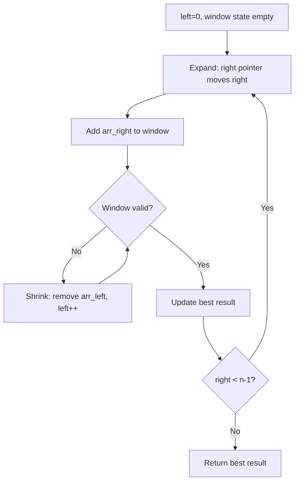
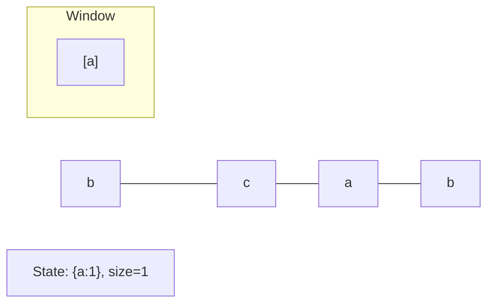
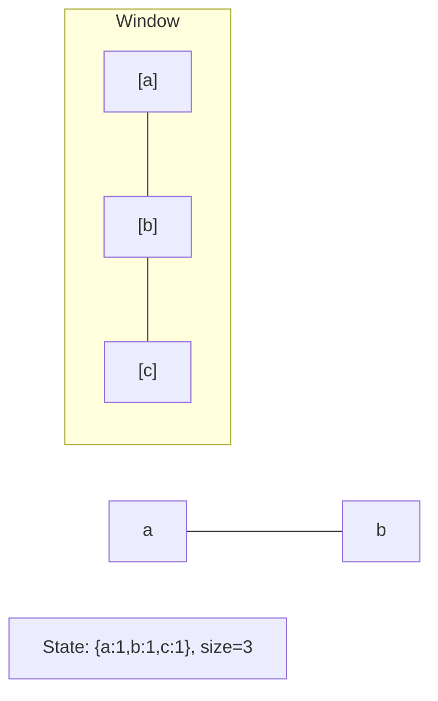
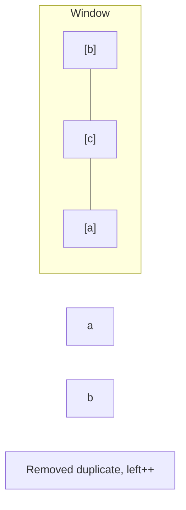
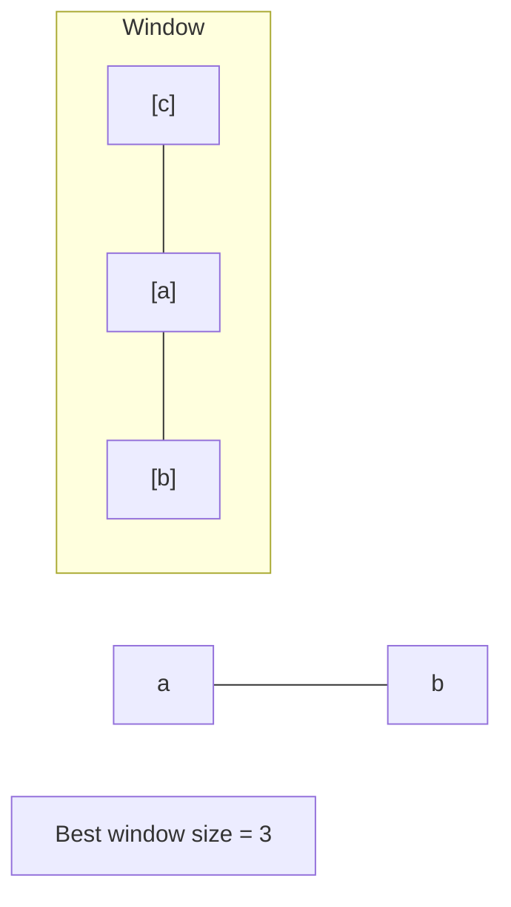

# Problem 718: Maximum Length of Repeated Subarray

**Difficulty:** Medium  
**Tags:** Array, Binary Search, Dynamic Programming, Sliding Window, Rolling Hash, Hash Function  
**Pattern:** Sliding Window  
**Link:** [leetcode.com/problems/maximum-length-of-repeated-subarray](https://leetcode.com/problems/maximum-length-of-repeated-subarray/)

## Description

Given two integer arrays `nums1` and `nums2`, return *the maximum length of a subarray that appears in **both** arrays*.

 

Example 1:

```

**Input:** nums1 = [1,2,3,2,1], nums2 = [3,2,1,4,7]
**Output:** 3
**Explanation:** The repeated subarray with maximum length is [3,2,1].

```

Example 2:

```

**Input:** nums1 = [0,0,0,0,0], nums2 = [0,0,0,0,0]
**Output:** 5
**Explanation:** The repeated subarray with maximum length is [0,0,0,0,0].

```

 

**Constraints:**

	- `1 <= nums1.length, nums2.length <= 1000`
	- `0 <= nums1[i], nums2[i] <= 100`

## Approach: Sliding Window

Maintain a window over the data using two pointers. Expand the right boundary to include new elements, and shrink the left boundary when the window constraint is violated. Track the optimal window.

## Pseudocode

```
1. Initialize left = 0, result = initial_value
2. For right in range(n):
   a. Add element at right to window state
   b. While window is invalid:
      - Remove element at left from window state
      - left++
   c. Update result = best of (result, window size/value)
3. Return result
```

## Algorithm Flow



## Visual State Transitions

**Sliding Window Step-by-Step:**

**Frame 1: Initial window (left=0, right=0)**


**Frame 2: Expand right (right=2)**


**Frame 3: Violation - shrink left**


**Frame 4: Continue expanding**



## Complexity Analysis

- **Time:** O(n)
- **Space:** O(k)

## Solution (Python3)

```python
class Solution:
    def findLength(self, nums1: List[int], nums2: List[int]) -> int:
        # Sliding window approach - O(n) time, O(k) space
        from collections import defaultdict
        window = defaultdict(int)
        left = 0
        result = 0
        for right in range(len(nums1)):
            window[nums1[right]] += 1
            while len(window) > (nums2 if isinstance(nums2, int) else len(nums1)):
                window[nums1[left]] -= 1
                if window[nums1[left]] == 0:
                    del window[nums1[left]]
                left += 1
            result = max(result, right - left + 1)
        return result
```

## Solution (C++)

```cpp
#include <algorithm>
#include <string>
#include <unordered_map>
#include <vector>
using namespace std;

class Solution {
public:
    int findLength(vector<int>& nums1, vector<int>& nums2) {
        // Sliding window approach - O(n) time, O(k) space
        unordered_map<char, int> window;
        int left = 0, result = 0;
        for (int right = 0; right < nums1.size(); right++) {
            window[nums1[right]]++;
            while ((int)window.size() > nums2) {
                window[nums1[left]]--;
                if (window[nums1[left]] == 0)
                    window.erase(nums1[left]);
                left++;
            }
            result = max(result, right - left + 1);
        }
        return result;
    }
};
```
