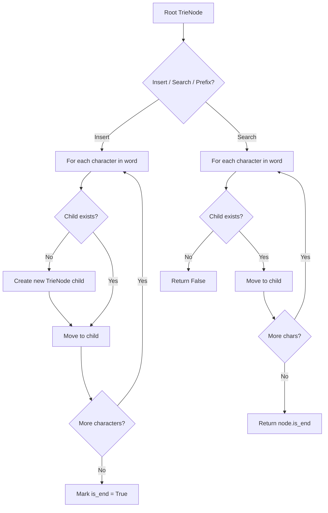
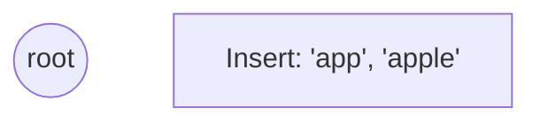
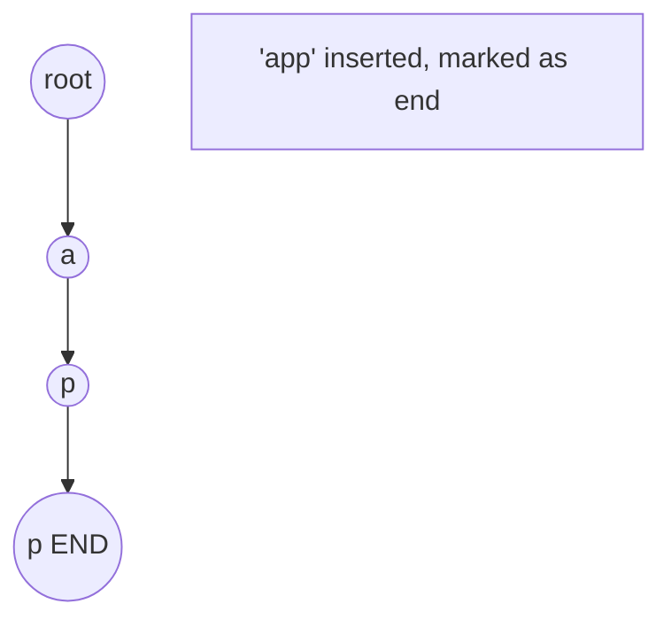
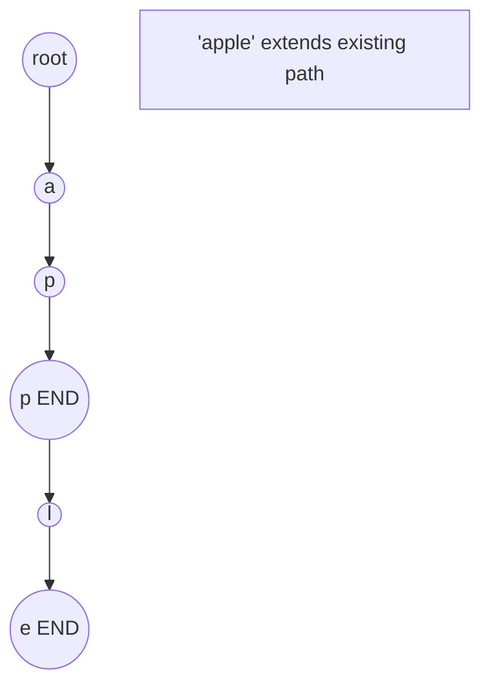
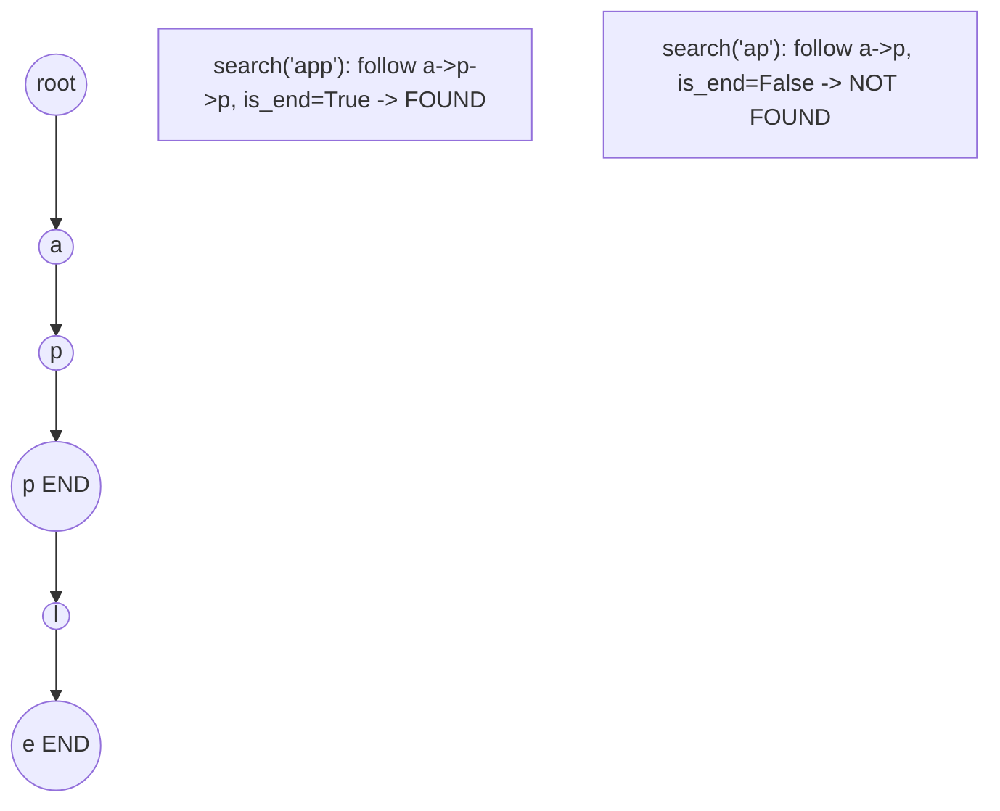

# Problem 720: Longest Word in Dictionary

**Difficulty:** Medium  
**Tags:** Array, Hash Table, String, Trie, Sorting  
**Pattern:** Trie / Prefix Tree  
**Link:** [leetcode.com/problems/longest-word-in-dictionary](https://leetcode.com/problems/longest-word-in-dictionary/)

## Description

Given an array of strings `words` representing an English Dictionary, return *the longest word in* `words` *that can be built one character at a time by other words in* `words`.

If there is more than one possible answer, return the longest word with the smallest lexicographical order. If there is no answer, return the empty string.

Note that the word should be built from left to right with each additional character being added to the end of a previous word. 

 

Example 1:

```

**Input:** words = ["w","wo","wor","worl","world"]
**Output:** "world"
**Explanation:** The word "world" can be built one character at a time by "w", "wo", "wor", and "worl".

```

Example 2:

```

**Input:** words = ["a","banana","app","appl","ap","apply","apple"]
**Output:** "apple"
**Explanation:** Both "apply" and "apple" can be built from other words in the dictionary. However, "apple" is lexicographically smaller than "apply".

```

 

**Constraints:**

	- `1 <= words.length <= 1000`
	- `1 <= words[i].length <= 30`
	- `words[i]` consists of lowercase English letters.

## Approach: Trie / Prefix Tree

Build a trie (prefix tree) where each node represents a character. Insert words character by character, and search by following child pointers. Supports efficient prefix matching.

## Pseudocode

```
1. TrieNode: children = {}, is_end = False
2. Insert(word):
   - For each char: create child if absent, move to child
   - Mark last node as end
3. Search(word):
   - For each char: if child absent return False, move to child
   - Return node.is_end
4. StartsWith(prefix): same as search but return True at end
```

## Algorithm Flow



## Visual State Transitions

**Trie Insert and Search:**

**Frame 1: Empty trie**


**Frame 2: Insert 'app'**


**Frame 3: Insert 'apple'**


**Frame 4: Search 'app' = True, 'ap' = False**



## Complexity Analysis

- **Time:** O(L) per operation
- **Space:** O(N * L)

## Solution (Python3)

```python
class Solution:
    def longestWord(self, words: List[str]) -> str:
        # Trie-based approach
        trie = {}
        # Build trie from word list
        words = words if isinstance(words, list) else [words]
        for word in words:
            node = trie
            for ch in word:
                if ch not in node:
                    node[ch] = {}
                node = node[ch]
            node['#'] = True
        
        # Search in trie
        def search(word):
            node = trie
            for ch in word:
                if ch not in node:
                    return False
                node = node[ch]
            return '#' in node
        
        return ""
```

## Solution (C++)

```cpp
#include <string>
#include <vector>
using namespace std;

class Solution {
public:
    string longestWord(vector<string>& words) {
        // Trie-based approach
        struct TrieNode {
            TrieNode* children[26] = {};
            bool isEnd = false;
        };
        TrieNode* root = new TrieNode();
        // Build trie
        for (auto& word : words) {
            TrieNode* node = root;
            for (char ch : word) {
                int idx = ch - 'a';
                if (!node->children[idx])
                    node->children[idx] = new TrieNode();
                node = node->children[idx];
            }
            node->isEnd = true;
        }
        return "";
    }
};
```
