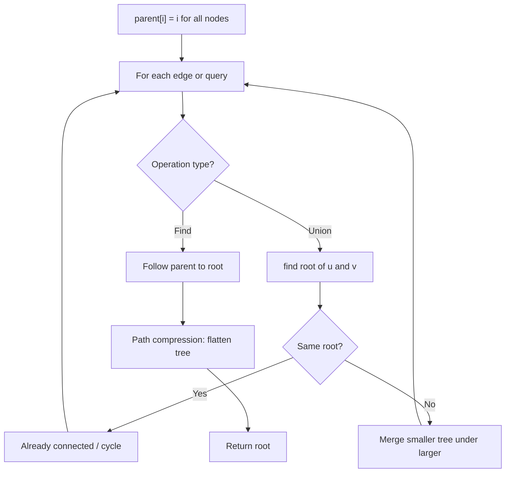
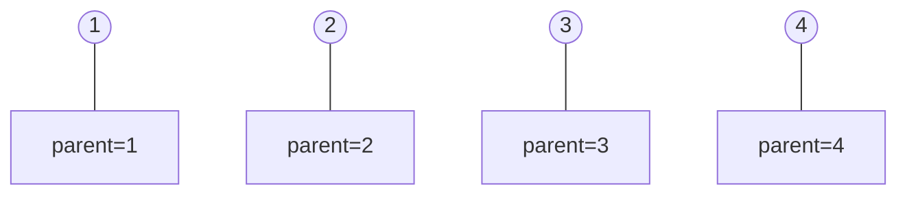
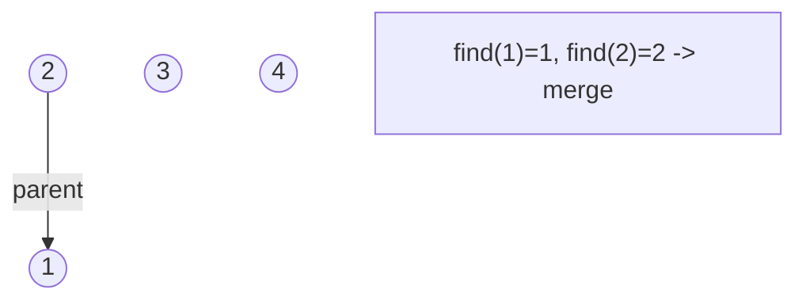
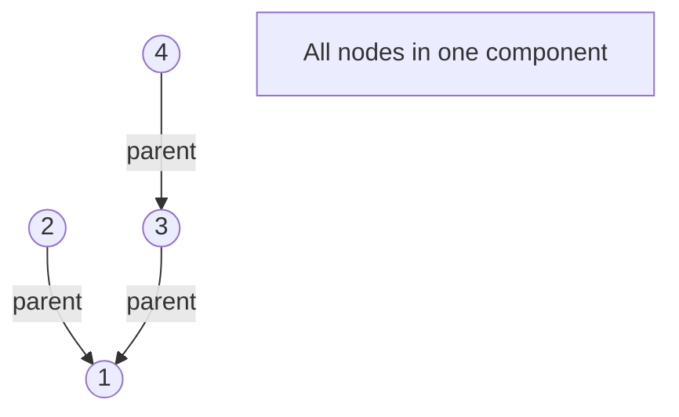
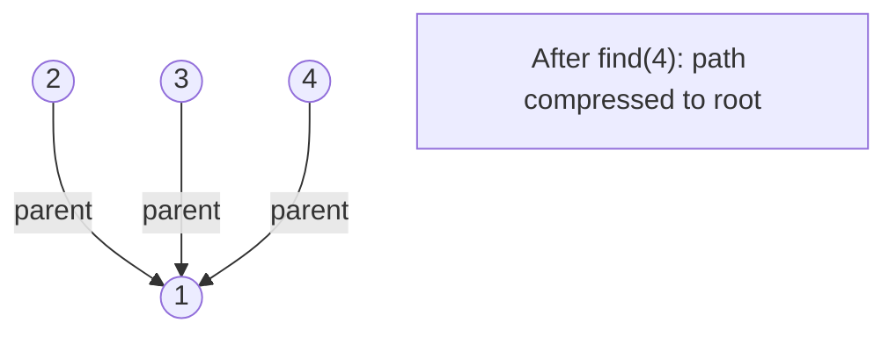

# Problem 721: Accounts Merge

**Difficulty:** Medium  
**Tags:** Array, Hash Table, String, Depth-First Search, Breadth-First Search, Union-Find, Sorting  
**Pattern:** Union-Find / Disjoint Set  
**Link:** [leetcode.com/problems/accounts-merge](https://leetcode.com/problems/accounts-merge/)

## Description

Given a list of `accounts` where each element `accounts[i]` is a list of strings, where the first element `accounts[i][0]` is a name, and the rest of the elements are **emails** representing emails of the account.

Now, we would like to merge these accounts. Two accounts definitely belong to the same person if there is some common email to both accounts. Note that even if two accounts have the same name, they may belong to different people as people could have the same name. A person can have any number of accounts initially, but all of their accounts definitely have the same name.

After merging the accounts, return the accounts in the following format: the first element of each account is the name, and the rest of the elements are emails **in sorted order**. The accounts themselves can be returned in **any order**.

 

Example 1:

```

**Input:** accounts = [["John","johnsmith@mail.com","john_newyork@mail.com"],["John","johnsmith@mail.com","john00@mail.com"],["Mary","mary@mail.com"],["John","johnnybravo@mail.com"]]
**Output:** [["John","john00@mail.com","john_newyork@mail.com","johnsmith@mail.com"],["Mary","mary@mail.com"],["John","johnnybravo@mail.com"]]
**Explanation:**
The first and second John's are the same person as they have the common email "johnsmith@mail.com".
The third John and Mary are different people as none of their email addresses are used by other accounts.
We could return these lists in any order, for example the answer [['Mary', 'mary@mail.com'], ['John', 'johnnybravo@mail.com'], 
['John', 'john00@mail.com', 'john_newyork@mail.com', 'johnsmith@mail.com']] would still be accepted.

```

Example 2:

```

**Input:** accounts = [["Gabe","Gabe0@m.co","Gabe3@m.co","Gabe1@m.co"],["Kevin","Kevin3@m.co","Kevin5@m.co","Kevin0@m.co"],["Ethan","Ethan5@m.co","Ethan4@m.co","Ethan0@m.co"],["Hanzo","Hanzo3@m.co","Hanzo1@m.co","Hanzo0@m.co"],["Fern","Fern5@m.co","Fern1@m.co","Fern0@m.co"]]
**Output:** [["Ethan","Ethan0@m.co","Ethan4@m.co","Ethan5@m.co"],["Gabe","Gabe0@m.co","Gabe1@m.co","Gabe3@m.co"],["Hanzo","Hanzo0@m.co","Hanzo1@m.co","Hanzo3@m.co"],["Kevin","Kevin0@m.co","Kevin3@m.co","Kevin5@m.co"],["Fern","Fern0@m.co","Fern1@m.co","Fern5@m.co"]]

```

 

**Constraints:**

	- `1 <= accounts.length <= 1000`
	- `2 <= accounts[i].length <= 10`
	- `1 <= accounts[i][j].length <= 30`
	- `accounts[i][0]` consists of English letters.
	- `accounts[i][j] (for j > 0)` is a valid email.

## Approach: Union-Find / Disjoint Set

Use Union-Find with path compression and union by rank to efficiently manage connected components. Find(x) returns the root of x's component; Union(x,y) merges two components.

## Pseudocode

```
1. parent[i] = i for all nodes (each is its own set)
2. find(x): follow parent pointers to root (with path compression)
3. union(x, y): merge sets of x and y by rank
4. Process edges/operations:
   a. For each edge (u, v): union(u, v)
5. Answer queries using find()
```

## Algorithm Flow



## Visual State Transitions

**Union-Find Step-by-Step:**

**Frame 1: Initial - each node is own parent**


**Frame 2: Union(1,2) - merge components**


**Frame 3: Union(3,4) then Union(2,3)**


**Frame 4: Path compression on find(4)**



## Complexity Analysis

- **Time:** O(n * alpha(n))
- **Space:** O(n)

## Solution (Python3)

```python
class Solution:
    def accountsMerge(self, accounts: List[List[str]]) -> List[List[str]]:
        # Union Find (Disjoint Set Union) - O(n * alpha(n))
        parent = list(range(len(accounts) + 1 if isinstance(accounts, list) else accounts + 1))
        rank = [0] * len(parent)
        
        def find(x):
            if parent[x] != x:
                parent[x] = find(parent[x])
            return parent[x]
        
        def union(x, y):
            px, py = find(x), find(y)
            if px == py:
                return False
            if rank[px] < rank[py]:
                px, py = py, px
            parent[py] = px
            if rank[px] == rank[py]:
                rank[px] += 1
            return True
        
        components = len(parent)
        # Process edges/connections
        return components
```

## Solution (C++)

```cpp
#include <functional>
#include <numeric>
#include <string>
#include <vector>
using namespace std;

class Solution {
public:
    vector<vector<string>> accountsMerge(vector<vector<string>>& accounts) {
        // Union Find (DSU) - O(n * alpha(n))
        int n = accounts.size();
        vector<int> parent(n + 1), rnk(n + 1, 0);
        iota(parent.begin(), parent.end(), 0);
        function<int(int)> find = [&](int x) -> int {
            return parent[x] == x ? x : parent[x] = find(parent[x]);
        };
        auto unite = [&](int x, int y) -> bool {
            int px = find(x), py = find(y);
            if (px == py) return false;
            if (rnk[px] < rnk[py]) swap(px, py);
            parent[py] = px;
            if (rnk[px] == rnk[py]) rnk[px]++;
            return true;
        };
        int components = n;
        return components;
    }
};
```
