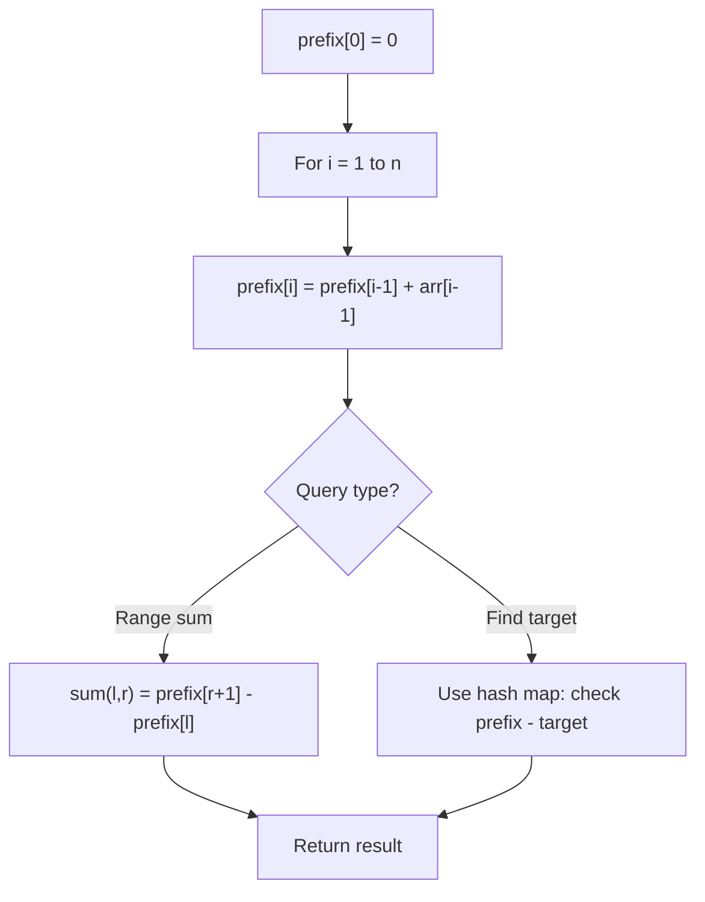

# Problem 724: Find Pivot Index

**Difficulty:** Easy  
**Tags:** Array, Prefix Sum  
**Pattern:** Prefix Sum  
**Link:** [leetcode.com/problems/find-pivot-index](https://leetcode.com/problems/find-pivot-index/)

## Description

Given an array of integers `nums`, calculate the **pivot index** of this array.

The **pivot index** is the index where the sum of all the numbers **strictly** to the left of the index is equal to the sum of all the numbers **strictly** to the index's right.

If the index is on the left edge of the array, then the left sum is `0` because there are no elements to the left. This also applies to the right edge of the array.

Return *the **leftmost pivot index***. If no such index exists, return `-1`.

 

Example 1:

```

**Input:** nums = [1,7,3,6,5,6]
**Output:** 3
**Explanation:**
The pivot index is 3.
Left sum = nums[0] + nums[1] + nums[2] = 1 + 7 + 3 = 11
Right sum = nums[4] + nums[5] = 5 + 6 = 11

```

Example 2:

```

**Input:** nums = [1,2,3]
**Output:** -1
**Explanation:**
There is no index that satisfies the conditions in the problem statement.
```

Example 3:

```

**Input:** nums = [2,1,-1]
**Output:** 0
**Explanation:**
The pivot index is 0.
Left sum = 0 (no elements to the left of index 0)
Right sum = nums[1] + nums[2] = 1 + -1 = 0

```

 

**Constraints:**

	- `1 <= nums.length <= 10^4`
	- `-1000 <= nums[i] <= 1000`

 

**Note:** This question is the same as 1991: https://leetcode.com/problems/find-the-middle-index-in-array/

## Approach: Prefix Sum

Pivot index where left_sum == total - left_sum - nums[i].

## Pseudocode

```
1. Build prefix sum array: prefix[0]=0, prefix[i]=prefix[i-1]+arr[i-1]
2. Use prefix sums to answer queries:
   - Subarray sum [l..r] = prefix[r+1] - prefix[l]
   - Or use hash map to find prefix[j]-prefix[i] == target
3. Return result
```

## Algorithm Flow



## Complexity Analysis

- **Time:** O(n)
- **Space:** O(1)

## Solution (Python3)

```python
class Solution:
    def pivotIndex(self, nums: list[int]) -> int:
        total = sum(nums)
        left_sum = 0
        for i, num in enumerate(nums):
            if left_sum == total - left_sum - num:
                return i
            left_sum += num
        return -1
```

## Solution (C++)

```cpp
#include <algorithm>
#include <string>
#include <unordered_map>
#include <vector>
using namespace std;

class Solution {
public:
    int pivotIndex(vector<int>& nums) {
        // Prefix sum approach - O(n) time, O(n) space
        unordered_map<int, int> prefix;
        prefix[0] = -1;
        int curr_sum = 0, result = 0;
        int target = nums;
        for (int i = 0; i < (int)nums.size(); i++) {
            curr_sum += nums[i];
            if (prefix.count(curr_sum - target)) {
                result = max(result, i - prefix[curr_sum - target]);
            }
            if (!prefix.count(curr_sum)) {
                prefix[curr_sum] = i;
            }
        }
        return result;
    }
};
```
