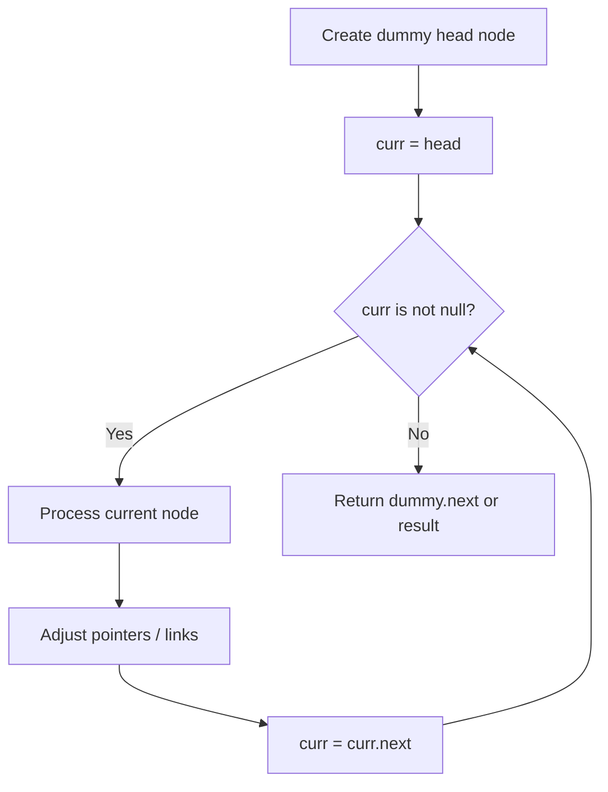
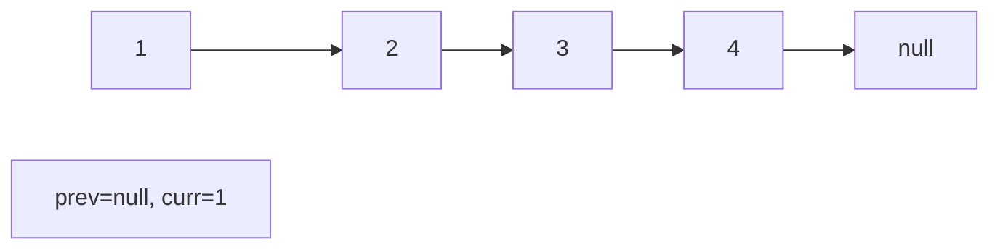
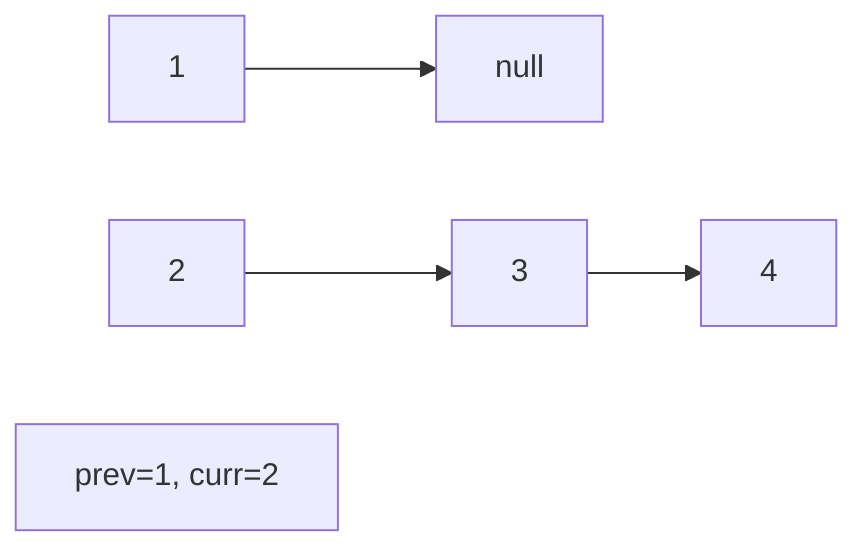
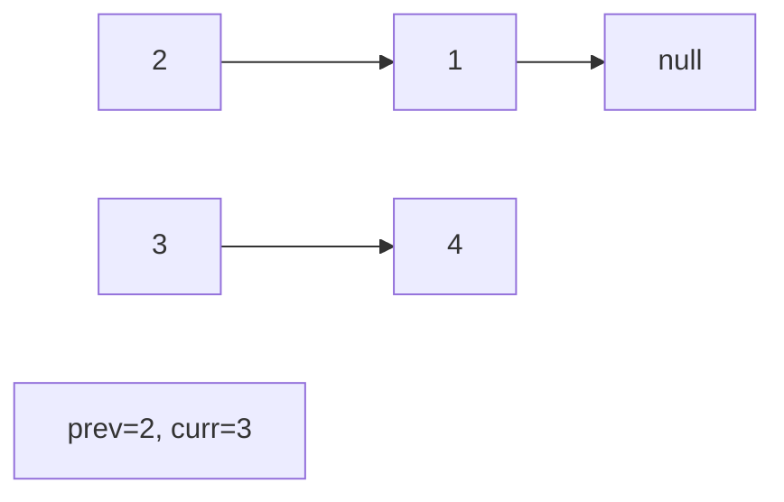
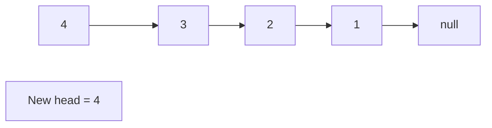

# Problem 725: Split Linked List in Parts

**Difficulty:** Medium  
**Tags:** Linked List  
**Pattern:** Linked List  
**Link:** [leetcode.com/problems/split-linked-list-in-parts](https://leetcode.com/problems/split-linked-list-in-parts/)

## Description

Given the `head` of a singly linked list and an integer `k`, split the linked list into `k` consecutive linked list parts.

The length of each part should be as equal as possible: no two parts should have a size differing by more than one. This may lead to some parts being null.

The parts should be in the order of occurrence in the input list, and parts occurring earlier should always have a size greater than or equal to parts occurring later.

Return *an array of the *`k`* parts*.

 

Example 1:

```

**Input:** head = [1,2,3], k = 5
**Output:** [[1],[2],[3],[],[]]
**Explanation:**
The first element output[0] has output[0].val = 1, output[0].next = null.
The last element output[4] is null, but its string representation as a ListNode is [].

```

Example 2:

```

**Input:** head = [1,2,3,4,5,6,7,8,9,10], k = 3
**Output:** [[1,2,3,4],[5,6,7],[8,9,10]]
**Explanation:**
The input has been split into consecutive parts with size difference at most 1, and earlier parts are a larger size than the later parts.

```

 

**Constraints:**

	- The number of nodes in the list is in the range `[0, 1000]`.
	- `0 <= Node.val <= 1000`
	- `1 <= k <= 50`

## Approach: Linked List

Traverse or manipulate the linked list using pointer techniques. Common patterns: dummy head node for edge cases, fast/slow pointers for cycle detection or middle finding, in-place reversal, and merge operations.

## Pseudocode

```
1. Create dummy head if needed
2. Initialize pointer(s) at head
3. Traverse / modify list:
   a. Process current node
   b. Adjust next pointers as needed
   c. Move to next node
4. Return dummy.next or result
```

## Algorithm Flow



## Visual State Transitions

**Linked List Operation (Reverse):**

**Frame 1: Initial list**


**Frame 2: Reverse first link**


**Frame 3: Reverse second link**


**Frame 4: Fully reversed**



## Complexity Analysis

- **Time:** O(n)
- **Space:** O(1)

## Solution (Python3)

```python
class Solution:
    def splitListToParts(self, head: Optional[ListNode], k: int) -> List[Optional[ListNode]]:
        # Linked list traversal/manipulation
        dummy = ListNode(0)
        dummy.next = head
        prev, curr = dummy, head
        while curr:
            nxt = curr.next
            # Process current node
            prev = curr
            curr = nxt
        return dummy.next
```

## Solution (C++)

```cpp
#include <string>
#include <vector>
using namespace std;

class Solution {
public:
    vector<ListNode*> splitListToParts(ListNode* head, int k) {
        // Linked list traversal/manipulation
        ListNode dummy(0);
        dummy.next = head;
        ListNode* prev = &dummy;
        ListNode* curr = head;
        while (curr) {
            ListNode* nxt = curr->next;
            // Process current node
            prev = curr;
            curr = nxt;
        }
        return dummy.next;
    }
};
```
