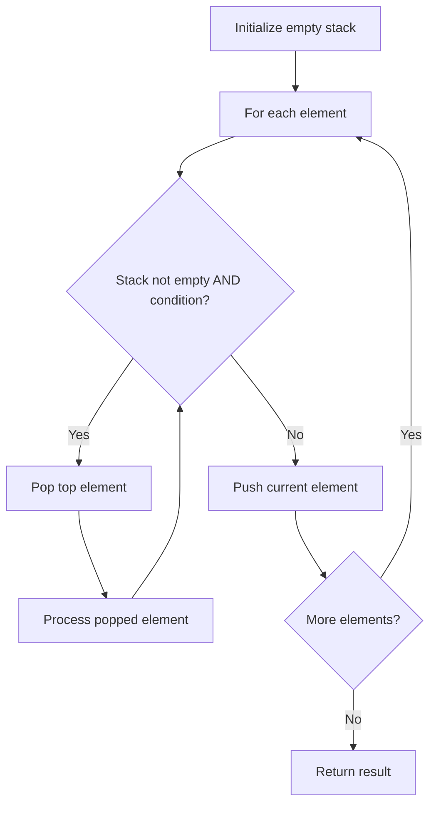

# Problem 726: Number of Atoms

**Difficulty:** Hard  
**Tags:** Hash Table, String, Stack, Sorting  
**Pattern:** Stack  
**Link:** [leetcode.com/problems/number-of-atoms](https://leetcode.com/problems/number-of-atoms/)

## Description

Given a string `formula` representing a chemical formula, return *the count of each atom*.

The atomic element always starts with an uppercase character, then zero or more lowercase letters, representing the name.

One or more digits representing that element's count may follow if the count is greater than `1`. If the count is `1`, no digits will follow.

	- For example, `"H2O"` and `"H2O2"` are possible, but `"H1O2"` is impossible.

Two formulas are concatenated together to produce another formula.

	- For example, `"H2O2He3Mg4"` is also a formula.

A formula placed in parentheses, and a count (optionally added) is also a formula.

	- For example, `"(H2O2)"` and `"(H2O2)3"` are formulas.

Return the count of all elements as a string in the following form: the first name (in sorted order), followed by its count (if that count is more than `1`), followed by the second name (in sorted order), followed by its count (if that count is more than `1`), and so on.

The test cases are generated so that all the values in the output fit in a **32-bit** integer.

 

Example 1:

```

**Input:** formula = "H2O"
**Output:** "H2O"
**Explanation:** The count of elements are {'H': 2, 'O': 1}.

```

Example 2:

```

**Input:** formula = "Mg(OH)2"
**Output:** "H2MgO2"
**Explanation:** The count of elements are {'H': 2, 'Mg': 1, 'O': 2}.

```

Example 3:

```

**Input:** formula = "K4(ON(SO3)2)2"
**Output:** "K4N2O14S4"
**Explanation:** The count of elements are {'K': 4, 'N': 2, 'O': 14, 'S': 4}.

```

 

**Constraints:**

	- `1 <= formula.length <= 1000`
	- `formula` consists of English letters, digits, `'('`, and `')'`.
	- `formula` is always valid.

## Approach: Stack

Use a stack (LIFO) to process elements. Push elements when they might be needed later; pop when a matching or resolving condition is found. Common uses: parentheses matching, expression evaluation, next greater element.

## Pseudocode

```
1. Initialize empty stack
2. For each element:
   a. While stack is not empty and condition met:
      - Pop and process top element
   b. Push current element onto stack
3. Process remaining elements in stack if needed
4. Return result
```

## Algorithm Flow



## Complexity Analysis

- **Time:** O(n)
- **Space:** O(n)

## Solution (Python3)

```python
class Solution:
    def countOfAtoms(self, formula: str) -> str:
        # Stack-based approach - O(n) time
        stack = []
        for ch in formula:
            if stack and self._matches(stack[-1], ch):
                stack.pop()
            else:
                stack.append(ch)
        return len(stack) == 0 if isinstance("", bool) else stack

    def _matches(self, a, b):
        pairs = {'(': ')', '[': ']', '{': '}'}
        return pairs.get(a) == b
```

## Solution (C++)

```cpp
#include <stack>
#include <string>
#include <unordered_map>
#include <vector>
using namespace std;

class Solution {
public:
    string countOfAtoms(string& formula) {
        // Stack-based approach - O(n) time
        stack<char> st;
        unordered_map<char, char> pairs = {{'(', ')'}, {'[', ']'}, {'{', '}'}};
        for (char ch : formula) {
            if (!st.empty() && pairs.count(st.top()) && pairs[st.top()] == ch) {
                st.pop();
            } else {
                st.push(ch);
            }
        }
        return st.empty();
    }
};
```
