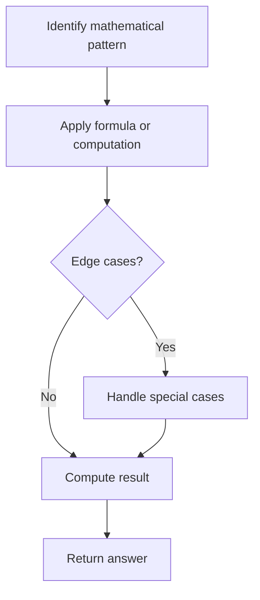

# Problem 728: Self Dividing Numbers

**Difficulty:** Easy  
**Tags:** Math  
**Pattern:** Math  
**Link:** [leetcode.com/problems/self-dividing-numbers](https://leetcode.com/problems/self-dividing-numbers/)

## Description

A **self-dividing number** is a number that is divisible by every digit it contains.

	- For example, `128` is **a self-dividing number** because `128 % 1 == 0`, `128 % 2 == 0`, and `128 % 8 == 0`.

A **self-dividing number** is not allowed to contain the digit zero.

Given two integers `left` and `right`, return *a list of all the **self-dividing numbers** in the range* `[left, right]` (both **inclusive**).

 

Example 1:

```
**Input:** left = 1, right = 22
**Output:** [1,2,3,4,5,6,7,8,9,11,12,15,22]

```
Example 2:

```
**Input:** left = 47, right = 85
**Output:** [48,55,66,77]

```

 

**Constraints:**

	- `1 <= left <= right <= 10^4`

## Approach: Math

Apply mathematical properties, formulas, or number-theoretic concepts. Look for patterns, modular arithmetic, or closed-form solutions.

## Pseudocode

```
1. Identify the mathematical pattern or formula
2. Apply computation:
   - Modular arithmetic for large numbers
   - GCD/LCM for divisibility
   - Sieve for primes
3. Handle edge cases
4. Return result
```

## Algorithm Flow



## Complexity Analysis

- **Time:** O(n) or O(sqrt(n))
- **Space:** O(1)

## Solution (Python3)

```python
class Solution:
    def selfDividingNumbers(self, left: int, right: int) -> List[int]:
        # Mathematical approach
        result = 0
        x = left
        while x != 0:
            result = result * 10 + x % 10
            x //= 10 if isinstance(x, int) else 1
        return result
```

## Solution (C++)

```cpp
#include <string>
#include <vector>
using namespace std;

class Solution {
public:
    vector<int> selfDividingNumbers(int left, int right) {
        // Mathematical approach
        long long result = 0;
        int x = left;
        while (x != 0) {
            result = result * 10 + x % 10;
            x /= 10;
        }
        return (int)result;
    }
};
```
