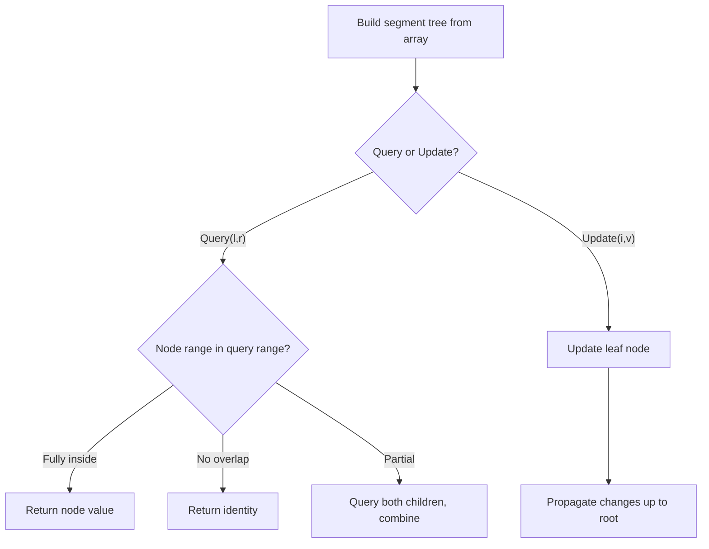

# Problem 729: My Calendar I

**Difficulty:** Medium  
**Tags:** Array, Binary Search, Design, Segment Tree, Ordered Set  
**Pattern:** Segment Tree  
**Link:** [leetcode.com/problems/my-calendar-i](https://leetcode.com/problems/my-calendar-i/)

## Description

You are implementing a program to use as your calendar. We can add a new event if adding the event will not cause a **double booking**.

A **double booking** happens when two events have some non-empty intersection (i.e., some moment is common to both events.).

The event can be represented as a pair of integers `startTime` and `endTime` that represents a booking on the half-open interval `[startTime, endTime)`, the range of real numbers `x` such that `startTime <= x < endTime`.

Implement the `MyCalendar` class:

	- `MyCalendar()` Initializes the calendar object.
	- `boolean book(int startTime, int endTime)` Returns `true` if the event can be added to the calendar successfully without causing a **double booking**. Otherwise, return `false` and do not add the event to the calendar.

 

Example 1:

```

**Input**
["MyCalendar", "book", "book", "book"]
[[], [10, 20], [15, 25], [20, 30]]
**Output**
[null, true, false, true]

**Explanation**
MyCalendar myCalendar = new MyCalendar();
myCalendar.book(10, 20); // return True
myCalendar.book(15, 25); // return False, It can not be booked because time 15 is already booked by another event.
myCalendar.book(20, 30); // return True, The event can be booked, as the first event takes every time less than 20, but not including 20.
```

 

**Constraints:**

	- `0 <= start < end <= 10^9`
	- At most `1000` calls will be made to `book`.

## Approach: Segment Tree

Build a segment tree for range queries (sum, min, max) with point or range updates. Each node covers a range; queries are answered by combining relevant segments.

## Pseudocode

```
1. Build segment tree from array (O(n))
2. Query(l, r):
   - If node range within [l,r]: return node value
   - If no overlap: return identity
   - Else: combine query(left_child) and query(right_child)
3. Update(i, val): update leaf and propagate up
```

## Algorithm Flow



## Complexity Analysis

- **Time:** O(n log n) build, O(log n) query/update
- **Space:** O(n)

## Solution (Python3)

```python
class MyCalendar:
    def __init__(self):
        # Initialize data structure
        pass

    def book(self, startTime: int, endTime: int) -> bool:
        return False

```

## Solution (C++)

```cpp
#include <functional>
#include <string>
#include <vector>
using namespace std;

class MyCalendar {
public:
    MyCalendar() {
        // Initialize
    }

    bool book(int startTime, int endTime) {
        return false;
    }

};
```
