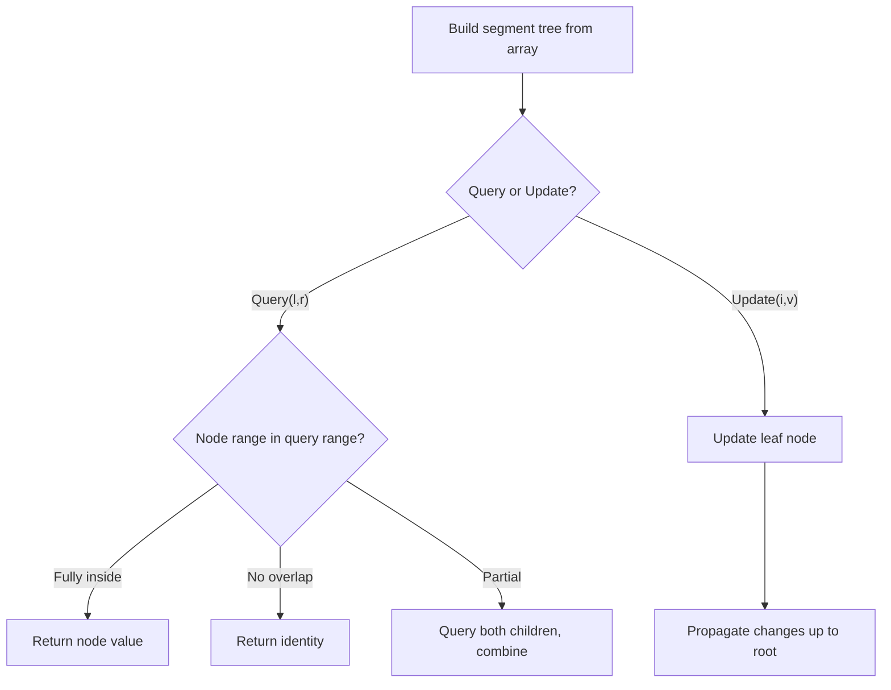

# Problem 731: My Calendar II

**Difficulty:** Medium  
**Tags:** Array, Binary Search, Design, Segment Tree, Prefix Sum, Ordered Set  
**Pattern:** Segment Tree  
**Link:** [leetcode.com/problems/my-calendar-ii](https://leetcode.com/problems/my-calendar-ii/)

## Description

You are implementing a program to use as your calendar. We can add a new event if adding the event will not cause a **triple booking**.

A **triple booking** happens when three events have some non-empty intersection (i.e., some moment is common to all the three events.).

The event can be represented as a pair of integers `startTime` and `endTime` that represents a booking on the half-open interval `[startTime, endTime)`, the range of real numbers `x` such that `startTime <= x < endTime`.

Implement the `MyCalendarTwo` class:

	- `MyCalendarTwo()` Initializes the calendar object.
	- `boolean book(int startTime, int endTime)` Returns `true` if the event can be added to the calendar successfully without causing a **triple booking**. Otherwise, return `false` and do not add the event to the calendar.

 

Example 1:

```

**Input**
["MyCalendarTwo", "book", "book", "book", "book", "book", "book"]
[[], [10, 20], [50, 60], [10, 40], [5, 15], [5, 10], [25, 55]]
**Output**
[null, true, true, true, false, true, true]

**Explanation**
MyCalendarTwo myCalendarTwo = new MyCalendarTwo();
myCalendarTwo.book(10, 20); // return True, The event can be booked. 
myCalendarTwo.book(50, 60); // return True, The event can be booked. 
myCalendarTwo.book(10, 40); // return True, The event can be double booked. 
myCalendarTwo.book(5, 15);  // return False, The event cannot be booked, because it would result in a triple booking.
myCalendarTwo.book(5, 10); // return True, The event can be booked, as it does not use time 10 which is already double booked.
myCalendarTwo.book(25, 55); // return True, The event can be booked, as the time in [25, 40) will be double booked with the third event, the time [40, 50) will be single booked, and the time [50, 55) will be double booked with the second event.

```

 

**Constraints:**

	- `0 <= start < end <= 10^9`
	- At most `1000` calls will be made to `book`.

## Approach: Segment Tree

Build a segment tree for range queries (sum, min, max) with point or range updates. Each node covers a range; queries are answered by combining relevant segments.

## Pseudocode

```
1. Build segment tree from array (O(n))
2. Query(l, r):
   - If node range within [l,r]: return node value
   - If no overlap: return identity
   - Else: combine query(left_child) and query(right_child)
3. Update(i, val): update leaf and propagate up
```

## Algorithm Flow



## Complexity Analysis

- **Time:** O(n log n) build, O(log n) query/update
- **Space:** O(n)

## Solution (Python3)

```python
class MyCalendarTwo:
    def __init__(self):
        # Initialize data structure
        pass

    def book(self, startTime: int, endTime: int) -> bool:
        return False

```

## Solution (C++)

```cpp
#include <functional>
#include <string>
#include <vector>
using namespace std;

class MyCalendarTwo {
public:
    MyCalendarTwo() {
        // Initialize
    }

    bool book(int startTime, int endTime) {
        return false;
    }

};
```
