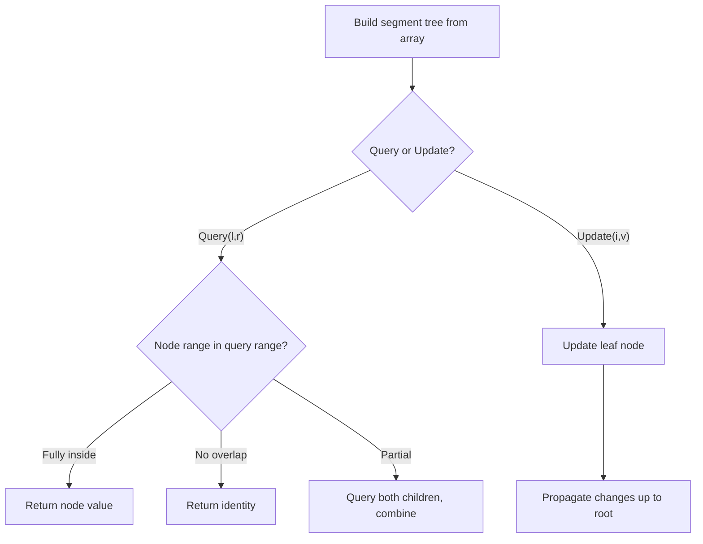

# Problem 732: My Calendar III

**Difficulty:** Hard  
**Tags:** Binary Search, Design, Segment Tree, Prefix Sum, Ordered Set  
**Pattern:** Segment Tree  
**Link:** [leetcode.com/problems/my-calendar-iii](https://leetcode.com/problems/my-calendar-iii/)

## Description

A `k`-booking happens when `k` events have some non-empty intersection (i.e., there is some time that is common to all `k` events.)

You are given some events `[startTime, endTime)`, after each given event, return an integer `k` representing the maximum `k`-booking between all the previous events.

Implement the `MyCalendarThree` class:

	- `MyCalendarThree()` Initializes the object.
	- `int book(int startTime, int endTime)` Returns an integer `k` representing the largest integer such that there exists a `k`-booking in the calendar.

 

Example 1:

```

**Input**
["MyCalendarThree", "book", "book", "book", "book", "book", "book"]
[[], [10, 20], [50, 60], [10, 40], [5, 15], [5, 10], [25, 55]]
**Output**
[null, 1, 1, 2, 3, 3, 3]

**Explanation**
MyCalendarThree myCalendarThree = new MyCalendarThree();
myCalendarThree.book(10, 20); // return 1
myCalendarThree.book(50, 60); // return 1
myCalendarThree.book(10, 40); // return 2
myCalendarThree.book(5, 15); // return 3
myCalendarThree.book(5, 10); // return 3
myCalendarThree.book(25, 55); // return 3

```

 

**Constraints:**

	- `0 <= startTime < endTime <= 10^9`
	- At most `400` calls will be made to `book`.

## Approach: Segment Tree

Build a segment tree for range queries (sum, min, max) with point or range updates. Each node covers a range; queries are answered by combining relevant segments.

## Pseudocode

```
1. Build segment tree from array (O(n))
2. Query(l, r):
   - If node range within [l,r]: return node value
   - If no overlap: return identity
   - Else: combine query(left_child) and query(right_child)
3. Update(i, val): update leaf and propagate up
```

## Algorithm Flow



## Complexity Analysis

- **Time:** O(n log n) build, O(log n) query/update
- **Space:** O(n)

## Solution (Python3)

```python
class MyCalendarThree:
    def __init__(self):
        # Initialize data structure
        pass

    def book(self, startTime: int, endTime: int) -> int:
        return 0

```

## Solution (C++)

```cpp
#include <functional>
#include <string>
#include <vector>
using namespace std;

class MyCalendarThree {
public:
    MyCalendarThree() {
        // Initialize
    }

    int book(int startTime, int endTime) {
        return 0;
    }

};
```
