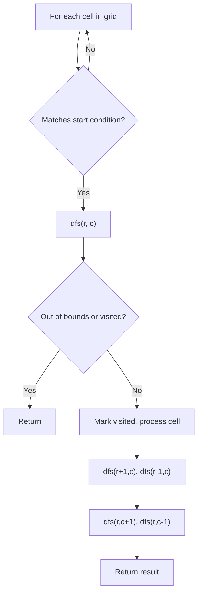
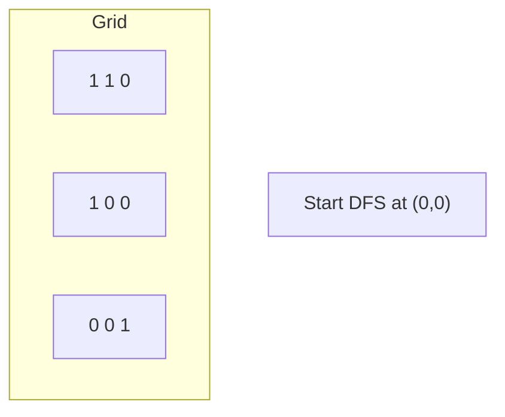
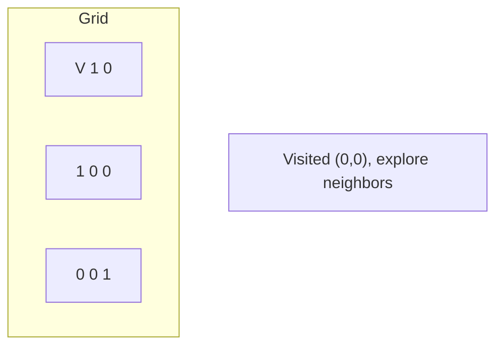
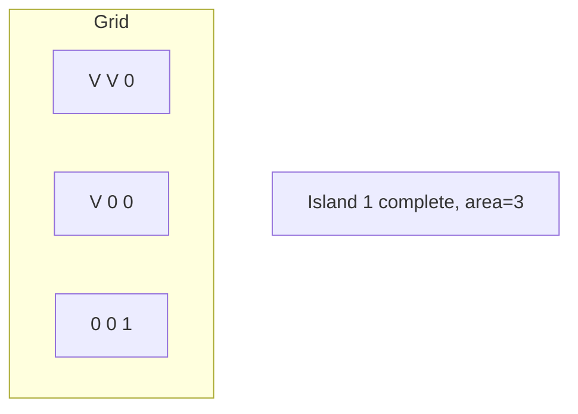
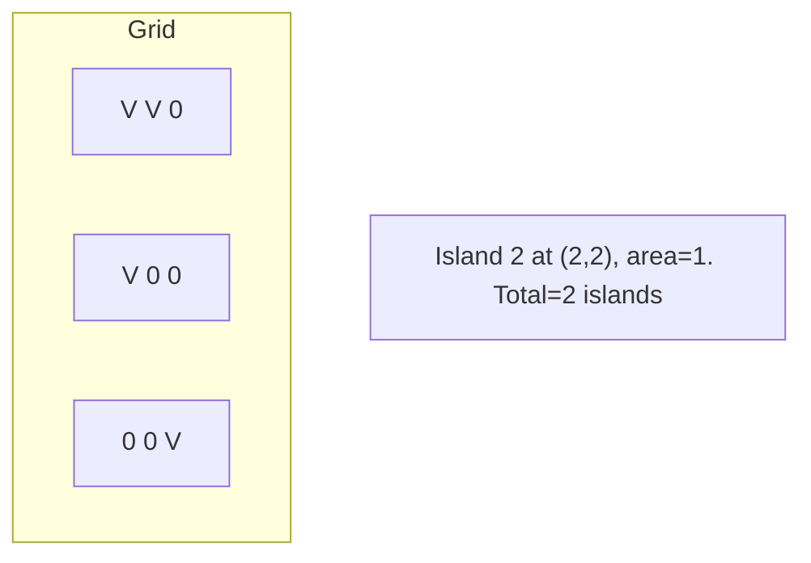

# Problem 733: Flood Fill

**Difficulty:** Easy  
**Tags:** Array, Depth-First Search, Breadth-First Search, Matrix  
**Pattern:** DFS / Graph  
**Link:** [leetcode.com/problems/flood-fill](https://leetcode.com/problems/flood-fill/)

## Description

You are given an image represented by an `m x n` grid of integers `image`, where `image[i][j]` represents the pixel value of the image. You are also given three integers `sr`, `sc`, and `color`. Your task is to perform a **flood fill** on the image starting from the pixel `image[sr][sc]`.

To perform a **flood fill**:

	- Begin with the starting pixel and change its color to `color`.
	- Perform the same process for each pixel that is **directly adjacent** (pixels that share a side with the original pixel, either horizontally or vertically) and shares the **same color** as the starting pixel.
	- Keep **repeating** this process by checking neighboring pixels of the *updated* pixels and modifying their color if it matches the original color of the starting pixel.
	- The process **stops** when there are **no more** adjacent pixels of the original color to update.

Return the **modified** image after performing the flood fill.

 

Example 1:

**Input:** image = [[1,1,1],[1,1,0],[1,0,1]], sr = 1, sc = 1, color = 2

**Output:** [[2,2,2],[2,2,0],[2,0,1]]

**Explanation:**

From the center of the image with position `(sr, sc) = (1, 1)` (i.e., the red pixel), all pixels connected by a path of the same color as the starting pixel (i.e., the blue pixels) are colored with the new color.

Note the bottom corner is **not** colored 2, because it is not horizontally or vertically connected to the starting pixel.

Example 2:

**Input:** image = [[0,0,0],[0,0,0]], sr = 0, sc = 0, color = 0

**Output:** [[0,0,0],[0,0,0]]

**Explanation:**

The starting pixel is already colored with 0, which is the same as the target color. Therefore, no changes are made to the image.

 

**Constraints:**

	- `m == image.length`
	- `n == image[i].length`
	- `1 <= m, n <= 50`
	- `0 <= image[i][j], color < 2^16`
	- `0 <= sr < m`
	- `0 <= sc < n`

## Approach: DFS / Graph

DFS from starting pixel, changing all connected same-color pixels.

## Pseudocode

```
1. For each cell (r, c) in grid:
   a. If cell meets start condition:
      - Call dfs(r, c)
2. dfs(r, c):
   a. If out of bounds or visited or invalid: return
   b. Mark cell visited
   c. Recurse on 4 neighbors: up, down, left, right
3. Return result
```

## Algorithm Flow



## Visual State Transitions

**DFS on Grid (Island/Flood Fill):**

**Frame 1: Find first land cell**


**Frame 2: DFS explores connected cells**


**Frame 3: Mark entire island**


**Frame 4: Find second island**



## Complexity Analysis

- **Time:** O(m*n)
- **Space:** O(m*n)

## Solution (Python3)

```python
class Solution:
    def floodFill(self, image, sr, sc, color):
        orig = image[sr][sc]
        if orig == color:
            return image
        m, n = len(image), len(image[0])
        def dfs(r, c):
            if r < 0 or r >= m or c < 0 or c >= n or image[r][c] != orig:
                return
            image[r][c] = color
            dfs(r+1,c); dfs(r-1,c); dfs(r,c+1); dfs(r,c-1)
        dfs(sr, sc)
        return image
```

## Solution (C++)

```cpp
#include <functional>
#include <string>
#include <vector>
using namespace std;

class Solution {
public:
    vector<vector<int>> floodFill(vector<vector<int>>& image, int sr, int sc, int color) {
        // DFS on grid - O(m*n) time
        if (image.empty()) return 0;
        int rows = image.size(), cols = image[0].size();
        int count = 0;
        function<void(int, int)> dfs = [&](int r, int c) {
            if (r < 0 || r >= rows || c < 0 || c >= cols) return;
            if (image[r][c] == '0') return;
            image[r][c] = '0';
            dfs(r+1, c); dfs(r-1, c);
            dfs(r, c+1); dfs(r, c-1);
        };
        for (int r = 0; r < rows; r++) {
            for (int c = 0; c < cols; c++) {
                if (image[r][c] == '1') {
                    dfs(r, c);
                    count++;
                }
            }
        }
        return count;
    }
};
```
