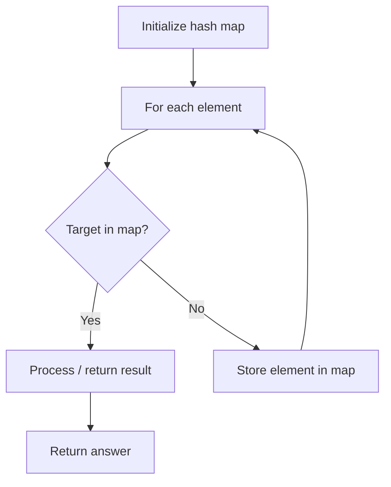

# Problem 734: Sentence Similarity

**Difficulty:** Easy  
**Tags:** Array, Hash Table, String  
**Pattern:** Hash Map Lookup  
**Link:** [leetcode.com/problems/sentence-similarity](https://leetcode.com/problems/sentence-similarity/)

## Description

*(Premium problem -- description requires LeetCode subscription)*

## Approach: Hash Map Lookup

Use a hash map (dictionary) to store elements for O(1) lookup. Iterate through the input, checking membership or counting frequencies in the map.

## Pseudocode

```
1. Initialize hash map
2. Iterate through elements:
   a. Check if target/complement exists in map
   b. If found: process result
   c. Otherwise: store element in map
3. Return result
```

## Algorithm Flow



## Complexity Analysis

- **Time:** O(n)
- **Space:** O(n)

## Solution (Python3)

```python
class Solution:
    pass
```

## Solution (C++)

```cpp
class Solution {
public:
    // Design problem stub
};
```
