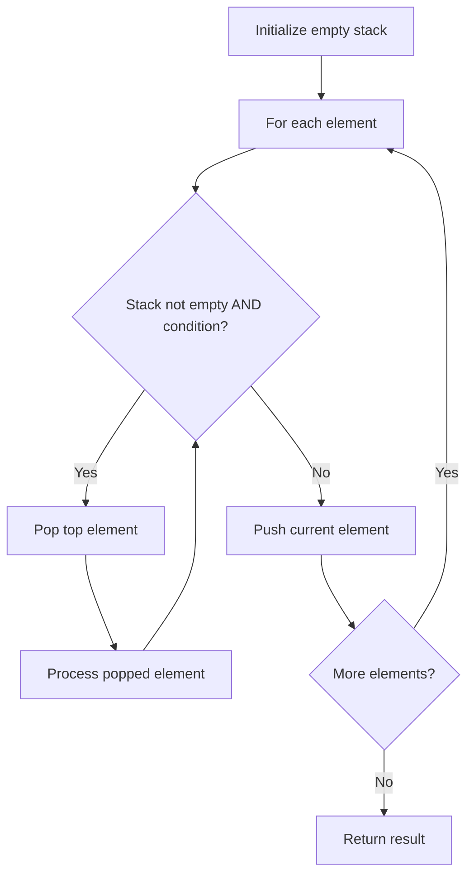

# Problem 735: Asteroid Collision

**Difficulty:** Medium  
**Tags:** Array, Stack, Simulation  
**Pattern:** Stack  
**Link:** [leetcode.com/problems/asteroid-collision](https://leetcode.com/problems/asteroid-collision/)

## Description

We are given an array `asteroids` of integers representing asteroids in a row. The indices of the asteroid in the array represent their relative position in space.

For each asteroid, the absolute value represents its size, and the sign represents its direction (positive meaning right, negative meaning left). Each asteroid moves at the same speed.

Find out the state of the asteroids after all collisions. If two asteroids meet, the smaller one will explode. If both are the same size, both will explode. Two asteroids moving in the same direction will never meet.

 

Example 1:

```

**Input:** asteroids = [5,10,-5]
**Output:** [5,10]
**Explanation:** The 10 and -5 collide resulting in 10. The 5 and 10 never collide.

```

Example 2:

```

**Input:** asteroids = [8,-8]
**Output:** []
**Explanation:** The 8 and -8 collide exploding each other.

```

Example 3:

```

**Input:** asteroids = [10,2,-5]
**Output:** [10]
**Explanation:** The 2 and -5 collide resulting in -5. The 10 and -5 collide resulting in 10.

```

Example 4:

```

**Input:** asteroids = [3,5,-6,2,-1,4]​​​​​​​
**Output:** [-6,2,4]
**Explanation:** The asteroid -6 makes the asteroid 3 and 5 explode, and then continues going left. On the other side, the asteroid 2 makes the asteroid -1 explode and then continues going right, without reaching asteroid 4.

```

 

**Constraints:**

	- `2 <= asteroids.length <= 10^4`
	- `-1000 <= asteroids[i] <= 1000`
	- `asteroids[i] != 0`

## Approach: Stack

Use a stack (LIFO) to process elements. Push elements when they might be needed later; pop when a matching or resolving condition is found. Common uses: parentheses matching, expression evaluation, next greater element.

## Pseudocode

```
1. Initialize empty stack
2. For each element:
   a. While stack is not empty and condition met:
      - Pop and process top element
   b. Push current element onto stack
3. Process remaining elements in stack if needed
4. Return result
```

## Algorithm Flow



## Complexity Analysis

- **Time:** O(n)
- **Space:** O(n)

## Solution (Python3)

```python
class Solution:
    def asteroidCollision(self, asteroids: List[int]) -> List[int]:
        # Stack-based approach - O(n) time
        stack = []
        for ch in asteroids:
            if stack and self._matches(stack[-1], ch):
                stack.pop()
            else:
                stack.append(ch)
        return len(stack) == 0 if isinstance([], bool) else stack

    def _matches(self, a, b):
        pairs = {'(': ')', '[': ']', '{': '}'}
        return pairs.get(a) == b
```

## Solution (C++)

```cpp
#include <stack>
#include <string>
#include <unordered_map>
#include <vector>
using namespace std;

class Solution {
public:
    vector<int> asteroidCollision(vector<int>& asteroids) {
        // Stack-based approach - O(n) time
        stack<char> st;
        unordered_map<char, char> pairs = {{'(', ')'}, {'[', ']'}, {'{', '}'}};
        for (char ch : asteroids) {
            if (!st.empty() && pairs.count(st.top()) && pairs[st.top()] == ch) {
                st.pop();
            } else {
                st.push(ch);
            }
        }
        return st.empty();
    }
};
```
