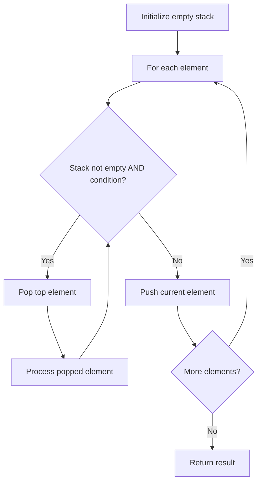

# Problem 736: Parse Lisp Expression

**Difficulty:** Hard  
**Tags:** Hash Table, String, Stack, Recursion  
**Pattern:** Stack  
**Link:** [leetcode.com/problems/parse-lisp-expression](https://leetcode.com/problems/parse-lisp-expression/)

## Description

You are given a string expression representing a Lisp-like expression to return the integer value of.

The syntax for these expressions is given as follows.

	- An expression is either an integer, let expression, add expression, mult expression, or an assigned variable. Expressions always evaluate to a single integer.
	- (An integer could be positive or negative.)
	- A let expression takes the form `"(let v1 e1 v2 e2 ... vn en expr)"`, where let is always the string `"let"`, then there are one or more pairs of alternating variables and expressions, meaning that the first variable `v1` is assigned the value of the expression `e1`, the second variable `v2` is assigned the value of the expression `e2`, and so on sequentially; and then the value of this let expression is the value of the expression `expr`.
	- An add expression takes the form `"(add e1 e2)"` where add is always the string `"add"`, there are always two expressions `e1`, `e2` and the result is the addition of the evaluation of `e1` and the evaluation of `e2`.
	- A mult expression takes the form `"(mult e1 e2)"` where mult is always the string `"mult"`, there are always two expressions `e1`, `e2` and the result is the multiplication of the evaluation of e1 and the evaluation of e2.
	- For this question, we will use a smaller subset of variable names. A variable starts with a lowercase letter, then zero or more lowercase letters or digits. Additionally, for your convenience, the names `"add"`, `"let"`, and `"mult"` are protected and will never be used as variable names.
	- Finally, there is the concept of scope. When an expression of a variable name is evaluated, within the context of that evaluation, the innermost scope (in terms of parentheses) is checked first for the value of that variable, and then outer scopes are checked sequentially. It is guaranteed that every expression is legal. Please see the examples for more details on the scope.

 

Example 1:

```

**Input:** expression = "(let x 2 (mult x (let x 3 y 4 (add x y))))"
**Output:** 14
**Explanation:** In the expression (add x y), when checking for the value of the variable x,
we check from the innermost scope to the outermost in the context of the variable we are trying to evaluate.
Since x = 3 is found first, the value of x is 3.

```

Example 2:

```

**Input:** expression = "(let x 3 x 2 x)"
**Output:** 2
**Explanation:** Assignment in let statements is processed sequentially.

```

Example 3:

```

**Input:** expression = "(let x 1 y 2 x (add x y) (add x y))"
**Output:** 5
**Explanation:** The first (add x y) evaluates as 3, and is assigned to x.
The second (add x y) evaluates as 3+2 = 5.

```

 

**Constraints:**

	- `1 <= expression.length <= 2000`
	- There are no leading or trailing spaces in `expression`.
	- All tokens are separated by a single space in `expression`.
	- The answer and all intermediate calculations of that answer are guaranteed to fit in a **32-bit** integer.
	- The expression is guaranteed to be legal and evaluate to an integer.

## Approach: Stack

Use a stack (LIFO) to process elements. Push elements when they might be needed later; pop when a matching or resolving condition is found. Common uses: parentheses matching, expression evaluation, next greater element.

## Pseudocode

```
1. Initialize empty stack
2. For each element:
   a. While stack is not empty and condition met:
      - Pop and process top element
   b. Push current element onto stack
3. Process remaining elements in stack if needed
4. Return result
```

## Algorithm Flow



## Complexity Analysis

- **Time:** O(n)
- **Space:** O(n)

## Solution (Python3)

```python
class Solution:
    def evaluate(self, expression: str) -> int:
        # Stack-based approach - O(n) time
        stack = []
        for ch in expression:
            if stack and self._matches(stack[-1], ch):
                stack.pop()
            else:
                stack.append(ch)
        return len(stack) == 0 if isinstance(0, bool) else stack

    def _matches(self, a, b):
        pairs = {'(': ')', '[': ']', '{': '}'}
        return pairs.get(a) == b
```

## Solution (C++)

```cpp
#include <stack>
#include <string>
#include <unordered_map>
#include <vector>
using namespace std;

class Solution {
public:
    int evaluate(string& expression) {
        // Stack-based approach - O(n) time
        stack<char> st;
        unordered_map<char, char> pairs = {{'(', ')'}, {'[', ']'}, {'{', '}'}};
        for (char ch : expression) {
            if (!st.empty() && pairs.count(st.top()) && pairs[st.top()] == ch) {
                st.pop();
            } else {
                st.push(ch);
            }
        }
        return st.empty();
    }
};
```
