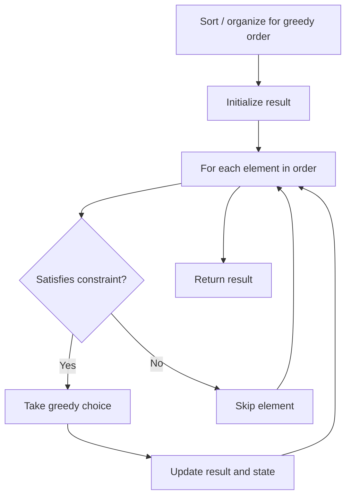

# Problem 738: Monotone Increasing Digits

**Difficulty:** Medium  
**Tags:** Math, Greedy  
**Pattern:** Greedy  
**Link:** [leetcode.com/problems/monotone-increasing-digits](https://leetcode.com/problems/monotone-increasing-digits/)

## Description

An integer has **monotone increasing digits** if and only if each pair of adjacent digits `x` and `y` satisfy `x <= y`.

Given an integer `n`, return *the largest number that is less than or equal to *`n`* with **monotone increasing digits***.

 

Example 1:

```

**Input:** n = 10
**Output:** 9

```

Example 2:

```

**Input:** n = 1234
**Output:** 1234

```

Example 3:

```

**Input:** n = 332
**Output:** 299

```

 

**Constraints:**

	- `0 <= n <= 10^9`

## Approach: Greedy

Make the locally optimal choice at each step, trusting it leads to a global optimum. Greedy works when the problem has the greedy-choice property and optimal substructure.

## Pseudocode

```
1. Sort or organize data for greedy ordering
2. Initialize result
3. For each element in greedy order:
   a. If element satisfies constraint:
      - Take the greedy choice
      - Update result and state
4. Return result
```

## Algorithm Flow



## Complexity Analysis

- **Time:** O(n log n)
- **Space:** O(1)

## Solution (Python3)

```python
class Solution:
    def monotoneIncreasingDigits(self, n: int) -> int:
        # Greedy approach - O(n) time
        result = 0
        curr_max = 0
        for i in range(len(n)):
            if isinstance(n[i], int):
                curr_max = max(curr_max, n[i])
                result = max(result, curr_max)
            else:
                result += 1
        return result
```

## Solution (C++)

```cpp
#include <algorithm>
#include <string>
#include <vector>
using namespace std;

class Solution {
public:
    int monotoneIncreasingDigits(int n) {
        // Greedy approach - O(n) time
        int result = 0, curr_max = 0;
        for (int i = 0; i < (int)n.size(); i++) {
            curr_max = max(curr_max, n[i]);
            result = max(result, curr_max);
        }
        return result;
    }
};
```
