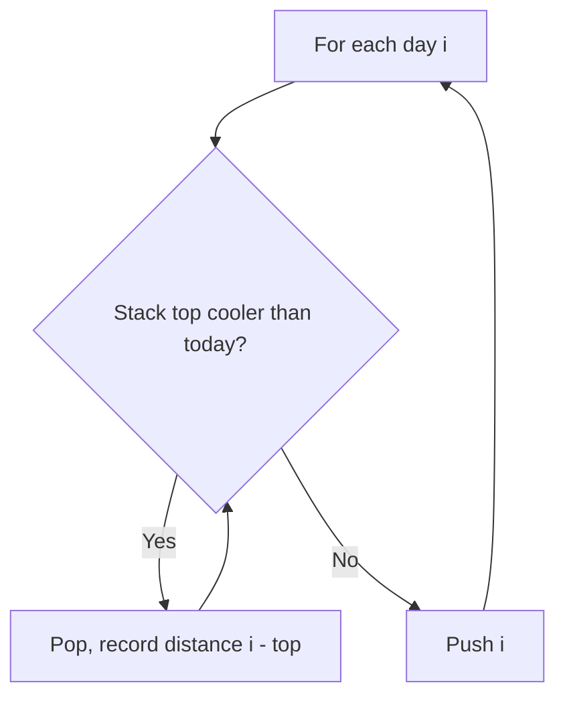
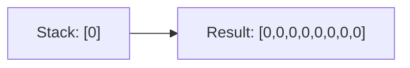
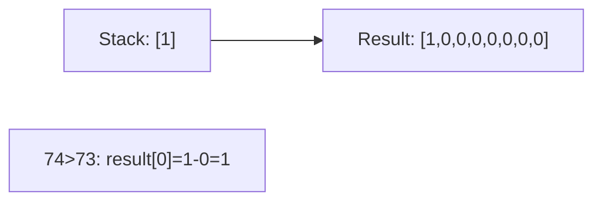
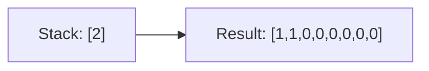
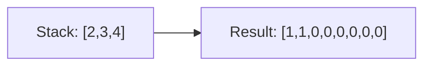
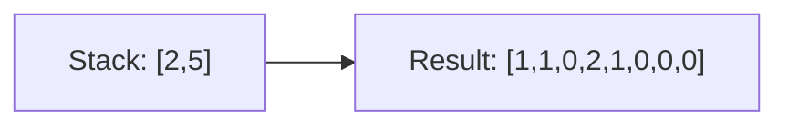
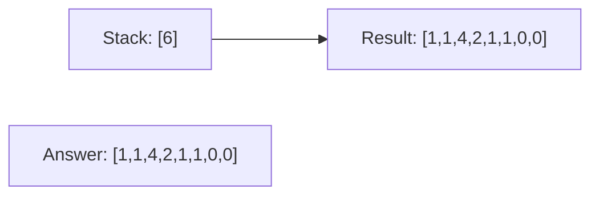

# Problem 739: Daily Temperatures

**Difficulty:** Medium  
**Tags:** Array, Stack, Monotonic Stack  
**Pattern:** Monotonic Stack  
**Link:** [leetcode.com/problems/daily-temperatures](https://leetcode.com/problems/daily-temperatures/)

## Description

Given an array of integers `temperatures` represents the daily temperatures, return *an array* `answer` *such that* `answer[i]` *is the number of days you have to wait after the* `i^th` *day to get a warmer temperature*. If there is no future day for which this is possible, keep `answer[i] == 0` instead.

 

Example 1:

```
**Input:** temperatures = [73,74,75,71,69,72,76,73]
**Output:** [1,1,4,2,1,1,0,0]

```
Example 2:

```
**Input:** temperatures = [30,40,50,60]
**Output:** [1,1,1,0]

```
Example 3:

```
**Input:** temperatures = [30,60,90]
**Output:** [1,1,0]

```

 

**Constraints:**

	- `1 <= temperatures.length <= 10^5`
	- `30 <= temperatures[i] <= 100`

## Approach: Monotonic Stack

**Monotonic decreasing stack** of indices. When a warmer day appears, pop and record the distance.

## Pseudocode

```
1. Initialize empty stack, result array
2. For each element (index i):
   a. While stack not empty and arr[i] breaks monotonic order:
      - Pop index j from stack
      - result[j] = compute(i, j)
   b. Push i onto stack
3. Handle remaining elements in stack
4. Return result
```

## Algorithm Flow



## Visual State Transitions

**Monotonic Stack Step-by-Step:**

**Input:** temps = [73, 74, 75, 71, 69, 72, 76, 73]

**Frame 1: Process 73 (i=0)**


**Frame 2: Process 74 (i=1) - 74 > 73, pop 0**


**Frame 3: Process 75 (i=2) - 75 > 74, pop 1**


**Frame 4: Process 71,69 (i=3,4) - push both**


**Frame 5: Process 72 (i=5) - pop 69,71**


**Frame 6: Process 76 (i=6) - pop all**



## Complexity Analysis

- **Time:** O(n)
- **Space:** O(n)

## Solution (Python3)

```python
class Solution:
    def dailyTemperatures(self, temperatures: list[int]) -> list[int]:
        n = len(temperatures)
        result = [0] * n
        stack = []
        for i in range(n):
            while stack and temperatures[i] > temperatures[stack[-1]]:
                j = stack.pop()
                result[j] = i - j
            stack.append(i)
        return result
```

## Solution (C++)

```cpp
#include <stack>
#include <string>
#include <vector>
using namespace std;

class Solution {
public:
    vector<int> dailyTemperatures(vector<int>& temperatures) {
        // Monotonic stack - O(n) time, O(n) space
        int n = temperatures.size();
        vector<int> result(n, 0);
        stack<int> st;
        for (int i = 0; i < n; i++) {
            while (!st.empty() && temperatures[i] > temperatures[st.top()]) {
                int idx = st.top(); st.pop();
                result[idx] = i - idx;
            }
            st.push(i);
        }
        return result;
    }
};
```
