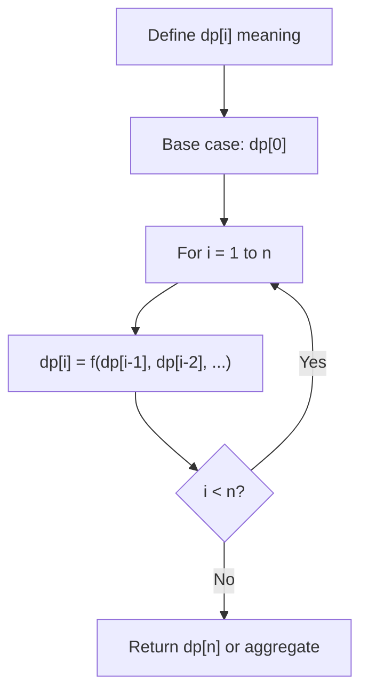
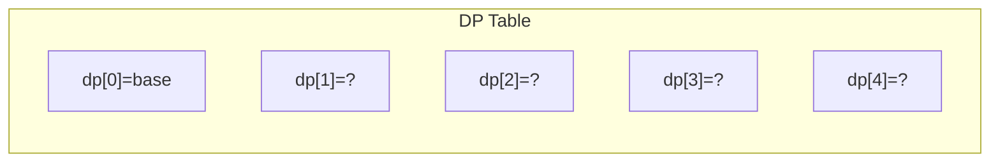
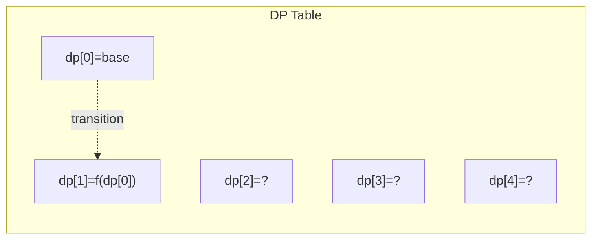
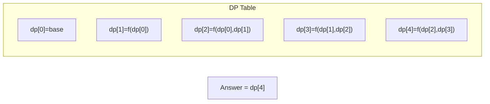

# Problem 740: Delete and Earn

**Difficulty:** Medium  
**Tags:** Array, Hash Table, Dynamic Programming  
**Pattern:** Dynamic Programming (1D)  
**Link:** [leetcode.com/problems/delete-and-earn](https://leetcode.com/problems/delete-and-earn/)

## Description

You are given an integer array `nums`. You want to maximize the number of points you get by performing the following operation any number of times:

	- Pick any `nums[i]` and delete it to earn `nums[i]` points. Afterwards, you must delete **every** element equal to `nums[i] - 1` and **every** element equal to `nums[i] + 1`.

Return *the **maximum number of points** you can earn by applying the above operation some number of times*.

 

Example 1:

```

**Input:** nums = [3,4,2]
**Output:** 6
**Explanation:** You can perform the following operations:
- Delete 4 to earn 4 points. Consequently, 3 is also deleted. nums = [2].
- Delete 2 to earn 2 points. nums = [].
You earn a total of 6 points.

```

Example 2:

```

**Input:** nums = [2,2,3,3,3,4]
**Output:** 9
**Explanation:** You can perform the following operations:
- Delete a 3 to earn 3 points. All 2's and 4's are also deleted. nums = [3,3].
- Delete a 3 again to earn 3 points. nums = [3].
- Delete a 3 once more to earn 3 points. nums = [].
You earn a total of 9 points.
```

 

**Constraints:**

	- `1 <= nums.length <= 2 * 10^4`
	- `1 <= nums[i] <= 10^4`

## Approach: Dynamic Programming (1D)

Break the problem into overlapping subproblems. Define dp[i] as the optimal value for the subproblem ending at or considering index i. Build the solution bottom-up, using previously computed dp values.

## Pseudocode

```
1. Define dp[i] = optimal value for subproblem i
2. Base case: dp[0] = initial value
3. For i from 1 to n:
   a. dp[i] = recurrence(dp[i-1], dp[i-2], ...)
4. Return dp[n] or max/min of dp
```

## Algorithm Flow



## Visual State Transitions

**1D Dynamic Programming Table Build:**

**Frame 1: Initialize base cases**


**Frame 2: Fill dp[1] from dp[0]**


**Frame 3: Fill remaining cells**



## Complexity Analysis

- **Time:** O(n)
- **Space:** O(n)

## Solution (Python3)

```python
class Solution:
    def deleteAndEarn(self, nums: List[int]) -> int:
        # Dynamic programming (1D) - O(n) time, O(n) space
        if not nums:
            return 0
        n = len(nums) if isinstance(nums, list) else nums
        dp = [0] * (n + 1)
        dp[0] = 1  # base case
        for i in range(1, n + 1):
            dp[i] = dp[i-1]  # transition (customize per problem)
            if i >= 2:
                dp[i] += dp[i-2]
        return dp[n]
```

## Solution (C++)

```cpp
#include <string>
#include <vector>
using namespace std;

class Solution {
public:
    int deleteAndEarn(vector<int>& nums) {
        // Dynamic programming (1D) - O(n) time, O(n) space
        int n = nums;
        if (n <= 0) return 0;
        vector<int> dp(n + 1, 0);
        dp[0] = 1;
        for (int i = 1; i <= n; i++) {
            dp[i] = dp[i-1];
            if (i >= 2) dp[i] += dp[i-2];
        }
        return dp[n];
    }
};
```
