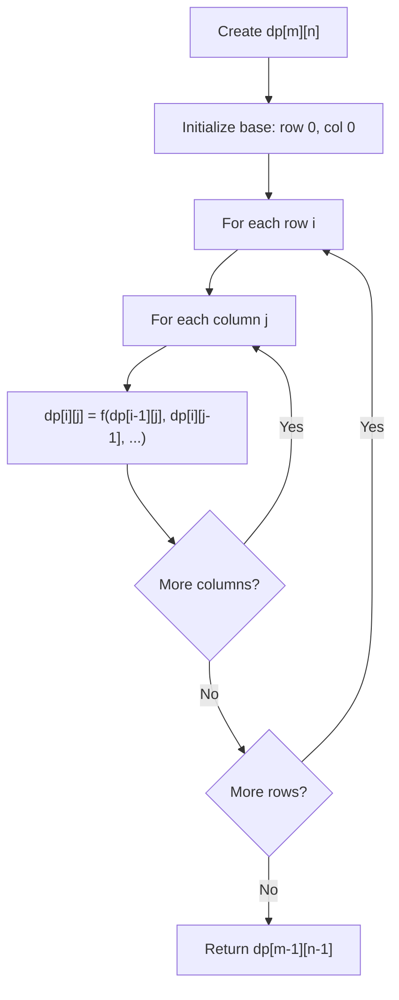
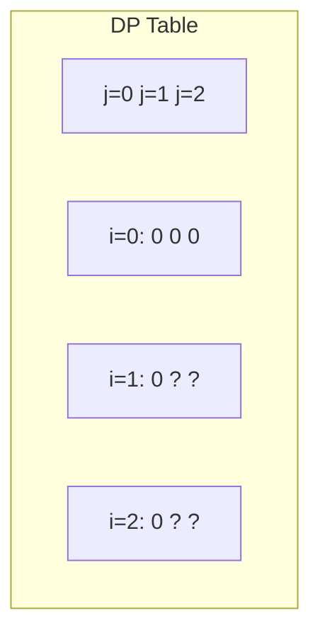
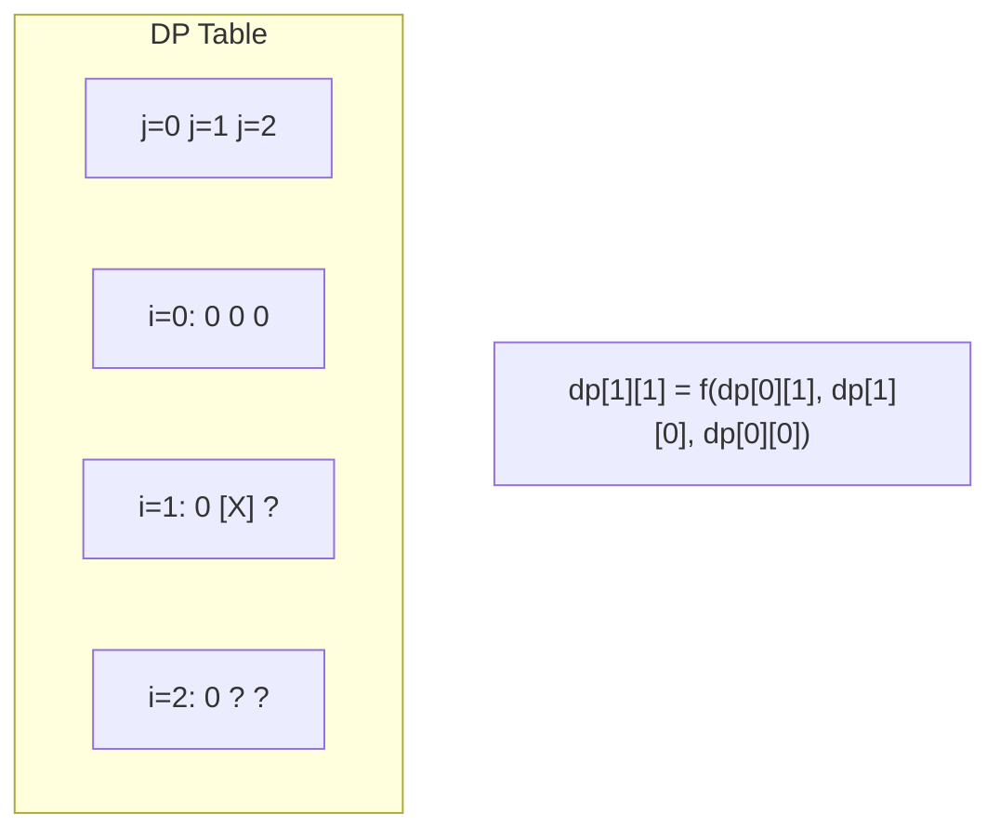
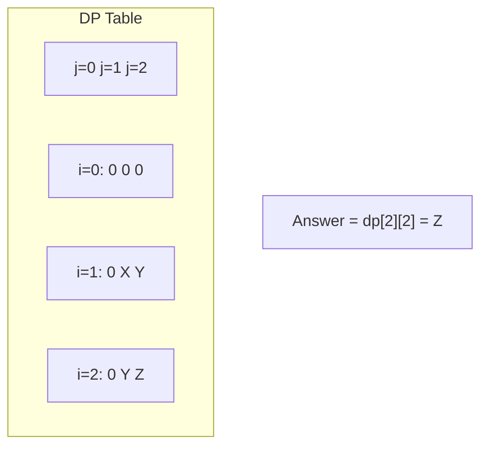

# Problem 741: Cherry Pickup

**Difficulty:** Hard  
**Tags:** Array, Dynamic Programming, Matrix  
**Pattern:** Dynamic Programming (2D Grid/Matrix)  
**Link:** [leetcode.com/problems/cherry-pickup](https://leetcode.com/problems/cherry-pickup/)

## Description

You are given an `n x n` `grid` representing a field of cherries, each cell is one of three possible integers.

	- `0` means the cell is empty, so you can pass through,
	- `1` means the cell contains a cherry that you can pick up and pass through, or
	- `-1` means the cell contains a thorn that blocks your way.

Return *the maximum number of cherries you can collect by following the rules below*:

	- Starting at the position `(0, 0)` and reaching `(n - 1, n - 1)` by moving right or down through valid path cells (cells with value `0` or `1`).
	- After reaching `(n - 1, n - 1)`, returning to `(0, 0)` by moving left or up through valid path cells.
	- When passing through a path cell containing a cherry, you pick it up, and the cell becomes an empty cell `0`.
	- If there is no valid path between `(0, 0)` and `(n - 1, n - 1)`, then no cherries can be collected.

 

Example 1:

```

**Input:** grid = [[0,1,-1],[1,0,-1],[1,1,1]]
**Output:** 5
**Explanation:** The player started at (0, 0) and went down, down, right right to reach (2, 2).
4 cherries were picked up during this single trip, and the matrix becomes [[0,1,-1],[0,0,-1],[0,0,0]].
Then, the player went left, up, up, left to return home, picking up one more cherry.
The total number of cherries picked up is 5, and this is the maximum possible.

```

Example 2:

```

**Input:** grid = [[1,1,-1],[1,-1,1],[-1,1,1]]
**Output:** 0

```

 

**Constraints:**

	- `n == grid.length`
	- `n == grid[i].length`
	- `1 <= n <= 50`
	- `grid[i][j]` is `-1`, `0`, or `1`.
	- `grid[0][0] != -1`
	- `grid[n - 1][n - 1] != -1`

## Approach: Dynamic Programming (2D Grid/Matrix)

Use a 2D DP table where dp[i][j] represents the optimal value for the subproblem defined by rows 0..i and columns 0..j. Fill row by row or column by column.

## Pseudocode

```
1. Create dp[m][n] table
2. Initialize base cases (first row, first column)
3. For i from 1 to m-1:
   For j from 1 to n-1:
     dp[i][j] = recurrence(dp[i-1][j], dp[i][j-1], dp[i-1][j-1])
4. Return dp[m-1][n-1]
```

## Algorithm Flow



## Visual State Transitions

**2D DP Table Build:**

**Frame 1: Initialize borders**


**Frame 2: Fill cell by cell**


**Frame 3: Table complete**



## Complexity Analysis

- **Time:** O(m * n)
- **Space:** O(m * n)

## Solution (Python3)

```python
class Solution:
    def cherryPickup(self, grid: List[List[int]]) -> int:
        # Dynamic programming (2D) - O(m*n) time and space
        if not grid:
            return 0
        m, n = len(grid), len(grid[0])
        dp = [[0] * (n + 1) for _ in range(m + 1)]
        for i in range(1, m + 1):
            for j in range(1, n + 1):
                dp[i][j] = max(dp[i-1][j], dp[i][j-1])
                # Add problem-specific transition
        return dp[m][n]
```

## Solution (C++)

```cpp
#include <algorithm>
#include <string>
#include <vector>
using namespace std;

class Solution {
public:
    int cherryPickup(vector<vector<int>>& grid) {
        // Dynamic programming (2D) - O(m*n) time and space
        if (grid.empty()) return 0;
        int m = grid.size(), n = grid[0].size();
        vector<vector<int>> dp(m + 1, vector<int>(n + 1, 0));
        for (int i = 1; i <= m; i++) {
            for (int j = 1; j <= n; j++) {
                dp[i][j] = max(dp[i-1][j], dp[i][j-1]);
            }
        }
        return dp[m][n];
    }
};
```
