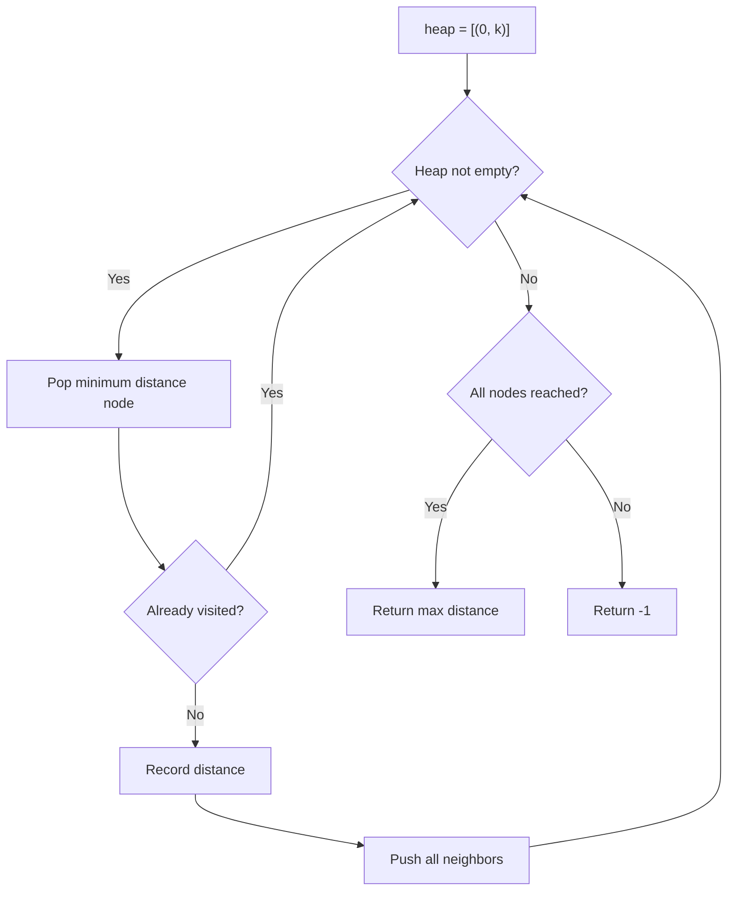
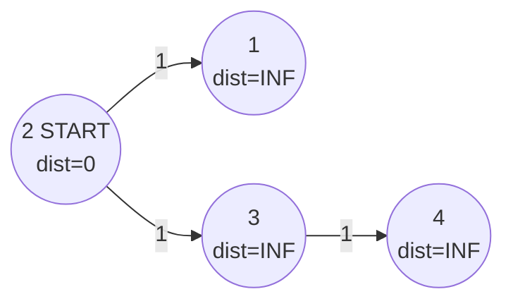
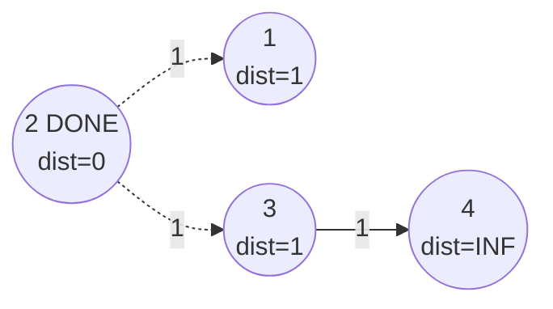
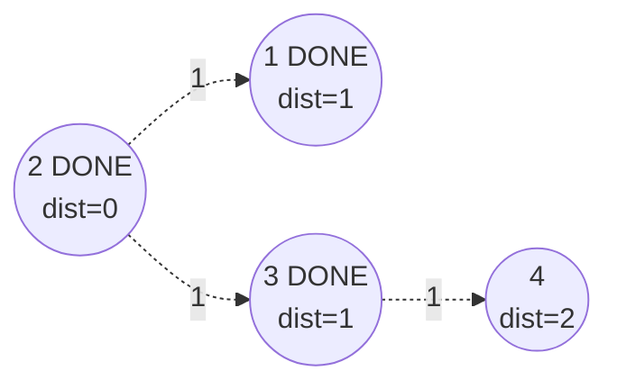
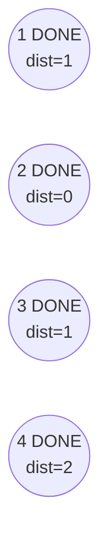

# Problem 743: Network Delay Time

**Difficulty:** Medium  
**Tags:** Depth-First Search, Breadth-First Search, Graph Theory, Heap (Priority Queue), Shortest Path  
**Pattern:** Dijkstra / Shortest Path  
**Link:** [leetcode.com/problems/network-delay-time](https://leetcode.com/problems/network-delay-time/)

## Description

You are given a network of `n` nodes, labeled from `1` to `n`. You are also given `times`, a list of travel times as directed edges `times[i] = (ui, vi, wi)`, where `ui` is the source node, `vi` is the target node, and `wi` is the time it takes for a signal to travel from source to target.

We will send a signal from a given node `k`. Return *the **minimum** time it takes for all the* `n` *nodes to receive the signal*. If it is impossible for all the `n` nodes to receive the signal, return `-1`.

 

Example 1:

```

**Input:** times = [[2,1,1],[2,3,1],[3,4,1]], n = 4, k = 2
**Output:** 2

```

Example 2:

```

**Input:** times = [[1,2,1]], n = 2, k = 1
**Output:** 1

```

Example 3:

```

**Input:** times = [[1,2,1]], n = 2, k = 2
**Output:** -1

```

 

**Constraints:**

	- `1 <= k <= n <= 100`
	- `1 <= times.length <= 6000`
	- `times[i].length == 3`
	- `1 <= ui, vi <= n`
	- `ui != vi`
	- `0 <= wi <= 100`
	- All the pairs `(ui, vi)` are **unique**. (i.e., no multiple edges.)

## Approach: Dijkstra / Shortest Path

Dijkstra's algorithm from source k. Answer is max of all shortest distances.

## Pseudocode

```
1. Initialize heap (min or max)
2. Push initial elements onto heap
3. While heap not empty and condition:
   a. Pop top element (min or max)
   b. Process element
   c. Push new elements if needed
4. Return result
```

## Algorithm Flow



## Visual State Transitions

**Dijkstra's Algorithm Step-by-Step:**

**Frame 1: Initial State**


**Frame 2: Process node 2 (dist=0)**


**Frame 3: Process node 1 and 3 (dist=1)**


**Frame 4: All processed - Answer = max(0,1,1,2) = 2**



## Complexity Analysis

- **Time:** O(E log V)
- **Space:** O(V + E)

## Solution (Python3)

```python
import heapq
from collections import defaultdict

class Solution:
    def networkDelayTime(self, times, n, k):
        graph = defaultdict(list)
        for u, v, w in times:
            graph[u].append((v, w))
        dist = {}
        heap = [(0, k)]
        while heap:
            d, u = heapq.heappop(heap)
            if u in dist:
                continue
            dist[u] = d
            for v, w in graph[u]:
                if v not in dist:
                    heapq.heappush(heap, (d + w, v))
        return max(dist.values()) if len(dist) == n else -1
```

## Solution (C++)

```cpp
#include <queue>
#include <string>
#include <vector>
using namespace std;

class Solution {
public:
    int networkDelayTime(vector<vector<int>>& times, int n, int k) {
        // Heap/Priority Queue - O(n log k) time
        priority_queue<int, vector<int>, greater<int>> pq;
        for (int val : times) {
            pq.push(val);
            if ((int)pq.size() > n)
                pq.pop();
        }
        return pq.empty() ? 0 : pq.top();
    }
};
```
