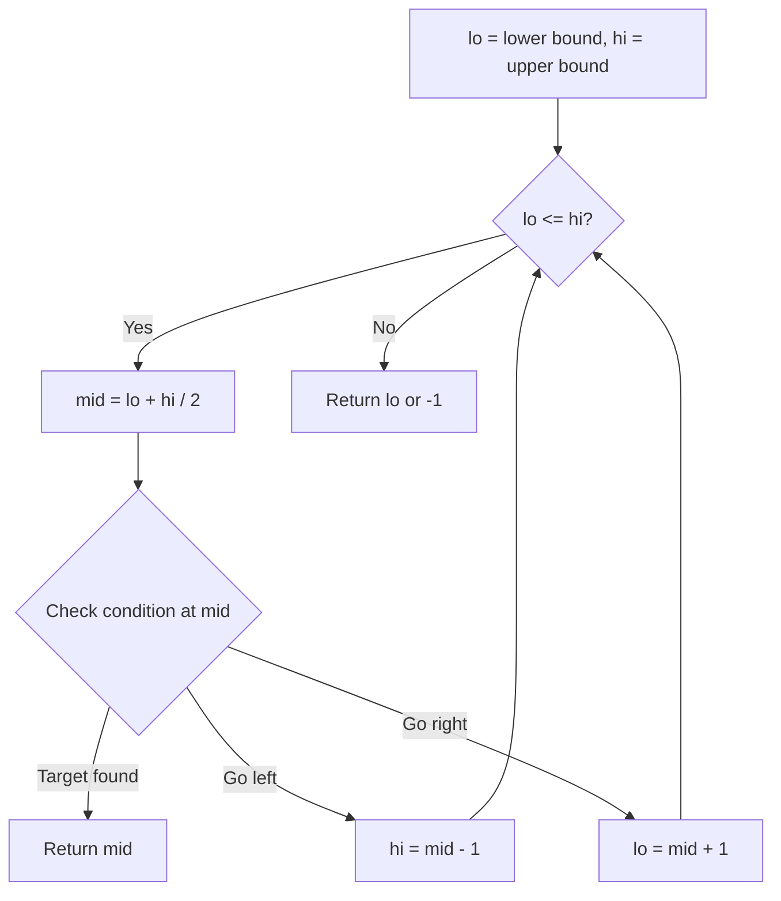
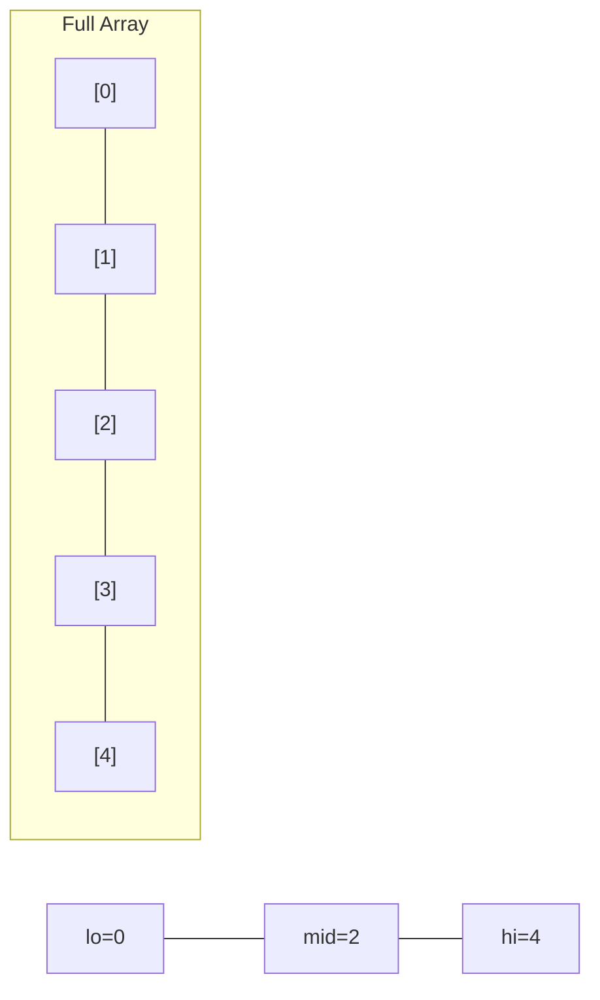
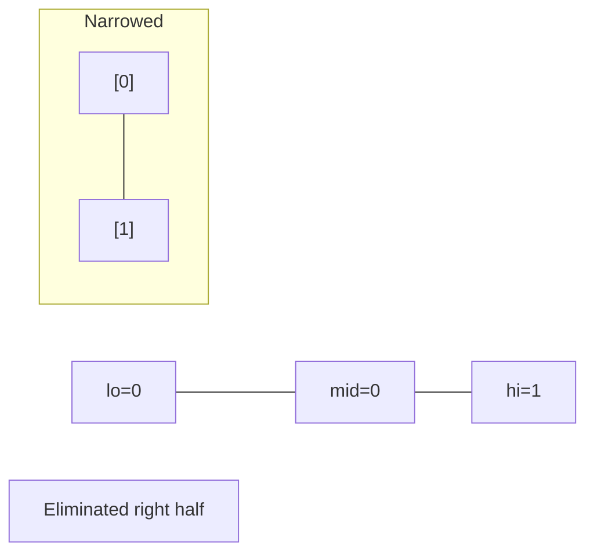
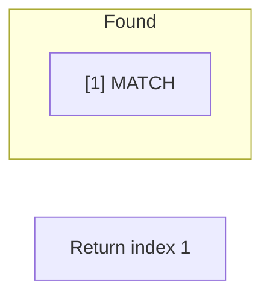

# Problem 744: Find Smallest Letter Greater Than Target

**Difficulty:** Easy  
**Tags:** Array, Binary Search  
**Pattern:** Binary Search  
**Link:** [leetcode.com/problems/find-smallest-letter-greater-than-target](https://leetcode.com/problems/find-smallest-letter-greater-than-target/)

## Description

You are given an array of characters `letters` that is sorted in **non-decreasing order**, and a character `target`. There are **at least two different** characters in `letters`.

Return *the smallest character in *`letters`* that is lexicographically greater than *`target`. If such a character does not exist, return the first character in `letters`.

 

Example 1:

```

**Input:** letters = ["c","f","j"], target = "a"
**Output:** "c"
**Explanation:** The smallest character that is lexicographically greater than 'a' in letters is 'c'.

```

Example 2:

```

**Input:** letters = ["c","f","j"], target = "c"
**Output:** "f"
**Explanation:** The smallest character that is lexicographically greater than 'c' in letters is 'f'.

```

Example 3:

```

**Input:** letters = ["x","x","y","y"], target = "z"
**Output:** "x"
**Explanation:** There are no characters in letters that is lexicographically greater than 'z' so we return letters[0].

```

 

**Constraints:**

	- `2 <= letters.length <= 10^4`
	- `letters[i]` is a lowercase English letter.
	- `letters` is sorted in **non-decreasing** order.
	- `letters` contains at least two different characters.
	- `target` is a lowercase English letter.

## Approach: Binary Search

Use binary search to halve the search space each iteration. Define the search range [lo, hi], compute mid, and decide which half to keep based on the problem's monotonic condition.

## Pseudocode

```
1. lo = lower_bound, hi = upper_bound
2. While lo <= hi (or lo < hi):
   a. mid = (lo + hi) // 2
   b. If condition(mid) is satisfied: record answer, search left half
   c. Else: search right half
3. Return answer
```

## Algorithm Flow



## Visual State Transitions

**Binary Search Step-by-Step:**

**Frame 1: Initial search space**


**Frame 2: Compare mid, narrow search**


**Frame 3: Found target**



## Complexity Analysis

- **Time:** O(log n)
- **Space:** O(1)

## Solution (Python3)

```python
class Solution:
    def nextGreatestLetter(self, letters: List[str], target: str) -> str:
        # Binary search - O(log n) time, O(1) space
        lo, hi = 0, len(letters) - 1
        while lo <= hi:
            mid = lo + (hi - lo) // 2
            if letters[mid] == target:
                return mid
            elif letters[mid] < target:
                lo = mid + 1
            else:
                hi = mid - 1
        return ""
```

## Solution (C++)

```cpp
#include <string>
#include <vector>
using namespace std;

class Solution {
public:
    string nextGreatestLetter(vector<string>& letters, string& target) {
        // Binary search - O(log n) time, O(1) space
        int lo = 0, hi = letters.size() - 1;
        while (lo <= hi) {
            int mid = lo + (hi - lo) / 2;
            if (letters[mid] == target) {
                return mid;
            } else if (letters[mid] < target) {
                lo = mid + 1;
            } else {
                hi = mid - 1;
            }
        }
        return "";
    }
};
```
