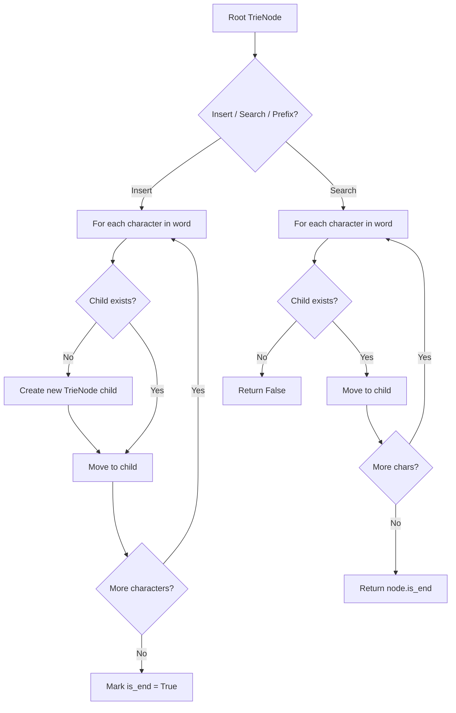
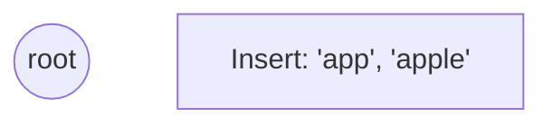
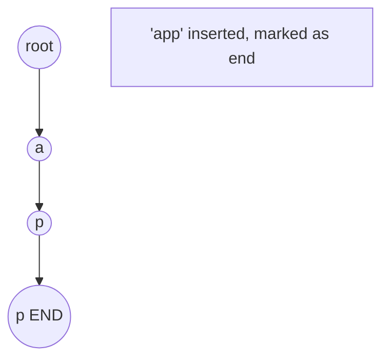
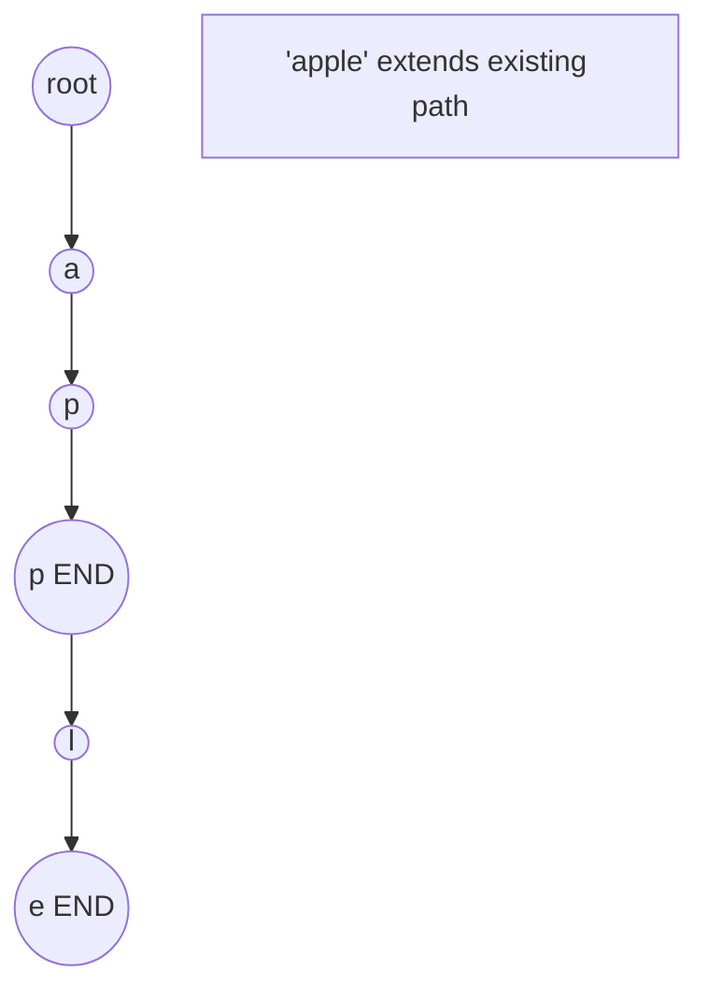
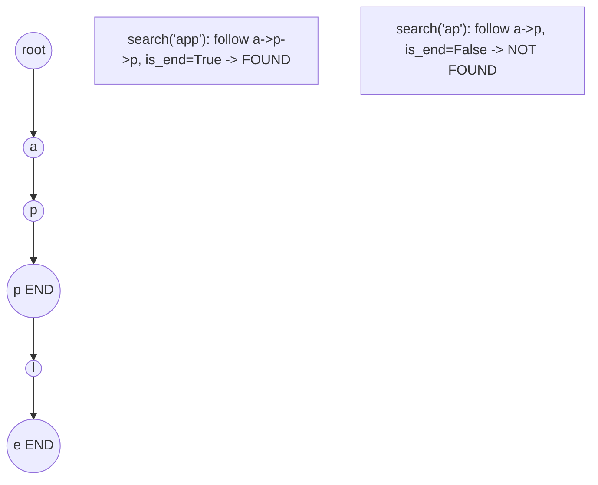

# Problem 745: Prefix and Suffix Search

**Difficulty:** Hard  
**Tags:** Array, Hash Table, String, Design, Trie  
**Pattern:** Trie / Prefix Tree  
**Link:** [leetcode.com/problems/prefix-and-suffix-search](https://leetcode.com/problems/prefix-and-suffix-search/)

## Description

Design a special dictionary that searches the words in it by a prefix and a suffix.

Implement the `WordFilter` class:

	- `WordFilter(string[] words)` Initializes the object with the `words` in the dictionary.
	- `f(string pref, string suff)` Returns *the index of the word in the dictionary,* which has the prefix `pref` and the suffix `suff`. If there is more than one valid index, return **the largest** of them. If there is no such word in the dictionary, return `-1`.

 

Example 1:

```

**Input**
["WordFilter", "f"]
[[["apple"]], ["a", "e"]]
**Output**
[null, 0]
**Explanation**
WordFilter wordFilter = new WordFilter(["apple"]);
wordFilter.f("a", "e"); // return 0, because the word at index 0 has prefix = "a" and suffix = "e".

```

 

**Constraints:**

	- `1 <= words.length <= 10^4`
	- `1 <= words[i].length <= 7`
	- `1 <= pref.length, suff.length <= 7`
	- `words[i]`, `pref` and `suff` consist of lowercase English letters only.
	- At most `10^4` calls will be made to the function `f`.

## Approach: Trie / Prefix Tree

Build a trie (prefix tree) where each node represents a character. Insert words character by character, and search by following child pointers. Supports efficient prefix matching.

## Pseudocode

```
1. TrieNode: children = {}, is_end = False
2. Insert(word):
   - For each char: create child if absent, move to child
   - Mark last node as end
3. Search(word):
   - For each char: if child absent return False, move to child
   - Return node.is_end
4. StartsWith(prefix): same as search but return True at end
```

## Algorithm Flow



## Visual State Transitions

**Trie Insert and Search:**

**Frame 1: Empty trie**


**Frame 2: Insert 'app'**


**Frame 3: Insert 'apple'**


**Frame 4: Search 'app' = True, 'ap' = False**



## Complexity Analysis

- **Time:** O(L) per operation
- **Space:** O(N * L)

## Solution (Python3)

```python
class WordFilter:
    def __init__(self, words: List[str]):
        # Initialize data structure
        self.words = words

    def f(self, pref: str, suff: str) -> int:
        return 0

```

## Solution (C++)

```cpp
#include <string>
#include <vector>
using namespace std;

class WordFilter {
public:
    WordFilter(vector<string>& words) {
        // Initialize
    }

    int f(string& pref, string& suff) {
        return 0;
    }

};
```
