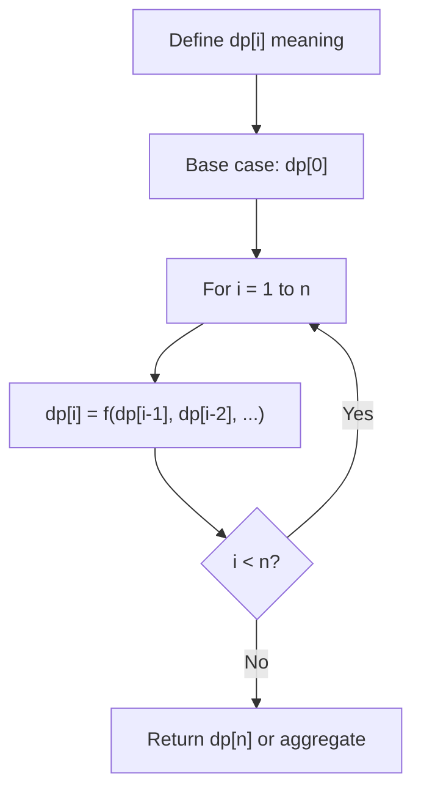
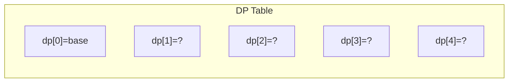
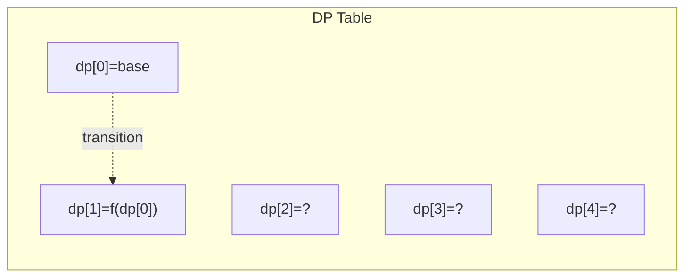
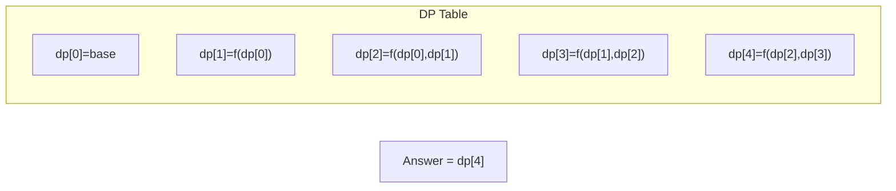

# Problem 746: Min Cost Climbing Stairs

**Difficulty:** Easy  
**Tags:** Array, Dynamic Programming  
**Pattern:** Dynamic Programming  
**Link:** [leetcode.com/problems/min-cost-climbing-stairs](https://leetcode.com/problems/min-cost-climbing-stairs/)

## Description

You are given an integer array `cost` where `cost[i]` is the cost of `i^th` step on a staircase. Once you pay the cost, you can either climb one or two steps.

You can either start from the step with index `0`, or the step with index `1`.

Return *the minimum cost to reach the top of the floor*.

 

Example 1:

```

**Input:** cost = [10,15,20]
**Output:** 15
**Explanation:** You will start at index 1.
- Pay 15 and climb two steps to reach the top.
The total cost is 15.

```

Example 2:

```

**Input:** cost = [1,100,1,1,1,100,1,1,100,1]
**Output:** 6
**Explanation:** You will start at index 0.
- Pay 1 and climb two steps to reach index 2.
- Pay 1 and climb two steps to reach index 4.
- Pay 1 and climb two steps to reach index 6.
- Pay 1 and climb one step to reach index 7.
- Pay 1 and climb two steps to reach index 9.
- Pay 1 and climb one step to reach the top.
The total cost is 6.

```

 

**Constraints:**

	- `2 <= cost.length <= 1000`
	- `0 <= cost[i] <= 999`

## Approach: Dynamic Programming

DP: cost[i] += min of previous two steps. Return min of last two.

## Pseudocode

```
1. Define dp[i] = optimal value for subproblem i
2. Base case: dp[0] = initial value
3. For i from 1 to n:
   a. dp[i] = recurrence(dp[i-1], dp[i-2], ...)
4. Return dp[n] or max/min of dp
```

## Algorithm Flow



## Visual State Transitions

**1D Dynamic Programming Table Build:**

**Frame 1: Initialize base cases**


**Frame 2: Fill dp[1] from dp[0]**


**Frame 3: Fill remaining cells**



## Complexity Analysis

- **Time:** O(n)
- **Space:** O(1)

## Solution (Python3)

```python
class Solution:
    def minCostClimbingStairs(self, cost: list[int]) -> int:
        for i in range(2, len(cost)):
            cost[i] += min(cost[i-1], cost[i-2])
        return min(cost[-1], cost[-2])
```

## Solution (C++)

```cpp
#include <string>
#include <vector>
using namespace std;

class Solution {
public:
    int minCostClimbingStairs(vector<int>& cost) {
        // Dynamic programming (1D) - O(n) time, O(n) space
        int n = cost;
        if (n <= 0) return 0;
        vector<int> dp(n + 1, 0);
        dp[0] = 1;
        for (int i = 1; i <= n; i++) {
            dp[i] = dp[i-1];
            if (i >= 2) dp[i] += dp[i-2];
        }
        return dp[n];
    }
};
```
